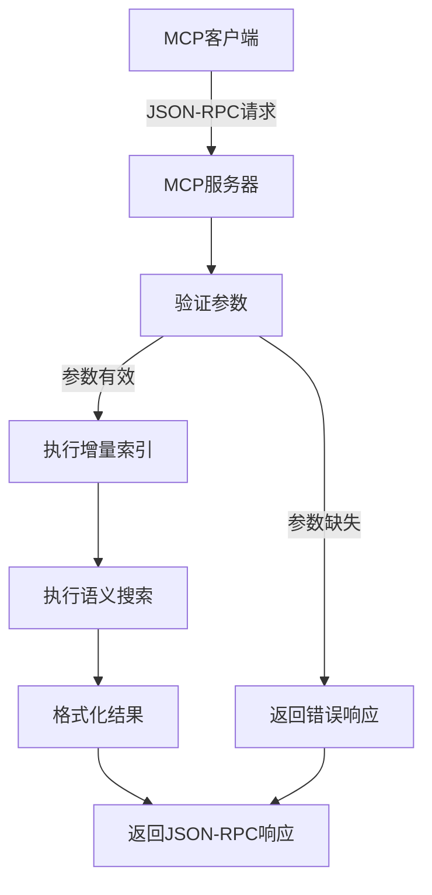
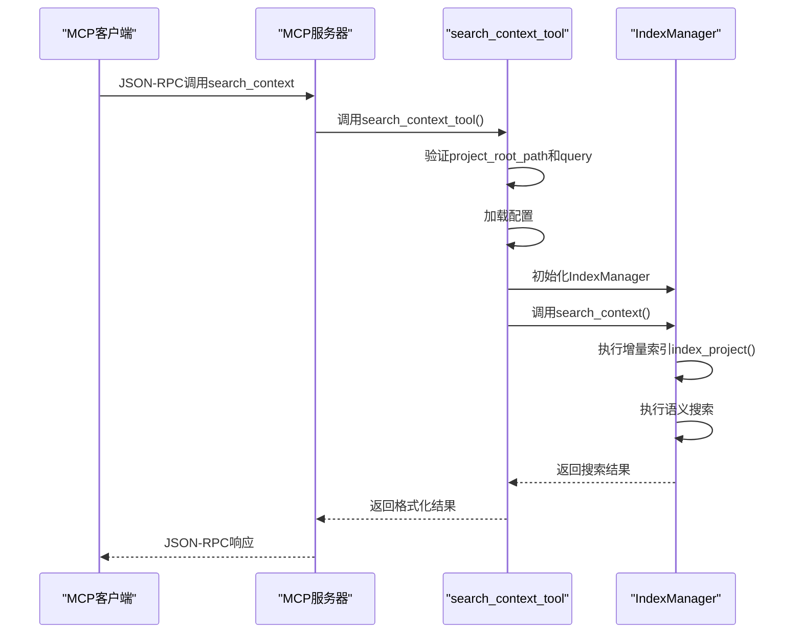

# MCP协议接口

<cite>
**本文档引用的文件**  
- [search_context.py](file://src/acemcp/tools/search_context.py)
- [server.py](file://src/acemcp/server.py)
- [manager.py](file://src/acemcp/index/manager.py)
- [config.py](file://src/acemcp/config.py)
- [README.md](file://README.md)
</cite>

## 目录
1. [简介](#简介)
2. [核心功能语义](#核心功能语义)
3. [参数规范](#参数规范)
4. [工具调用流程](#工具调用流程)
5. [JSON-RPC请求/响应示例](#json-rpc请求响应示例)
6. [执行流程解析](#执行流程解析)
7. [常见问题排查指南](#常见问题排查指南)
8. [结论](#结论)

## 简介
本接口文档详细说明了MCP协议中`search_context`工具的调用规范。该工具用于在指定项目根路径中基于自然语言查询执行语义搜索，并自动触发增量索引以确保结果的时效性。

**Section sources**
- [README.md](file://README.md#L1-L350)

## 核心功能语义
`search_context`工具的核心功能是在执行搜索前自动进行增量索引，确保搜索结果始终反映代码库的最新状态。此过程无需用户手动干预或预先索引项目。

该工具支持语义搜索而非简单的关键词匹配，能够返回与查询高度相关的代码片段。搜索范围涵盖项目中所有符合文本扩展名配置的文件，并自动遵守`.gitignore`规则和排除模式。

工具具备多编码支持能力，可自动检测并处理UTF-8、GBK、GB2312、Latin-1等多种字符编码的文件，确保国际化项目的兼容性。

**Section sources**
- [README.md](file://README.md#L127-L133)
- [manager.py](file://src/acemcp/index/manager.py#L468-L472)

## 参数规范
### project_root_path
- **类型**：字符串
- **约束**：必须为绝对路径，使用正斜杠`/`作为路径分隔符（即使在Windows系统上）
- **说明**：指定要搜索的项目根目录路径
- **示例**：
  - Windows: `C:/Users/username/projects/myproject`
  - Linux/Mac: `/home/username/projects/myproject`

### query
- **类型**：字符串
- **约束**：不能为空
- **说明**：自然语言搜索查询语句，用于查找相关代码上下文
- **使用建议**：
  - 使用多个相关关键词提高匹配精度
  - 描述功能而非具体变量名
  - 包含特定技术术语
- **查询示例**：
  - `日志配置 设置 初始化 logger`
  - `用户认证 登录 密码验证`
  - `数据库连接池 初始化`
  - `错误处理 异常 try catch`
  - `API 端点 路由 HTTP 处理器`

**Section sources**
- [server.py](file://src/acemcp/server.py#L34-L37)
- [server.py](file://src/acemcp/server.py#L38-L41)
- [README.md](file://README.md#L135-L142)

## 工具调用流程
MCP客户端通过JSON-RPC协议调用`search_context`工具，传递包含`project_root_path`和`query`参数的请求对象。服务器接收到请求后，按照以下流程处理：

1. 验证必填参数是否存在
2. 初始化配置和索引管理器
3. 执行自动增量索引
4. 进行语义搜索
5. 返回格式化结果

整个流程对客户端透明，用户只需关注查询本身。



**Diagram sources**
- [search_context.py](file://src/acemcp/tools/search_context.py#L22-L31)
- [manager.py](file://src/acemcp/index/manager.py#L484-L487)

## JSON-RPC请求/响应示例
### 成功响应示例
```json
{
  "result": {
    "type": "text",
    "text": "```python\n# src/logger.py:12-18\n\ndef setup_logger():\n    logging.basicConfig(\n        level=logging.INFO,\n        format='%(asctime)s - %(name)s - %(levelname)s - %(message)s'\n    )\n    return logging.getLogger(__name__)\n```\n\n```javascript\n// config/app.js:45-52\n\nconst logger = require('winston');\n\nlogger.configure({\n  level: 'info',\n  format: logger.format.json(),\n  transports: [new logger.transports.Console()]\n});\n```"
  }
}
```

### 失败响应示例（缺少project_root_path）
```json
{
  "result": {
    "type": "text",
    "text": "Error: project_root_path is required"
  }
}
```

### 失败响应示例（缺少query）
```json
{
  "result": {
    "type": "text",
    "text": "Error: query is required"
  }
}
```

### 失败响应示例（索引失败）
```json
{
  "result": {
    "type": "text",
    "text": "Error: Failed to index project before search. Project root path does not exist: C:/nonexistent/project"
  }
}
```

**Section sources**
- [search_context.py](file://src/acemcp/tools/search_context.py#L26-L30)
- [search_context.py](file://src/acemcp/tools/search_context.py#L48-L50)

## 执行流程解析
`search_context`工具的执行流程分为以下几个关键步骤：

1. **MCP客户端调用**：客户端发送包含`project_root_path`和`query`的JSON-RPC请求
2. **call_tool处理器**：服务器端的`call_tool`装饰器函数接收请求并路由到对应的工具处理函数
3. **参数验证**：检查`project_root_path`和`query`是否提供
4. **配置加载**：从用户配置文件读取索引存储路径、API端点等配置
5. **索引管理器初始化**：创建`IndexManager`实例，准备执行索引和搜索
6. **增量索引执行**：自动检测新文件或修改过的文件并上传
7. **语义搜索执行**：向远程API发送搜索请求，获取相关代码片段
8. **结果返回**：将搜索结果封装为标准格式返回给客户端



**Diagram sources**
- [server.py](file://src/acemcp/server.py#L48-L64)
- [search_context.py](file://src/acemcp/tools/search_context.py#L11-L52)
- [manager.py](file://src/acemcp/index/manager.py#L331-L332)

## 常见问题排查指南
### 路径分隔符错误
**问题现象**：返回"project_root_path is required"错误，即使提供了路径  
**原因**：使用了反斜杠`\`而非正斜杠`/`作为路径分隔符  
**解决方案**：确保在`project_root_path`中使用正斜杠`/`，例如`C:/Users/project`而不是`C:\Users\project`

### 配置缺失导致调用失败
**问题现象**：搜索失败，提示API认证错误  
**原因**：未正确配置`BASE_URL`或`TOKEN`  
**解决方案**：
1. 检查`~/.acemcp/settings.toml`配置文件
2. 确保`BASE_URL`和`TOKEN`已正确设置
3. 或通过命令行参数覆盖：`--base-url`和`--token`

### 项目路径不存在
**问题现象**：索引失败，提示项目路径不存在  
**原因**：提供的`project_root_path`指向的目录不存在  
**解决方案**：
1. 验证路径的正确性和存在性
2. 确保路径使用绝对路径格式
3. 检查路径是否包含特殊字符或空格

### 无相关代码找到
**问题现象**：返回"No relevant code context found for your query"  
**解决方案**：
1. 尝试使用不同的关键词组合
2. 扩大查询范围，使用更通用的描述
3. 检查项目中是否存在相关内容

**Section sources**
- [README.md](file://README.md#L136-L137)
- [config.py](file://src/acemcp/config.py#L160-L165)
- [search_context.py](file://src/acemcp/tools/search_context.py#L26-L30)
- [manager.py](file://src/acemcp/index/manager.py#L287-L289)
- [manager.py](file://src/acemcp/index/manager.py#L542-L543)

## 结论
`search_context`工具提供了一种高效、智能的代码上下文搜索方式。通过自动增量索引机制，确保了搜索结果的实时性和准确性。工具设计充分考虑了跨平台兼容性，要求使用正斜杠作为路径分隔符，并支持多种文件编码格式。

用户只需关注自然语言查询的构建，无需关心底层索引机制，极大地提升了开发效率。配合详细的错误提示和灵活的配置选项，该工具能够满足各种复杂场景下的代码搜索需求。