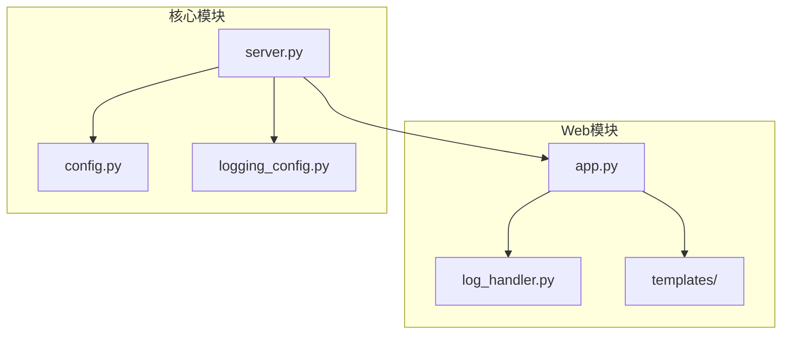
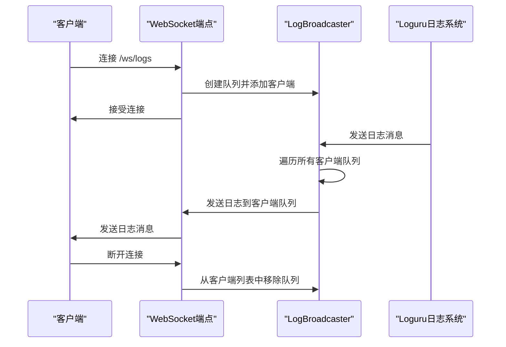
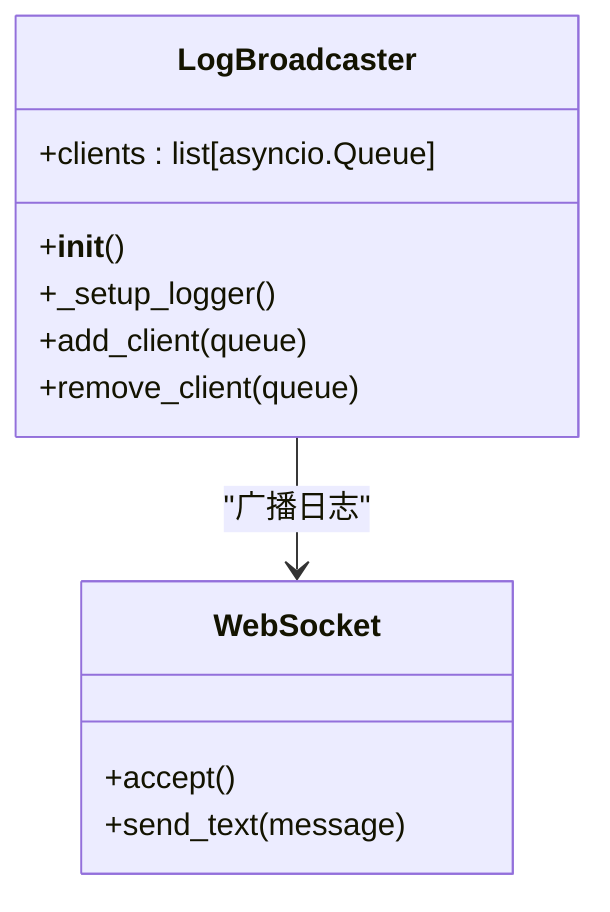
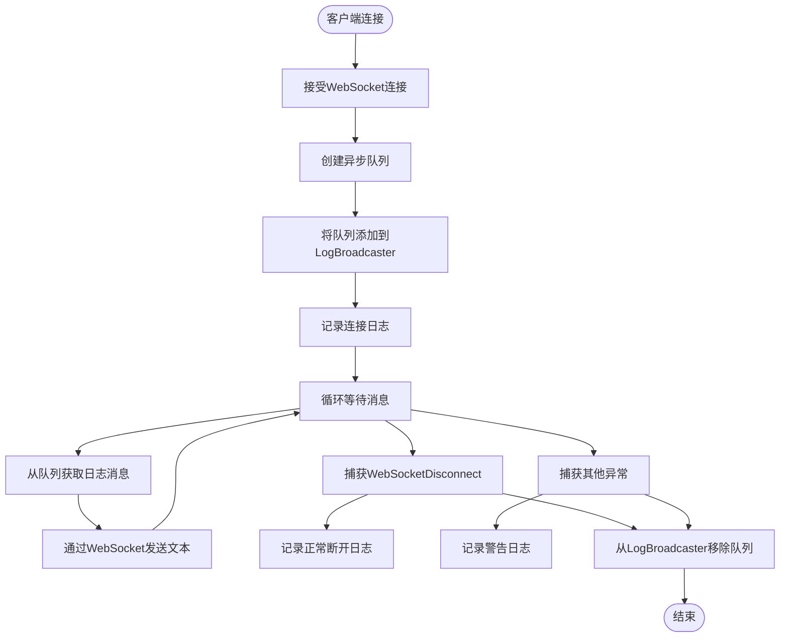
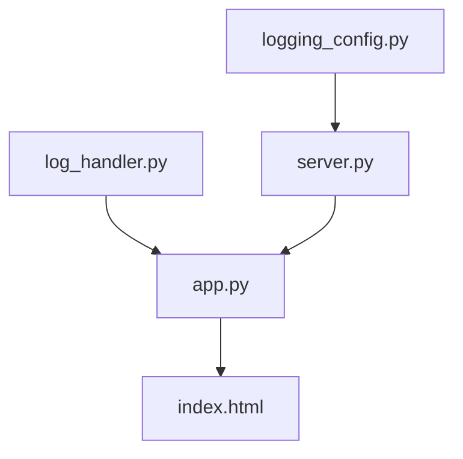
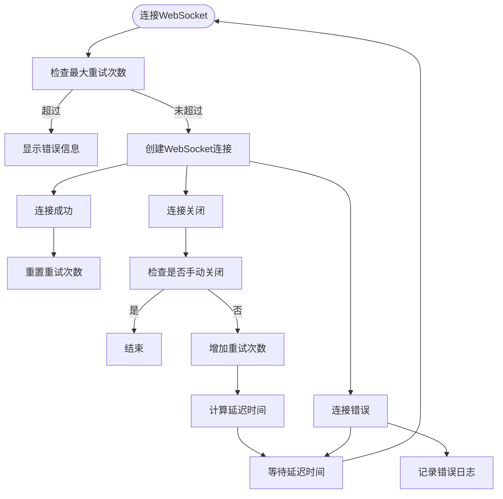

# WebSocket实时日志

<cite>
**本文档引用的文件**
- [app.py](file://src/acemcp/web/app.py)
- [log_handler.py](file://src/acemcp/web/log_handler.py)
- [index.html](file://src/acemcp/web/templates/index.html)
</cite>

## 目录
1. [简介](#简介)
2. [项目结构](#项目结构)
3. [核心组件](#核心组件)
4. [架构概述](#架构概述)
5. [详细组件分析](#详细组件分析)
6. [依赖分析](#依赖分析)
7. [性能考虑](#性能考虑)
8. [故障排除指南](#故障排除指南)
9. [结论](#结论)

## 简介
本文档详细说明了 `/ws/logs` WebSocket端点的实时日志流功能。该功能允许客户端通过WebSocket连接接收服务器端的实时日志消息。文档涵盖了连接建立过程、消息格式、服务端广播机制、客户端处理策略、异常处理以及性能优化建议。

## 项目结构
项目结构清晰地组织了不同功能模块。核心的WebSocket日志功能位于 `src/acemcp/web/` 目录下，其中 `app.py` 定义了FastAPI应用和WebSocket端点，`log_handler.py` 实现了日志广播机制，`templates/index.html` 提供了前端界面。

**图示来源**
- [app.py](file://src/acemcp/web/app.py#L1-L190)
- [log_handler.py](file://src/acemcp/web/log_handler.py#L1-L75)
- [server.py](file://src/acemcp/server.py#L1-L141)

## 核心组件
核心组件包括 `LogBroadcaster` 类，负责将日志消息广播给所有连接的WebSocket客户端，以及 `websocket_logs` WebSocket端点，处理客户端连接和消息发送。

**组件来源**
- [log_handler.py](file://src/acemcp/web/log_handler.py#L11-L57)
- [app.py](file://src/acemcp/web/app.py#L168-L185)

## 架构概述
系统架构采用发布-订阅模式，`LogBroadcaster` 作为发布者，将日志消息推送给所有订阅的WebSocket客户端。

**图示来源**
- [app.py](file://src/acemcp/web/app.py#L168-L185)
- [log_handler.py](file://src/acemcp/web/log_handler.py#L11-L57)

## 详细组件分析

### LogBroadcaster分析
`LogBroadcaster` 类负责管理所有WebSocket客户端的队列，并将日志消息广播给所有客户端。

**图示来源**
- [log_handler.py](file://src/acemcp/web/log_handler.py#L11-L57)

### WebSocket端点分析
`websocket_logs` 端点处理客户端的WebSocket连接，接收日志消息并发送给客户端。

**图示来源**
- [app.py](file://src/acemcp/web/app.py#L168-L185)

## 依赖分析
组件之间的依赖关系清晰，`LogBroadcaster` 被 `app.py` 中的WebSocket端点使用，而前端HTML文件依赖于WebSocket API。

**图示来源**
- [log_handler.py](file://src/acemcp/web/log_handler.py#L63-L72)
- [app.py](file://src/acemcp/web/app.py#L17-L17)

## 性能考虑
在高日志频率下，客户端应实现消息缓冲和节流机制，避免UI卡顿。建议客户端实现日志级别过滤，只显示感兴趣的日志消息。

**组件来源**
- [index.html](file://src/acemcp/web/templates/index.html#L424-L438)

## 故障排除指南
常见问题包括WebSocket连接失败、消息丢失和客户端断开连接。客户端应实现重连机制，在连接断开后自动重试。

**图示来源**
- [index.html](file://src/acemcp/web/templates/index.html#L398-L458)

## 结论
`/ws/logs` WebSocket端点提供了一个高效的实时日志流功能，通过 `LogBroadcaster` 机制将日志消息广播给所有连接的客户端。客户端应实现适当的错误处理和重连机制，以确保日志流的稳定性和可靠性。