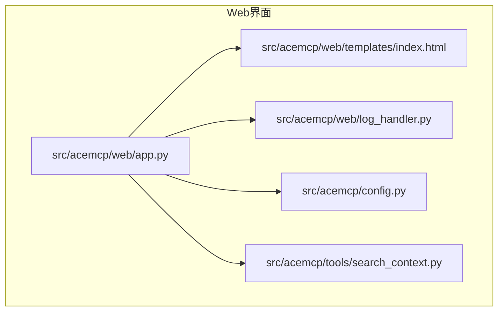
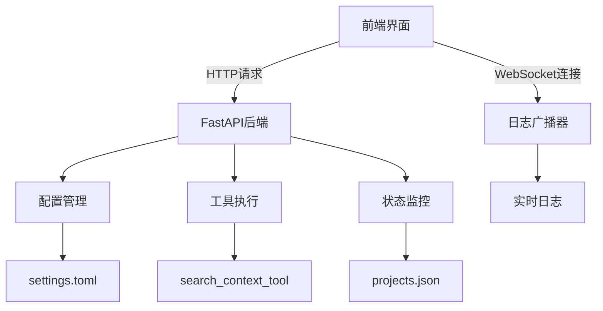
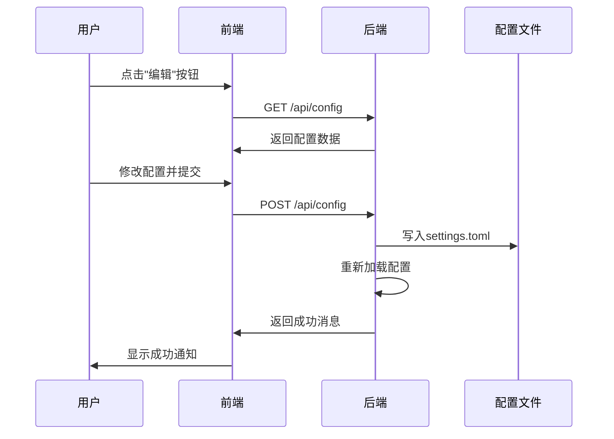
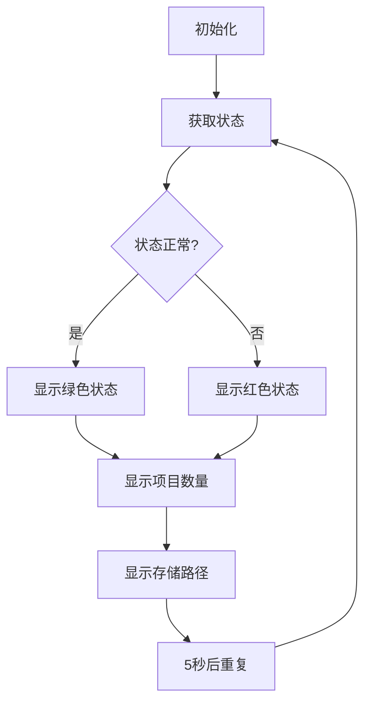
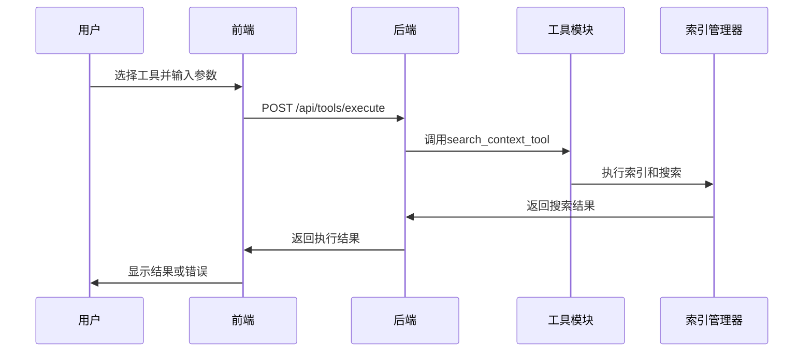
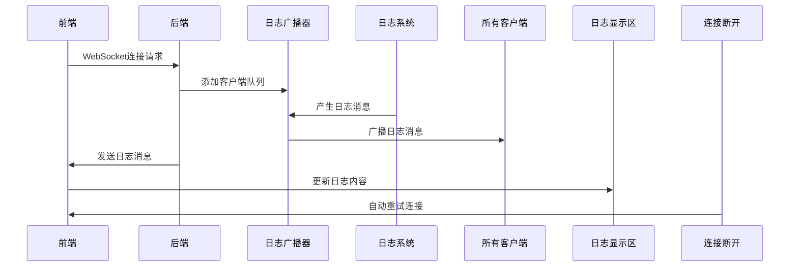
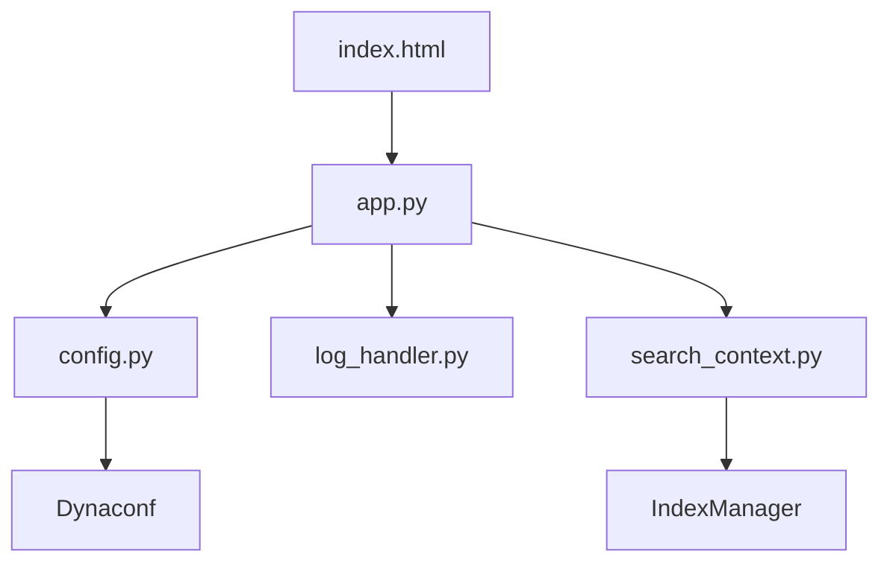

# Web管理界面

<cite>
**本文档引用的文件**
- [app.py](file://src/acemcp/web/app.py)
- [index.html](file://src/acemcp/web/templates/index.html)
- [config.py](file://src/acemcp/config.py)
- [log_handler.py](file://src/acemcp/web/log_handler.py)
- [search_context.py](file://src/acemcp/tools/search_context.py)
</cite>

## 目录
1. [简介](#简介)
2. [项目结构](#项目结构)
3. [核心组件](#核心组件)
4. [架构概述](#架构概述)
5. [详细组件分析](#详细组件分析)
6. [依赖分析](#依赖分析)
7. [性能考虑](#性能考虑)
8. [故障排除指南](#故障排除指南)
9. [结论](#结论)

## 简介
Web管理界面是Acemcp MCP服务器的集中管理平台，提供配置管理、服务器状态监控、工具调试和实时日志查看功能。该界面通过直观的前端HTML模板与强大的后端FastAPI应用集成，使用户能够轻松管理服务器配置、监控运行状态、执行调试工具并实时观察日志输出。界面支持中英文双语切换，确保不同语言背景的用户都能方便使用。

## 项目结构
项目结构清晰地组织了Web管理界面的各个组件，包括后端API、前端模板和配置管理。核心Web功能位于`src/acemcp/web/`目录下，其中`app.py`是FastAPI应用的入口点，`templates/index.html`是主管理页面的HTML模板。配置管理由`config.py`处理，日志广播功能由`log_handler.py`实现。工具调试功能通过`tools/search_context.py`提供。

**图示来源**
- [app.py](file://src/acemcp/web/app.py#L39-L188)
- [index.html](file://src/acemcp/web/templates/index.html#L1-L553)

**本节来源**
- [app.py](file://src/acemcp/web/app.py#L1-L190)
- [index.html](file://src/acemcp/web/templates/index.html#L1-L553)

## 核心组件
Web管理界面的核心组件包括配置管理面板、服务器状态监控、工具调试器和实时日志查看器。后端FastAPI应用通过`app.py`中的`create_app()`函数创建，提供REST API和WebSocket接口。前端使用Alpine.js实现动态交互，通过`x-data="mcpManager()"`初始化管理器对象。配置管理通过`ConfigUpdate`模型处理，工具执行通过`ToolRequest`模型管理，日志广播通过`LogBroadcaster`类实现。

**本节来源**
- [app.py](file://src/acemcp/web/app.py#L21-L37)
- [index.html](file://src/acemcp/web/templates/index.html#L267-L548)
- [log_handler.py](file://src/acemcp/web/log_handler.py#L12-L59)

## 架构概述
Web管理界面采用前后端分离架构，后端使用FastAPI提供API服务，前端使用HTML、Tailwind CSS和Alpine.js构建用户界面。后端通过`app.py`中的路由处理HTTP请求和WebSocket连接，前端通过JavaScript调用API获取数据并更新界面。配置数据存储在用户主目录下的`.acemcp/settings.toml`文件中，索引数据存储在`.acemcp/data/`目录下。

**图示来源**
- [app.py](file://src/acemcp/web/app.py#L51-L187)
- [index.html](file://src/acemcp/web/templates/index.html#L267-L548)

## 详细组件分析

### 配置管理面板分析
配置管理面板允许用户查看和修改服务器配置。界面显示当前配置的只读视图，用户点击"编辑"按钮后可进入编辑模式。配置更新通过`/api/config` POST接口提交，后端将更新写入`settings.toml`文件并重新加载配置。敏感信息如令牌在显示时被掩码处理。

**图示来源**
- [app.py](file://src/acemcp/web/app.py#L59-L119)
- [index.html](file://src/acemcp/web/templates/index.html#L42-L113)

**本节来源**
- [app.py](file://src/acemcp/web/app.py#L21-L30)
- [config.py](file://src/acemcp/config.py#L119-L151)

### 服务器状态监控分析
服务器状态监控组件定期从`/api/status`端点获取服务器状态信息，包括运行状态、已索引项目数量和存储路径。状态信息每5秒自动刷新一次，确保用户始终看到最新的服务器状态。运行状态通过颜色编码显示，绿色表示运行正常，红色表示异常。

**图示来源**
- [app.py](file://src/acemcp/web/app.py#L121-L137)
- [index.html](file://src/acemcp/web/templates/index.html#L28-L39)

**本节来源**
- [app.py](file://src/acemcp/web/app.py#L121-L137)
- [index.html](file://src/acemcp/web/templates/index.html#L267-L548)

### 工具调试器分析
工具调试器允许用户执行调试工具，当前支持`search_context`工具。用户选择工具后输入项目根路径和查询参数，点击"执行工具"按钮后，前端将请求发送到`/api/tools/execute`端点。后端调用相应的工具函数，返回执行结果。工具执行过程中显示"执行中..."状态，防止重复提交。

**图示来源**
- [app.py](file://src/acemcp/web/app.py#L139-L167)
- [search_context.py](file://src/acemcp/tools/search_context.py#L11-L51)
- [index.html](file://src/acemcp/web/templates/index.html#L139-L183)

**本节来源**
- [app.py](file://src/acemcp/web/app.py#L32-L37)
- [search_context.py](file://src/acemcp/tools/search_context.py#L11-L51)

### 实时日志查看器分析
实时日志查看器通过WebSocket连接从服务器接收日志消息。`LogBroadcaster`类管理多个客户端队列，当日志消息产生时广播给所有连接的客户端。前端通过`connectWebSocket()`函数建立连接，监听消息并实时更新日志显示区域。连接断开后会自动重试，最多重试10次。

**图示来源**
- [app.py](file://src/acemcp/web/app.py#L169-L187)
- [log_handler.py](file://src/acemcp/web/log_handler.py#L12-L59)
- [index.html](file://src/acemcp/web/templates/index.html#L267-L548)

**本节来源**
- [app.py](file://src/acemcp/web/app.py#L169-L187)
- [log_handler.py](file://src/acemcp/web/log_handler.py#L12-L59)

## 依赖分析
Web管理界面的组件之间存在清晰的依赖关系。`app.py`依赖`config.py`获取配置，依赖`log_handler.py`实现日志广播，依赖`tools/search_context.py`执行调试工具。前端`index.html`依赖`app.py`提供的API端点获取数据。配置管理模块`config.py`使用Dynaconf库管理配置文件。

**图示来源**
- [app.py](file://src/acemcp/web/app.py#L14-L15)
- [config.py](file://src/acemcp/config.py#L6-L7)
- [log_handler.py](file://src/acemcp/web/log_handler.py#L6-L7)

**本节来源**
- [app.py](file://src/acemcp/web/app.py#L14-L15)
- [config.py](file://src/acemcp/config.py#L6-L7)

## 性能考虑
Web管理界面在设计时考虑了性能优化。配置加载和状态查询使用异步操作，避免阻塞主线程。日志广播使用队列机制，确保日志消息不会丢失。工具执行支持重试机制，应对网络不稳定情况。前端实现连接重试和错误处理，提高用户体验。建议定期清理日志以避免内存占用过高。

## 故障排除指南
当Web管理界面出现问题时，可参考以下故障排除步骤：检查`settings.toml`配置文件是否存在且格式正确；验证服务器是否正在运行；检查网络连接是否正常；查看日志文件以获取错误信息；尝试清除浏览器缓存后重新加载页面。对于工具执行失败，检查项目路径是否正确，查询参数是否有效。

**本节来源**
- [app.py](file://src/acemcp/web/app.py#L87-L89)
- [config.py](file://src/acemcp/config.py#L86-L105)
- [index.html](file://src/acemcp/web/templates/index.html#L391-L458)

## 结论
Web管理界面为Acemcp MCP服务器提供了全面的管理功能，通过直观的用户界面和强大的后端支持，使用户能够轻松管理服务器配置、监控运行状态、执行调试工具和查看实时日志。界面设计考虑了用户体验和性能优化，支持中英文双语切换，适合不同语言背景的用户使用。未来可扩展更多调试工具和监控指标，进一步提升管理效率。