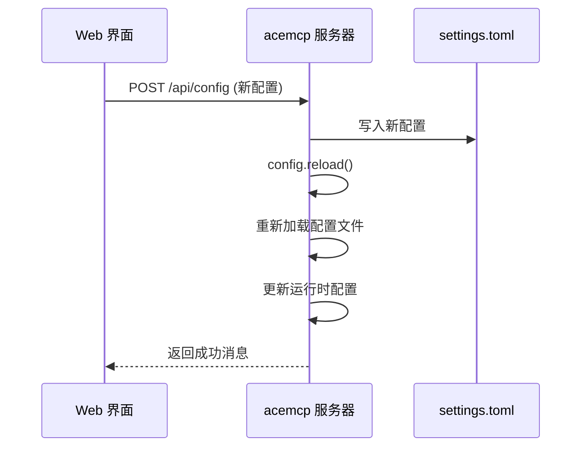

# 安装与配置

<cite>
**本文档中引用的文件**  
- [README.md](file://README.md)
- [pyproject.toml](file://pyproject.toml)
- [src/acemcp/config.py](file://src/acemcp/config.py)
- [src/acemcp/server.py](file://src/acemcp/server.py)
- [src/acemcp/web/app.py](file://src/acemcp/web/app.py)
- [src/acemcp/web/templates/index.html](file://src/acemcp/web/templates/index.html)
</cite>

## 目录
1. [安装](#安装)
2. [MCP 客户端配置](#mcp-客户端配置)
3. [配置管理系统](#配置管理系统)
4. [配置优先级](#配置优先级)
5. [Web 界面配置管理](#web-界面配置管理)
6. [常见配置问题排查](#常见配置问题排查)

## 安装

acemcp 可通过 `uv` 工具轻松安装，支持系统级安装和临时运行两种方式。

### 作为工具安装（推荐）

使用 `uv` 将 acemcp 安装到系统中，使其成为全局可用的命令行工具：

```bash
uv tool install acemcp
```

此命令会将 acemcp 安装到系统的可执行路径中，之后可直接通过 `acemcp` 命令启动服务。

### 临时运行（无需安装）

若不想永久安装，可使用 `uvx` 临时运行 acemcp，此方式不会在系统中留下任何文件：

```bash
uvx acemcp
```

`uvx` 会自动下载并运行 acemcp，适用于一次性使用或测试场景。

### 开发安装

对于开发者，可通过克隆仓库进行源码安装：

```bash
# 克隆仓库
git clone https://github.com/qy527145/acemcp.git
cd acemcp

# 安装依赖
uv sync

# 运行
uv run acemcp
```

此方式适用于需要修改源码或参与项目开发的用户。

**Section sources**
- [README.md](file://README.md#L11-L35)

## MCP 客户端配置

要将 acemcp 集成到 MCP 客户端（如 Claude Desktop），需在客户端的配置文件中添加相应的服务器定义。

### 基础配置

最简单的配置仅需指定命令和参数：

```json
{
  "mcpServers": {
    "acemcp": {
      "command": "uvx",
      "args": [
        "acemcp"
      ]
    }
  }
}
```

此配置使用 `uvx` 临时运行 acemcp，无需预先安装。

### 启用 Web 管理界面的配置

要启用 Web 管理界面，需在启动参数中添加 `--web-port`，指定监听端口：

```json
{
  "mcpServers": {
    "acemcp": {
      "command": "uvx",
      "args": [
        "acemcp",
        "--web-port",
        "8888"
      ]
    }
  }
}
```

配置完成后，启动 MCP 客户端，acemcp 服务将自动启动，并在 `http://localhost:8888` 提供 Web 管理界面。

**可用的命令行参数：**
- `--base-url`: 覆盖 BASE_URL 配置
- `--token`: 覆盖 TOKEN 配置
- `--web-port`: 在指定端口启用 Web 管理界面（例如 8080）

**Section sources**
- [README.md](file://README.md#L64-L108)

## 配置管理系统

acemcp 采用多层级配置系统，支持配置文件、环境变量和命令行参数三种方式。

### 配置文件

首次运行时，acemcp 会自动在 `~/.acemcp/settings.toml` 创建配置文件，包含默认值。用户可编辑此文件进行持久化配置。

**配置文件结构（settings.toml）：**

```toml
BATCH_SIZE = 10
MAX_LINES_PER_BLOB = 800
BASE_URL = "https://your-api-endpoint.com"
TOKEN = "your-bearer-token-here"
TEXT_EXTENSIONS = [".py", ".js", ".ts", ...]
EXCLUDE_PATTERNS = [".venv", "node_modules", ".git", "__pycache__", "*.pyc", ...]
```

**支持的配置项：**
- **BATCH_SIZE**: 每批上传的文件数量（默认：10）
- **MAX_LINES_PER_BLOB**: 大文件分割前的最大行数（默认：800）
- **BASE_URL**: API 端点 URL
- **TOKEN**: 认证令牌
- **TEXT_EXTENSIONS**: 要索引的文件扩展名列表
- **EXCLUDE_PATTERNS**: 要排除的模式列表（支持通配符如 `*.pyc`）

### 环境变量

所有配置项均可通过环境变量设置，环境变量名需以 `ACEMCP_` 为前缀。例如：
- `ACEMCP_BASE_URL`: 设置 API 端点
- `ACEMCP_TOKEN`: 设置认证令牌
- `ACEMCP_BATCH_SIZE`: 设置批次大小

环境变量适用于在不同环境（开发、测试、生产）中动态调整配置。

### 配置数据存储

acemcp 的数据存储遵循以下路径约定：
- **配置文件**: `~/.acemcp/settings.toml`
- **已索引项目**: `~/.acemcp/data/projects.json`（固定位置）
- **日志文件**: `~/.acemcp/log/acemcp.log`（自动轮转）

**Section sources**
- [README.md](file://README.md#L37-L58)
- [src/acemcp/config.py](file://src/acemcp/config.py#L80-L84)

## 配置优先级

acemcp 遵循明确的配置优先级规则，确保配置的灵活性和可覆盖性。

### 优先级顺序

配置的优先级从高到低为：
1. **命令行参数**（最高优先级）
2. **环境变量**（`ACEMCP_` 前缀）
3. **配置文件**（`settings.toml`，最低优先级）

这意味着，如果同一配置项在多个层级中定义，命令行参数将覆盖环境变量，环境变量将覆盖配置文件中的值。

### 优先级实现机制

在 `src/acemcp/server.py` 的 `main` 函数中，首先调用 `init_config` 初始化配置，该函数接收命令行参数作为输入。随后在 `Config` 类的 `__init__` 方法中，优先使用命令行参数的值，若未提供则回退到从配置文件或环境变量中读取的值。

```python
def __init__(self, base_url: str | None = None, token: str | None = None) -> None:
    self._cli_base_url = base_url
    self._cli_token = token
    self.base_url: str = base_url or settings.get("BASE_URL", DEFAULT_CONFIG["BASE_URL"])
    self.token: str = token or settings.get("TOKEN", DEFAULT_CONFIG["TOKEN"])
```

此设计确保了命令行参数具有最高优先级。

**Section sources**
- [README.md](file://README.md#L59-L62)
- [src/acemcp/config.py](file://src/acemcp/config.py#L122-L137)
- [src/acemcp/server.py](file://src/acemcp/server.py#L87-L95)

## Web 界面配置管理

acemcp 提供了功能丰富的 Web 管理界面，允许用户通过浏览器进行可视化配置管理。

### 启用 Web 界面

要启用 Web 界面，必须在 MCP 客户端配置中添加 `--web-port` 参数，例如：

```json
"args": [
  "acemcp",
  "--web-port",
  "8888"
]
```

启动服务后，访问 `http://localhost:8888` 即可打开管理界面。

### Web 管理功能

Web 界面提供以下核心功能：

#### 配置管理
- **查看配置**：实时显示当前所有配置项的值。
- **编辑配置**：通过表单修改 `BASE_URL`、`TOKEN`、`BATCH_SIZE`、`MAX_LINES_PER_BLOB`、`TEXT_EXTENSIONS` 和 `EXCLUDE_PATTERNS` 等配置。
- **保存配置**：修改后点击“保存更改”，配置将被写入 `~/.acemcp/settings.toml` 文件并立即生效。

#### 实时日志
- **日志流**：通过 WebSocket 实时显示服务器日志，支持自动滚动。
- **智能重连**：采用指数退避策略（1秒 → 1.5秒 → 2.25秒 ... 最大 30秒）进行自动重连，最多尝试 10 次。
- **日志过滤**：WebSocket 连接日志记录在 DEBUG 级别，减少 INFO 级别的日志噪音。

#### 工具调试器
- **工具测试**：可直接在 Web 界面测试 `search_context` 工具。
- **参数输入**：输入项目根路径和查询语句。
- **结果查看**：查看格式化的执行结果和错误消息，便于调试。

### 配置热重载机制

当通过 Web 界面或外部方式修改配置文件后，acemcp 能够自动检测到变化并重新加载配置，无需重启服务。

**实现原理：**
1. Web 界面通过 `/api/config` 的 POST 端点接收新的配置。
2. 服务端将新配置写入 `settings.toml` 文件。
3. 调用 `config.reload()` 方法，该方法会触发 `dynaconf` 重新加载配置文件。
4. `Config` 类的 `reload` 方法会更新所有配置项，并保留命令行参数的覆盖值。

```python
def reload(self) -> None:
    settings.reload()
    self.base_url = self._cli_base_url or settings.get("BASE_URL", DEFAULT_CONFIG["BASE_URL"])
    self.token = self._cli_token or settings.get("TOKEN", DEFAULT_CONFIG["TOKEN"])
```

此机制确保了配置更新的即时性和服务的高可用性。



**Diagram sources**
- [src/acemcp/web/app.py](file://src/acemcp/web/app.py#L73-L118)
- [src/acemcp/config.py](file://src/acemcp/config.py#L140-L148)

**Section sources**
- [README.md](file://README.md#L108-L120)
- [src/acemcp/web/app.py](file://src/acemcp/web/app.py#L38-L187)
- [src/acemcp/web/templates/index.html](file://src/acemcp/web/templates/index.html#L1-L553)

## 常见配置问题排查

以下是使用 acemcp 时可能遇到的常见配置问题及其解决方案。

### 1. 配置文件未创建

**问题现象**：首次运行 acemcp 后，`~/.acemcp/settings.toml` 文件不存在。

**解决方案**：
- 确保用户主目录（`~`）可写。
- 检查磁盘空间是否充足。
- 手动创建目录：`mkdir -p ~/.acemcp`，然后重新运行 acemcp。

### 2. BASE_URL 或 TOKEN 未配置

**问题现象**：服务启动失败，日志中出现 "BASE_URL must be configured" 或 "TOKEN must be configured" 错误。

**解决方案**：
- 检查 `settings.toml` 文件中的 `BASE_URL` 和 `TOKEN` 是否已正确设置。
- 通过命令行参数覆盖：`uvx acemcp --base-url https://your-api.com --token your-token`。
- 通过环境变量设置：`ACEMCP_BASE_URL=https://your-api.com uvx acemcp`。

### 3. Web 界面无法访问

**问题现象**：访问 `http://localhost:8888` 时连接被拒绝。

**解决方案**：
- 确认 MCP 客户端配置中已添加 `--web-port 8888` 参数。
- 检查端口是否被其他程序占用：`lsof -i :8888`。
- 查看服务日志，确认 Web 服务器是否成功启动。

### 4. 配置更新后未生效

**问题现象**：修改 `settings.toml` 文件后，服务仍使用旧配置。

**解决方案**：
- 确认修改的是正确的文件路径 `~/.acemcp/settings.toml`。
- 检查是否有命令行参数或环境变量覆盖了配置文件的值。
- 重启 acemcp 服务以强制重新加载配置。

### 5. 文件索引失败

**问题现象**：`search_context` 工具返回空结果或错误。

**解决方案**：
- 检查 `TEXT_EXTENSIONS` 是否包含目标文件的扩展名。
- 检查 `EXCLUDE_PATTERNS` 是否意外排除了目标文件。
- 查看日志文件 `~/.acemcp/log/acemcp.log` 获取详细错误信息。

**Section sources**
- [README.md](file://README.md#L300-L312)
- [src/acemcp/config.py](file://src/acemcp/config.py#L152-L165)
- [src/acemcp/logging_config.py](file://src/acemcp/logging_config.py#L30-L36)