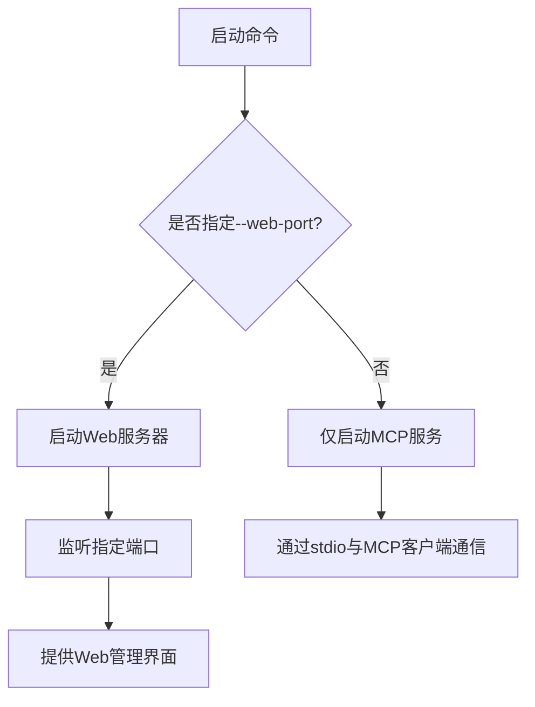
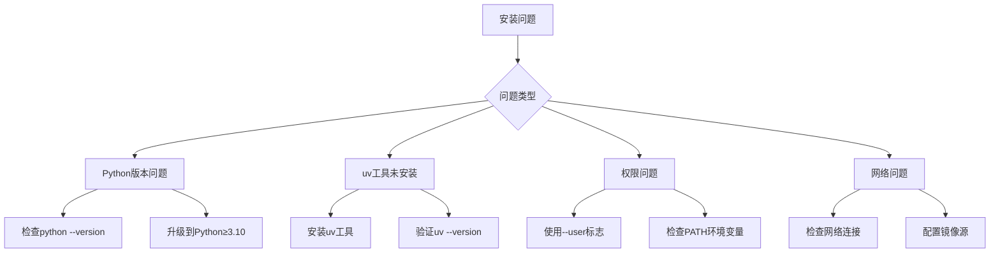

# 安装指南

<cite>
**Referenced Files in This Document**   
- [README.md](file://README.md)
- [pyproject.toml](file://pyproject.toml)
- [server.py](file://src/acemcp/server.py)
- [config.py](file://src/acemcp/config.py)
- [app.py](file://src/acemcp/web/app.py)
- [search_context.py](file://src/acemcp/tools/search_context.py)
- [log_handler.py](file://src/acemcp/web/log_handler.py)
</cite>

## 目录
1. [安装方法](#安装方法)
2. [依赖项管理](#依赖项管理)
3. [MCP客户端集成](#mcp客户端集成)
4. [服务启动与端口](#服务启动与端口)
5. [安装故障排除](#安装故障排除)

## 安装方法

acemcp提供了两种安装方式，推荐使用uv工具进行安装。

### 使用uv工具安装（推荐）

使用uv工具可以将acemcp安装到系统中，使其成为全局可用的命令行工具：

```bash
# 安装到系统
uv tool install acemcp

# 或临时运行（无需安装）
uvx acemcp
```

这种安装方式会自动处理所有依赖项，并将acemcp命令添加到系统路径中，使得在任何位置都可以直接调用。

### 开发安装

对于开发者或需要修改源码的用户，可以使用开发模式安装：

```bash
# 克隆仓库
git clone https://github.com/qy527145/acemcp.git
cd acemcp

# 安装依赖
uv sync

# 运行
uv run acemcp
```

开发安装方式允许直接修改源代码并立即测试更改，适合贡献代码或进行深度定制。

**Section sources**
- [README.md](file://README.md#L1-L350)

## 依赖项管理

acemcp通过pyproject.toml文件管理其依赖项，使用uv工具进行依赖安装和管理。

### 核心依赖项

项目依赖以下主要库：

- **FastAPI**: 用于Web管理界面的API框架
- **dynaconf**: 用于配置管理
- **mcp**: MCP服务器核心库
- **loguru**: 用于日志记录
- **httpx**: 用于HTTP客户端功能
- **uvicorn**: 用于ASGI服务器
- **toml**: 用于配置文件解析
- **websockets**: 用于WebSocket功能
- **pathspec**: 用于.gitignore模式匹配

这些依赖项在安装acemcp时会自动安装，无需手动干预。

### 依赖项自动安装机制

当使用`uv tool install acemcp`命令时，uv工具会自动读取pyproject.toml文件中的依赖项列表，并安装所有必需的包。安装过程包括：

1. 解析pyproject.toml中的dependencies字段
2. 下载并安装指定版本的每个依赖包
3. 处理依赖项之间的版本兼容性
4. 将所有包安装到隔离的环境或系统路径中

这种自动化机制确保了每次安装都能获得正确版本的依赖项，避免了版本冲突问题。

**Section sources**
- [pyproject.toml](file://pyproject.toml#L1-L114)
- [README.md](file://README.md#L1-L350)

## MCP客户端集成

要将acemcp集成到MCP客户端（如Claude Desktop）中，需要在客户端配置文件中添加相应的服务器配置。

### 基础配置

最简单的配置方式是使用uvx命令直接运行acemcp：

```json
{
  "mcpServers": {
    "acemcp": {
      "command": "uvx",
      "args": [
        "acemcp"
      ]
    }
  }
}
```

### 启用Web管理界面的配置

要启用Web管理界面，需要添加`--web-port`参数来指定监听端口：

```json
{
  "mcpServers": {
    "acemcp": {
      "command": "uvx",
      "args": [
        "acemcp",
        "--web-port",
        "8888"
      ]
    }
  }
}
```

配置完成后，MCP客户端会在需要时自动启动acemcp服务器，并通过标准输入输出与之通信。

**Section sources**
- [README.md](file://README.md#L64-L108)
- [server.py](file://src/acemcp/server.py#L1-L141)

## 服务启动与端口

acemcp服务的启动方式和端口配置如下：

### 默认启动方式

服务可以通过多种方式启动：

1. **作为MCP服务器**：由MCP客户端自动启动
2. **命令行启动**：使用`uvx acemcp`命令
3. **带Web界面启动**：使用`uvx acemcp --web-port 8888`命令

### 端口配置

Web管理界面默认在8888端口上运行。可以通过`--web-port`命令行参数指定其他端口：

```bash
# 在8888端口启动Web界面
uvx acemcp --web-port 8888

# 在其他端口启动，如9000
uvx acemcp --web-port 9000
```

启动后，可以通过访问`http://localhost:8888`来使用Web管理界面，该界面提供实时日志、配置管理和工具调试功能。



**Diagram sources**
- [server.py](file://src/acemcp/server.py#L68-L85)
- [app.py](file://src/acemcp/web/app.py#L39-L189)

**Section sources**
- [README.md](file://README.md#L87-L108)
- [server.py](file://src/acemcp/server.py#L68-L114)

## 安装故障排除

以下是安装acemcp时可能遇到的常见问题及其解决方案。

### Python版本不兼容

**问题描述**：acemcp需要Python 3.10或更高版本。如果系统中安装的Python版本过低，安装会失败。

**解决方案**：
1. 检查Python版本：`python --version` 或 `python3 --version`
2. 如果版本低于3.10，需要升级Python
3. 推荐使用pyenv或conda来管理Python版本
4. 安装完成后重新尝试安装acemcp

### uv工具未安装

**问题描述**：如果系统中没有安装uv工具，`uv tool install acemcp`命令会失败。

**解决方案**：
1. 安装uv工具：
   ```bash
   # 使用pipx安装（推荐）
   pipx install uv
   
   # 或使用curl安装
   curl -LsSf https://astral.sh/uv/install.sh | sh
   ```
2. 验证安装：`uv --version`
3. 重新尝试安装acemcp

### 权限问题

**问题描述**：在某些系统上，可能因为权限不足而无法将工具安装到系统路径。

**解决方案**：
1. 使用用户级安装：
   ```bash
   uv tool install --user acemcp
   ```
2. 确保用户bin目录在PATH环境变量中
3. 或者使用虚拟环境进行安装

### 验证安装结果

安装完成后，可以通过以下方式验证安装是否成功：

1. **检查版本**：
   ```bash
   uvx acemcp --help
   ```
2. **测试运行**：
   ```bash
   uvx acemcp --web-port 8888
   ```
   然后访问`http://localhost:8888`查看Web界面是否正常显示
3. **检查依赖**：
   ```bash
   uv tool list
   ```
   确认acemcp在已安装工具列表中



**Diagram sources**
- [README.md](file://README.md#L1-L350)
- [pyproject.toml](file://pyproject.toml#L9-L20)

**Section sources**
- [README.md](file://README.md#L1-L350)
- [config.py](file://src/acemcp/config.py#L1-L200)
- [pyproject.toml](file://pyproject.toml#L9-L20)