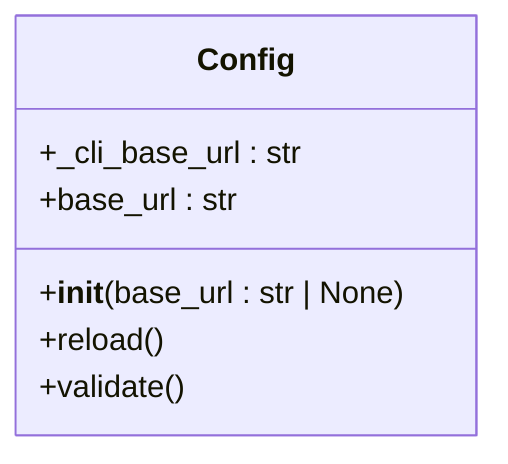
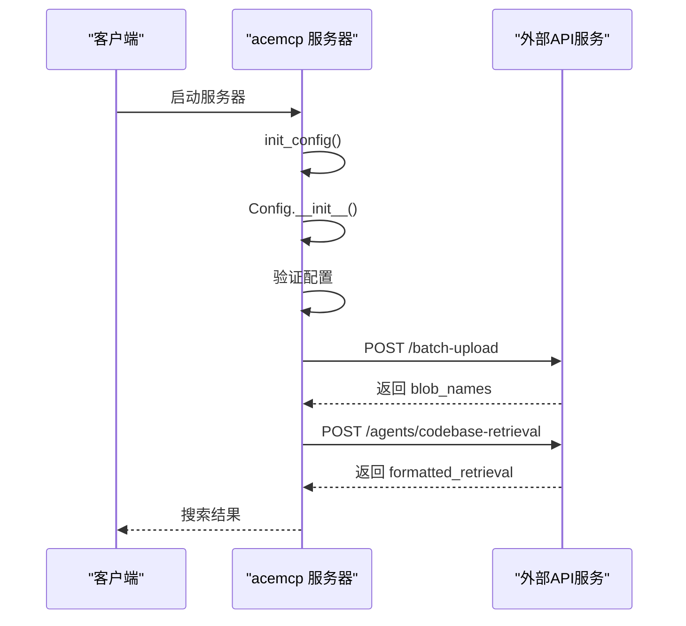
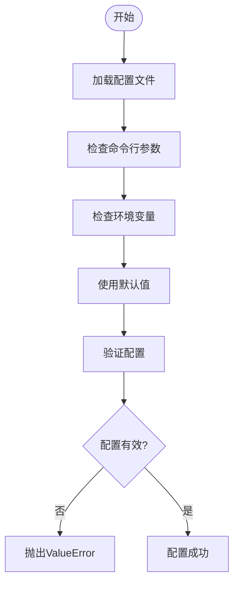
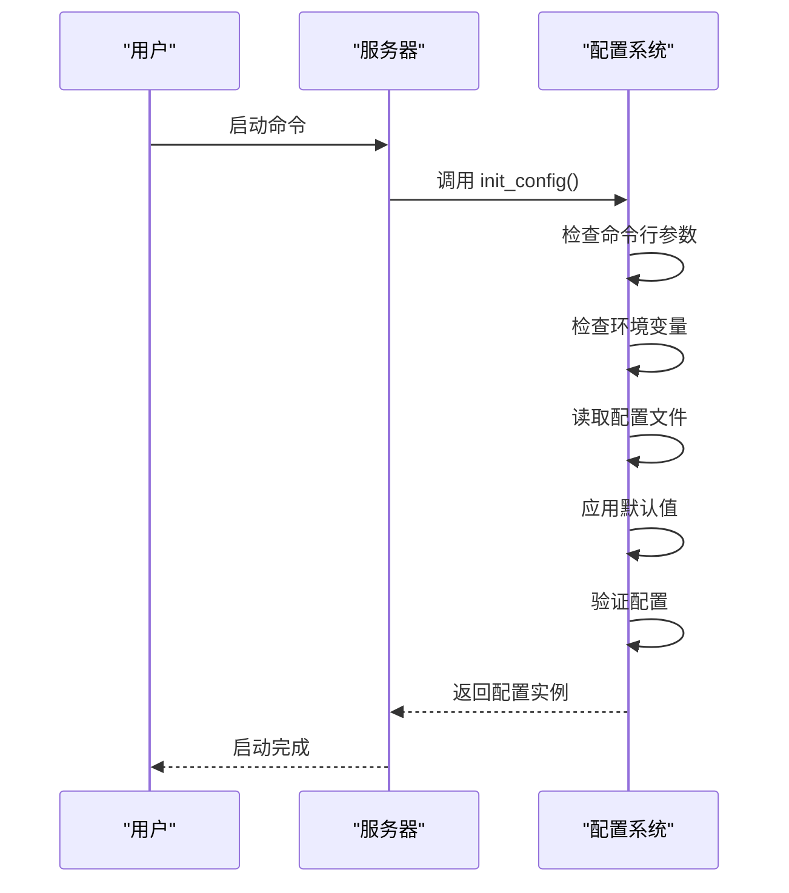
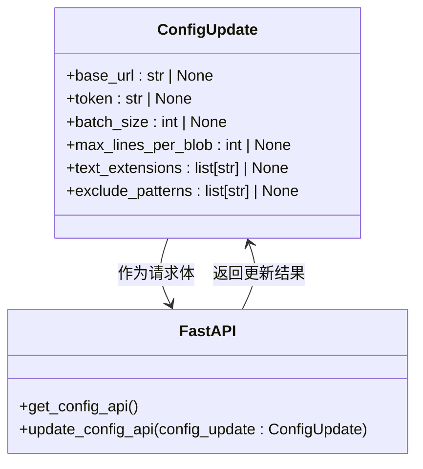
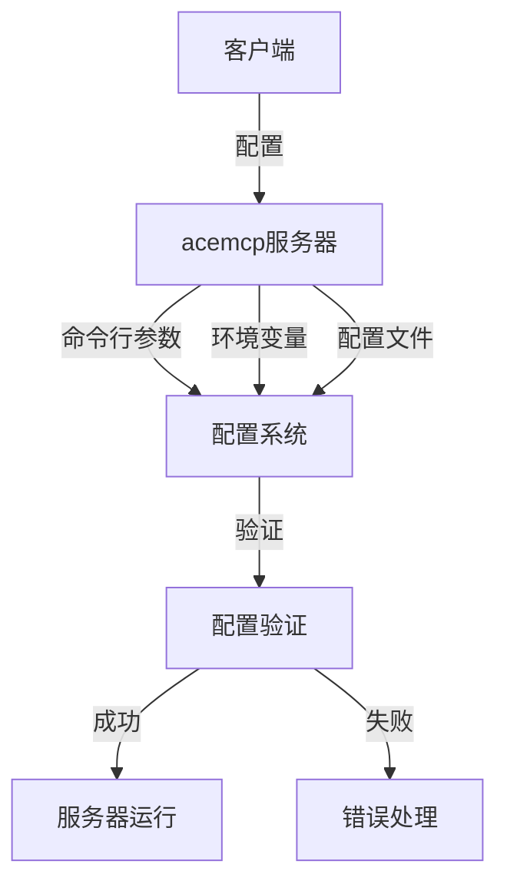
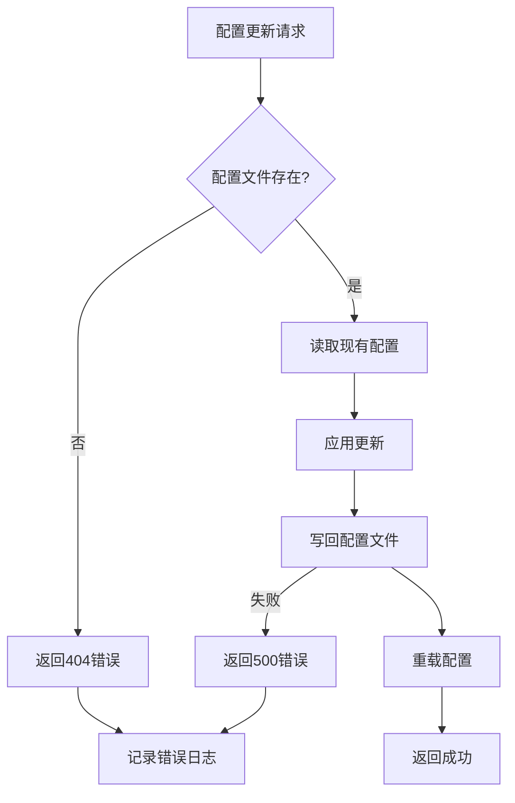
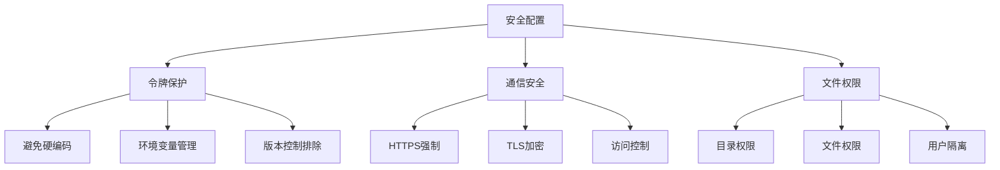

# 认证配置

<cite>
**本文档中引用的文件**
- [config.py](file://src/acemcp/config.py)
- [server.py](file://src/acemcp/server.py)
- [app.py](file://src/acemcp/web/app.py)
- [logging_config.py](file://src/acemcp/logging_config.py)
- [manager.py](file://src/acemcp/index/manager.py)
- [search_context.py](file://src/acemcp/tools/search_context.py)
- [log_handler.py](file://src/acemcp/web/log_handler.py)
- [pyproject.toml](file://pyproject.toml)
- [README.md](file://README.md)
- [URL_TOKEN.md](file://URL_TOKEN.md)
</cite>

## 目录
1. [简介](#简介)
2. [认证配置概述](#认证配置概述)
3. [配置项详解](#配置项详解)
4. [配置优先级](#配置优先级)
5. [Web管理界面配置](#web管理界面配置)
6. [MCP客户端配置](#mcp客户端配置)
7. [配置验证与错误处理](#配置验证与错误处理)
8. [安全考虑](#安全考虑)
9. [总结](#总结)

## 简介

`acemcp` 是一个用于代码库索引和语义搜索的 MCP 服务器。该系统通过 `BASE_URL` 和 `TOKEN` 与外部代码分析 API 服务进行通信，实现代码的索引化和检索功能。本文档详细说明了认证配置的各个方面，包括配置文件、环境变量、命令行参数以及 Web 管理界面的使用方法。

**认证配置的核心作用**：
- `BASE_URL`：指定外部代码分析 API 服务的端点 URL
- `TOKEN`：提供 API 服务的认证令牌，确保通信安全

这些配置项是系统正常运行的基础，决定了服务器与外部服务的连接方式和认证机制。

## 认证配置概述

`acemcp` 的认证配置系统设计为多层次、多来源的灵活架构，允许用户通过多种方式设置 `BASE_URL` 和 `TOKEN`。系统在启动时会按照预定义的优先级顺序加载配置，确保用户能够方便地进行配置管理。

### 配置来源

系统支持以下四种配置来源，按优先级从高到低排列：

1. **命令行参数**：最高优先级，直接在启动命令中指定
2. **环境变量**：以 `ACEMCP_` 为前缀的环境变量
3. **用户配置文件**：位于 `~/.acemcp/settings.toml` 的 TOML 文件
4. **默认值**：代码中定义的默认配置值

这种分层配置机制使得用户可以在不同场景下灵活选择最合适的配置方式，从开发调试到生产部署都能得到良好支持。

### 配置文件结构

首次运行时，系统会自动创建用户配置文件 `~/.acemcp/settings.toml`，其内容基于默认配置：

```toml
BATCH_SIZE = 10
MAX_LINES_PER_BLOB = 800
BASE_URL = "https://api.example.com"
TOKEN = "your-token-here"
TEXT_EXTENSIONS = [".py", ".js", ".ts", ...]
EXCLUDE_PATTERNS = [".venv", "node_modules", ".git", "__pycache__", "*.pyc", ...]
```

**Section sources**
- [config.py](file://src/acemcp/config.py#L9-L77)
- [README.md](file://README.md#L37-L49)

## 配置项详解

### BASE_URL

**数据类型**: 字符串 (str)  
**默认值**: `"https://api.example.com"`  
**作用**: 外部代码分析 API 服务的端点 URL

`BASE_URL` 配置项指定了系统与外部服务通信的基础地址。该 URL 用于构建两个关键 API 端点：
- 批量上传: `{BASE_URL}/batch-upload`
- 代码库检索: `{BASE_URL}/agents/codebase-retrieval`

系统通过 `config.py` 中的 `Config` 类管理此配置项，支持从命令行参数、环境变量或配置文件中读取值。



**Diagram sources**
- [config.py](file://src/acemcp/config.py#L118-L164)

**Section sources**
- [config.py](file://src/acemcp/config.py#L135-L135)
- [config.py](file://src/acemcp/config.py#L147-L147)
- [URL_TOKEN.md](file://URL_TOKEN.md#L9-L15)

### TOKEN

**数据类型**: 字符串 (str)  
**默认值**: `"your-token-here"`  
**作用**: API 服务的认证令牌

`TOKEN` 配置项用于身份验证，系统在向外部 API 发送请求时，会将其作为 Bearer 令牌包含在 Authorization 头部中：

```
Authorization: Bearer {TOKEN}
```

与 `BASE_URL` 类似，`TOKEN` 也通过 `Config` 类进行管理，并在 `validate()` 方法中进行有效性检查，确保配置值不为空。



**Diagram sources**
- [URL_TOKEN.md](file://URL_TOKEN.md#L22-L72)
- [server.py](file://src/acemcp/server.py#L97-L103)

**Section sources**
- [config.py](file://src/acemcp/config.py#L136-L136)
- [config.py](file://src/acemcp/config.py#L148-L148)
- [URL_TOKEN.md](file://URL_TOKEN.md#L16-L19)

### 其他相关配置项

除了核心的认证配置外，系统还包含多个辅助配置项，共同构成完整的配置体系：

#### BATCH_SIZE

**数据类型**: 整数 (int)  
**默认值**: 800  
**有效范围**: 正整数 (> 0)  
**作用**: 决定单个文本片段的最大行数，防止上下文过载。当文件行数超过此限制时，系统会自动将文件分割成多个块进行处理。该配置通过`settings.get("MAX_LINES_PER_BLOB", DEFAULT_CONFIG["MAX_LINES_PER_BLOB"])`获取，并在`validate()`方法中进行有效性检查。

**Section sources**
- [config.py](file://src/acemcp/config.py#L134-L134)
- [config.py](file://src/acemcp/config.py#L146-L146)
- [config.py](file://src/acemcp/config.py#L157-L159)

#### TEXT_EXTENSIONS

**数据类型**: 字符串列表 (list[str])  
**默认值**: 包含多种编程语言扩展名的列表  
**作用**: 定义需要索引的文件扩展名，确保只处理文本文件

#### EXCLUDE_PATTERNS

**数据类型**: 字符串列表 (list[str])  
**默认值**: 包含常见排除模式的列表  
**作用**: 定义需要排除的文件或目录模式，支持通配符匹配



**Diagram sources**
- [config.py](file://src/acemcp/config.py#L152-L165)

**Section sources**
- [config.py](file://src/acemcp/config.py#L15-L44)
- [config.py](file://src/acemcp/config.py#L45-L77)

## 配置优先级

系统的配置优先级机制确保了配置管理的灵活性和可预测性。当同一配置项在多个来源中存在时，系统会按照以下顺序进行选择：

### 优先级层次

1. **命令行参数**（最高优先级）
   - 通过 `--base-url` 和 `--token` 参数指定
   - 直接覆盖其他所有配置来源

2. **环境变量**
   - 使用 `ACEMCP_BASE_URL` 和 `ACEMCP_TOKEN` 环境变量
   - 适用于容器化部署和 CI/CD 环境

3. **用户配置文件**
   - 位于 `~/.acemcp/settings.toml`
   - 适用于持久化配置和多项目管理

4. **默认值**（最低优先级）
   - 在 `config.py` 中定义的默认值
   - 仅在没有其他配置时使用

### 初始化流程



**Diagram sources**
- [URL_TOKEN.md](file://URL_TOKEN.md#L23-L37)
- [server.py](file://src/acemcp/server.py#L118-L137)

**Section sources**
- [config.py](file://src/acemcp/config.py#L182-L194)
- [server.py](file://src/acemcp/server.py#L118-L137)

## Web管理界面配置

Web 管理界面提供了图形化的配置管理功能，使用户能够方便地查看和修改服务器配置。

### 启用Web界面

通过 `--web-port` 命令行参数启用 Web 管理界面：

```json
{
  "mcpServers": {
    "acemcp": {
      "command": "uvx",
      "args": [
        "acemcp",
        "--web-port",
        "8888"
      ]
    }
  }
}
```

启动后，可通过 `http://localhost:8888` 访问管理界面。

### 配置管理功能

Web 界面提供以下配置管理功能：

- **实时配置查看**：显示当前所有配置项的值
- **配置编辑**：通过表单修改配置并立即生效
- **敏感信息保护**：令牌值在界面中被掩码显示（`***`）
- **完整令牌访问**：通过 `token_full` 字段提供完整令牌的 API 访问



**Diagram sources**
- [app.py](file://src/acemcp/web/app.py#L20-L28)
- [app.py](file://src/acemcp/web/app.py#L73-L118)

**Section sources**
- [app.py](file://src/acemcp/web/app.py#L20-L28)
- [app.py](file://src/acemcp/web/app.py#L58-L71)
- [app.py](file://src/acemcp/web/app.py#L73-L118)

## MCP客户端配置

为了在 MCP 客户端中使用 `acemcp` 服务器，需要在客户端配置文件中添加相应的服务器定义。

### 基础配置

```json
{
  "mcpServers": {
    "acemcp": {
      "command": "uvx",
      "args": [
        "acemcp"
      ]
    }
  }
}
```

### 启用Web界面的配置

```json
{
  "mcpServers": {
    "acemcp": {
      "command": "uvx",
      "args": [
        "acemcp",
        "--web-port",
        "8888"
      ]
    }
  }
}
```

### 可用命令行参数

- `--base-url`: 覆盖 BASE_URL 配置
- `--token`: 覆盖 TOKEN 配置
- `--web-port`: 启用 Web 管理界面并指定端口



**Diagram sources**
- [README.md](file://README.md#L64-L104)
- [pyproject.toml](file://pyproject.toml#L22-L23)

**Section sources**
- [README.md](file://README.md#L64-L119)
- [pyproject.toml](file://pyproject.toml#L22-L23)

## 配置验证与错误处理

系统在启动和运行过程中实施了严格的配置验证机制，确保配置的正确性和系统的稳定性。

### 验证机制

`Config` 类的 `validate()` 方法执行以下检查：

- `BATCH_SIZE` 必须为正数
- `MAX_LINES_PER_BLOB` 必须为正数
- `BASE_URL` 必须配置且非空
- `TOKEN` 必须配置且非空

```python
def validate(self) -> None:
    """Validate configuration."""
    if self.batch_size <= 0:
        msg = "BATCH_SIZE must be positive"
        raise ValueError(msg)
    if self.max_lines_per_blob <= 0:
        msg = "MAX_LINES_PER_BLOB must be positive"
        raise ValueError(msg)
    if not self.base_url:
        msg = "BASE_URL must be configured"
        raise ValueError(msg)
    if not self.token:
        msg = "TOKEN must be configured"
        raise ValueError(msg)
```

### 错误处理策略

系统采用分层的错误处理策略：

1. **配置文件不存在**：返回 404 Not Found 错误
2. **配置更新失败**：返回 500 Internal Server Error 错误
3. **API通信失败**：自动重试最多 3 次，采用指数退避策略
4. **部分失败容忍**：批量上传中单个批次失败不影响整体流程



**Diagram sources**
- [app.py](file://src/acemcp/web/app.py#L84-L118)

**Section sources**
- [config.py](file://src/acemcp/config.py#L152-L165)
- [app.py](file://src/acemcp/web/app.py#L84-L118)

## 安全考虑

认证配置涉及敏感信息的管理，系统在设计时充分考虑了安全性。

### 令牌保护

- **避免硬编码**：禁止在代码中硬编码令牌
- **环境变量管理**：推荐使用环境变量管理令牌
- **版本控制排除**：确保配置文件不被提交到版本控制系统

### 通信安全

- **HTTPS强制**：`BASE_URL` 必须使用 HTTPS 协议
- **加密传输**：所有通信内容通过 TLS 加密
- **访问控制**：通过令牌认证限制 API 访问

### 配置文件权限

用户配置文件 `~/.acemcp/settings.toml` 应设置适当的文件权限，防止未授权访问。系统在创建配置目录时会自动设置合理的权限。



**Diagram sources**
- [URL_TOKEN.md](file://URL_TOKEN.md#L190-L203)

**Section sources**
- [URL_TOKEN.md](file://URL_TOKEN.md#L190-L203)

## 总结

`acemcp` 的认证配置系统提供了一个灵活、安全且易于管理的配置框架。通过多层次的配置来源、严格的验证机制和全面的安全考虑，系统确保了在各种部署场景下的可靠运行。

**核心要点**：
- `BASE_URL` 和 `TOKEN` 是系统与外部服务通信的基础
- 配置优先级从高到低为：命令行参数 > 环境变量 > 配置文件 > 默认值
- Web 管理界面提供了图形化的配置管理功能
- 系统实施了严格的配置验证和错误处理机制
- 安全性是配置管理的重要考虑因素

通过合理配置这些参数，用户可以确保 `acemcp` 服务器能够安全、高效地与外部代码分析服务进行通信，实现代码库的索引和检索功能。