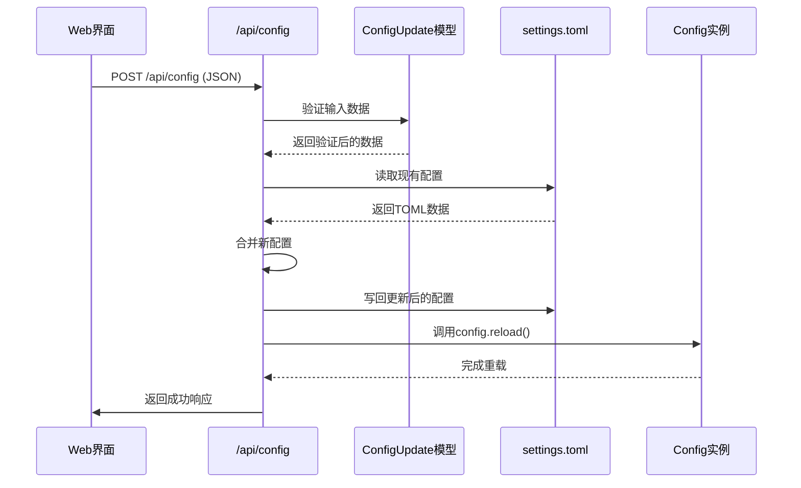
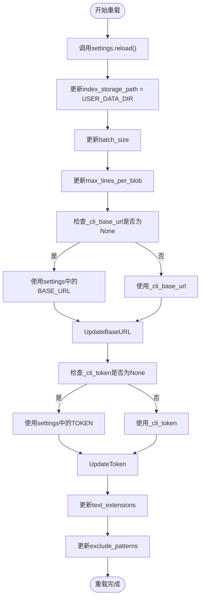
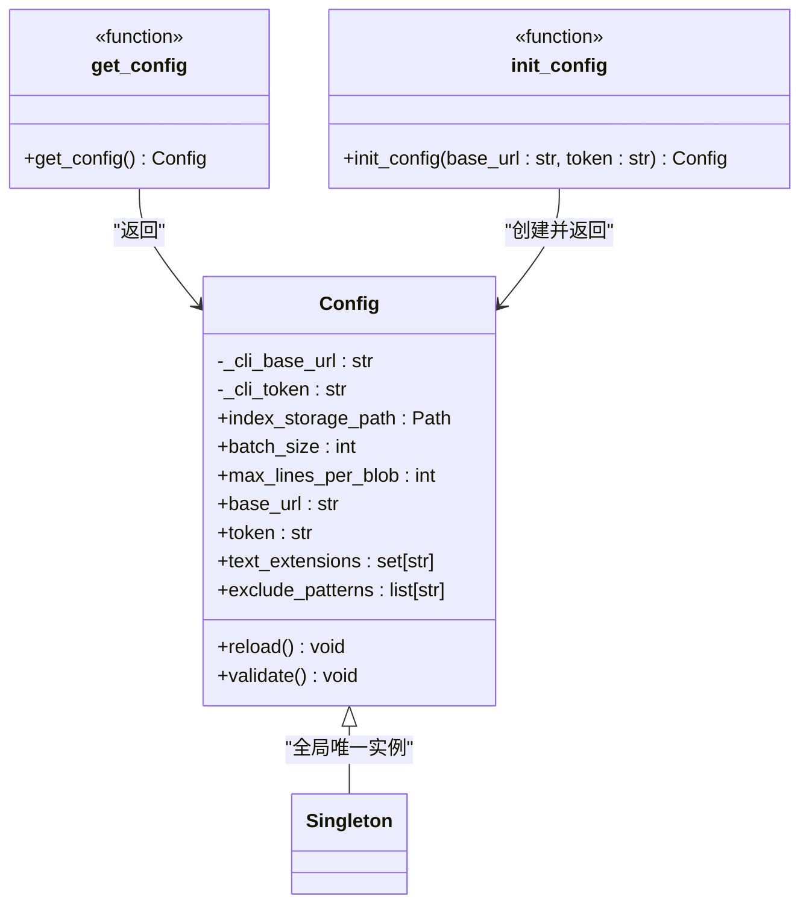

# 配置更新与热重载

<cite>
**本文档引用文件**  
- [config.py](file://src/acemcp/config.py)
- [web/app.py](file://src/acemcp/web/app.py)
</cite>

## 目录
1. [配置更新与热重载机制概述](#配置更新与热重载机制概述)  
2. [配置更新API流程](#配置更新api流程)  
3. [配置热重载机制](#配置热重载机制)  
4. [单例模式与全局配置一致性](#单例模式与全局配置一致性)  
5. [异常处理与日志记录](#异常处理与日志记录)  
6. [调试与故障排查](#调试与故障排查)

## 配置更新与热重载机制概述

acemcp 提供了通过 Web 界面动态更新配置并实时生效的能力。该机制允许用户通过 `/api/config` 接口提交新的配置值，系统将这些值写入用户主目录下的 `settings.toml` 文件，并立即重新加载配置，确保运行时状态与文件内容保持一致。整个过程涉及 Pydantic 模型验证、文件操作、Dynaconf 配置管理以及单例模式的协同工作。

**Section sources**  
- [config.py](file://src/acemcp/config.py#L9-L197)  
- [web/app.py](file://src/acemcp/web/app.py#L20-L118)

## 配置更新API流程

当用户通过 Web 界面提交配置更新请求时，`/api/config` POST 接口被触发。该接口接收一个 `ConfigUpdate` Pydantic 模型作为请求体，该模型定义了所有可更新的配置项，包括 `base_url`、`token`、`batch_size`、`max_lines_per_blob`、`text_extensions` 和 `exclude_patterns`。

**Diagram sources**  
- [web/app.py](file://src/acemcp/web/app.py#L73-L118)  
- [config.py](file://src/acemcp/config.py#L140-L149)

**Section sources**  
- [web/app.py](file://src/acemcp/web/app.py#L20-L28)  
- [web/app.py](file://src/acemcp/web/app.py#L73-L118)

## 配置热重载机制

配置热重载的核心是 `Config` 类中的 `reload()` 方法。该方法首先调用 `settings.reload()`，通知 Dynaconf 重新从 `settings.toml` 文件中加载配置。随后，`reload()` 方法会重新从 `settings` 对象中读取所有配置项，并更新当前 `Config` 实例的属性值。

特别重要的是，`reload()` 方法在更新 `base_url` 和 `token` 时，会优先使用命令行参数（`_cli_base_url` 和 `_cli_token`）的值。这确保了命令行覆盖的配置始终具有最高优先级，即使配置文件被修改，命令行指定的值仍然生效。

**Diagram sources**  
- [config.py](file://src/acemcp/config.py#L140-L149)

**Section sources**  
- [config.py](file://src/acemcp/config.py#L140-L149)

## 单例模式与全局配置一致性

为了确保整个应用程序中所有组件都能访问到最新的配置状态，acemcp 使用了单例模式来管理 `Config` 实例。全局变量 `_config_instance` 用于存储唯一的 `Config` 实例。`get_config()` 函数负责返回这个单例实例，如果实例尚未创建，则会进行初始化。

当 `update_config_api` 调用 `config.reload()` 时，它实际上是在修改这个全局唯一的 `Config` 实例。因此，任何后续通过 `get_config()` 获取配置的组件，都将获得包含最新值的配置对象，从而保证了配置状态的全局一致性。

**Diagram sources**  
- [config.py](file://src/acemcp/config.py#L167-L179)  
- [config.py](file://src/acemcp/config.py#L182-L194)

**Section sources**  
- [config.py](file://src/acemcp/config.py#L167-L197)

## 异常处理与日志记录

`update_config_api` 函数实现了完整的异常处理和日志记录闭环。在执行过程中，任何步骤发生的异常都会被捕获，详细的错误信息会被记录到日志中，然后以 `HTTPException` 的形式返回给客户端，状态码为 500。

成功更新配置后，系统会记录一条 INFO 级别的日志，确认配置已成功更新和应用。此外，该函数首先检查 `USER_CONFIG_FILE` 是否存在，如果不存在则返回 404 错误，这为用户提供了清晰的错误反馈。

**Section sources**  
- [web/app.py](file://src/acemcp/web/app.py#L84-L118)

## 调试与故障排查

### 验证配置是否生效
要验证配置是否真正生效，可以通过 `/api/config` GET 接口获取当前配置。该接口返回的 `base_url` 和 `token` 字段会显示实际生效的值（`token` 在返回时会被隐藏，但 `token_full` 字段包含完整值，可用于调试）。

### 热重载失败排查
如果热重载失败，应检查以下几点：
1. **文件权限**：确保 `~/.acemcp/settings.toml` 文件具有写权限。
2. **TOML格式错误**：检查 `settings.toml` 文件的语法是否正确，避免因格式错误导致 `toml.load()` 或 `toml.dump()` 失败。
3. **磁盘空间**：确认用户主目录有足够的磁盘空间。
4. **日志文件**：查看 `~/.acemcp/log/acemcp.log` 中的详细错误日志，定位具体问题。

**Section sources**  
- [config.py](file://src/acemcp/config.py#L85-L104)  
- [web/app.py](file://src/acemcp/web/app.py#L58-L71)  
- [web/app.py](file://src/acemcp/web/app.py#L87-L89)