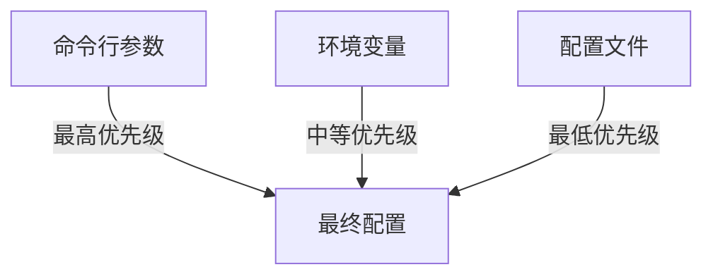
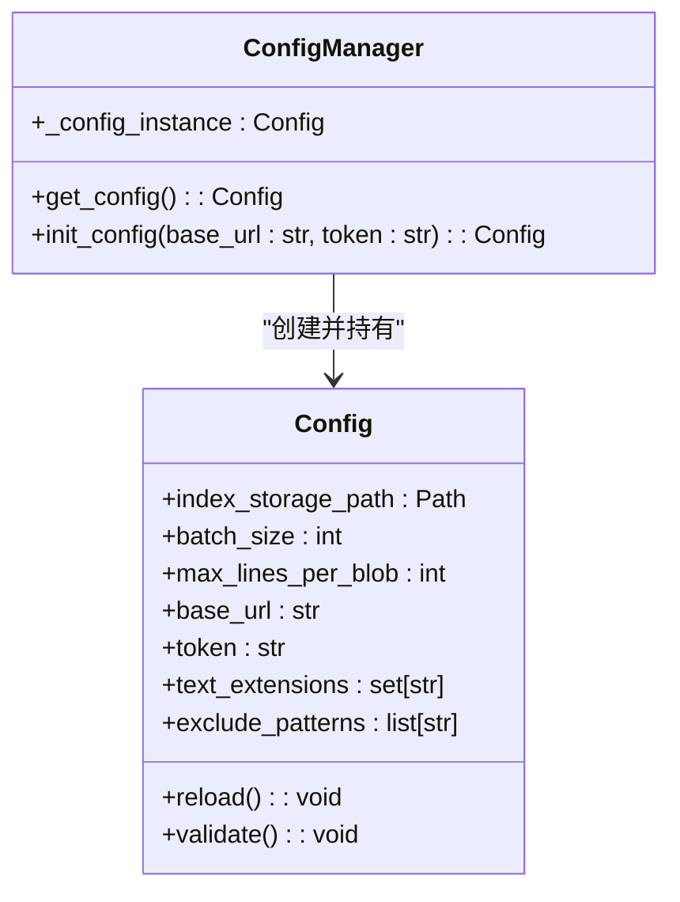
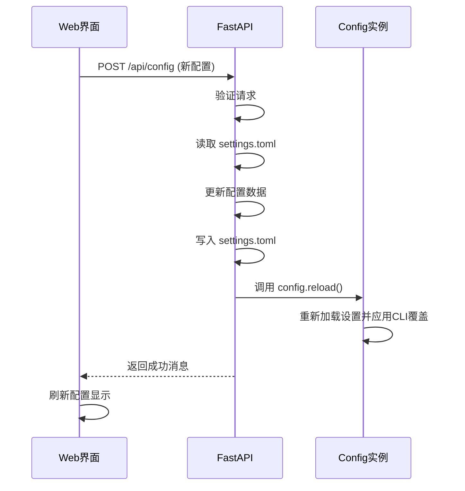

# 配置管理

<cite>
**本文档引用的文件**
- [config.py](file://src/acemcp/config.py)
- [app.py](file://src/acemcp/web/app.py)
- [settings.toml](file://~/.acemcp/settings.toml)
</cite>

## 目录
1. [配置文件结构](#配置文件结构)
2. [配置项详解](#配置项详解)
3. [配置来源与优先级](#配置来源与优先级)
4. [单例模式与全局访问](#单例模式与全局访问)
5. [Web界面配置管理](#web界面配置管理)
6. [配置验证与错误排查](#配置验证与错误排查)

## 配置文件结构

acemcp的配置系统以位于用户主目录下的 `~/.acemcp/settings.toml` 文件为核心。该文件在应用首次运行时自动创建，并填充默认值。配置文件采用TOML格式，这是一种易于阅读和编写的配置文件格式。

配置文件的创建和初始化由 `config.py` 中的 `_ensure_user_config()` 函数负责。该函数确保 `~/.acemcp` 目录及其子目录 `data` 存在，并在 `settings.toml` 文件不存在时，使用 `DEFAULT_CONFIG` 字典中的默认值创建该文件。

```toml
BATCH_SIZE = 10
MAX_LINES_PER_BLOB = 800
BASE_URL = "https://api.example.com"
TOKEN = "your-token-here"
TEXT_EXTENSIONS = [".py", ".js", ".ts", ...]
EXCLUDE_PATTERNS = [".venv", "node_modules", ".git", ...]
```

**Section sources**
- [config.py](file://src/acemcp/config.py#L80-L104)

## 配置项详解

配置系统支持以下核心配置项，这些配置项控制着acemcp服务器的行为：

- **`BATCH_SIZE`**: 每次批量上传到后端API的文件数量。默认值为10。增加此值可以提高索引速度，但会增加单次请求的负载。
- **`MAX_LINES_PER_BLOB`**: 单个数据块（blob）的最大行数。当文件行数超过此限制时，文件将被分割。默认值为800。
- **`BASE_URL`**: 后端API服务的根URL。acemcp通过此URL与后端服务进行通信，执行索引和搜索操作。
- **`TOKEN`**: 用于API身份验证的令牌。必须提供有效的令牌才能成功调用后端API。
- **`TEXT_EXTENSIONS`**: 一个字符串列表，定义了哪些文件扩展名的文件将被索引。默认包含常见的编程语言、标记和配置文件扩展名。
- **`EXCLUDE_PATTERNS`**: 一个字符串列表，定义了哪些文件或目录模式将被排除在索引之外。支持通配符（如 `*.pyc`, `node_modules`）。

**Section sources**
- [config.py](file://src/acemcp/config.py#L10-L78)

## 配置来源与优先级

acemcp的配置可以通过三种方式提供，它们的优先级从高到低依次为：

1.  **命令行参数 (最高优先级)**: 在启动服务器时，可以通过 `--base-url` 和 `--token` 参数直接覆盖配置文件中的对应值。这是优先级最高的配置方式。
2.  **环境变量**: 所有以 `ACEMCP_` 为前缀的环境变量都会被加载。例如，设置 `ACEMCP_BATCH_SIZE=20` 将覆盖配置文件中的 `BATCH_SIZE` 值。其优先级高于配置文件，但低于命令行参数。
3.  **配置文件 (最低优先级)**: `~/.acemcp/settings.toml` 文件中的配置是基础配置。当没有通过命令行或环境变量指定时，将使用此文件中的值。

这种优先级设计允许用户在不同场景下灵活地覆盖配置，例如在开发环境中通过命令行快速切换API端点。



**Diagram sources**
- [config.py](file://src/acemcp/config.py#L122-L142)
- [config.py](file://src/acemcp/config.py#L111-L116)

## 单例模式与全局访问

配置系统通过单例模式（Singleton Pattern）实现全局配置的统一访问。`Config` 类的实例在整个应用生命周期中只有一个，确保所有组件都使用同一份配置。

其实现依赖于一个全局变量 `_config_instance` 和两个关键函数：
- `get_config()`: 这是获取配置实例的主要入口。它检查 `_config_instance` 是否已创建，如果未创建，则新建一个 `Config` 实例并返回。后续调用将返回同一个实例。
- `init_config()`: 该函数用于在应用启动时初始化配置，通常用于处理命令行参数。它会创建一个新的 `Config` 实例并将其赋值给 `_config_instance`。

`config = get_config()` 这行代码创建了一个全局的配置对象，其他模块可以通过导入 `config` 来直接访问配置，而无需重复实例化。



**Diagram sources**
- [config.py](file://src/acemcp/config.py#L168-L198)
- [config.py](file://src/acemcp/config.py#L119-L150)

## Web界面配置管理

acemcp提供了Web管理界面，允许用户通过浏览器进行可视化配置。该功能通过 `--web-port` 命令行参数启用。

Web界面通过两个API端点实现配置的读取和更新：
- **`GET /api/config`**: 该API返回当前的配置信息。为了安全，`token` 字段在返回时会被隐藏（显示为 `***`），但提供了一个 `token_full` 字段供内部使用。
- **`POST /api/config`**: 该API用于更新配置。其工作流程如下：
    1.  从 `~/.acemcp/settings.toml` 文件中读取当前的TOML配置。
    2.  根据HTTP请求体中的 `ConfigUpdate` 模型，更新相应的配置项。
    3.  将修改后的配置重新写回 `settings.toml` 文件，实现持久化。
    4.  调用 `config.reload()` 方法，通知应用重新加载配置，实现热重载。



**Diagram sources**
- [app.py](file://src/acemcp/web/app.py#L58-L71)
- [app.py](file://src/acemcp/web/app.py#L73-L118)
- [config.py](file://src/acemcp/config.py#L140-L149)

## 配置验证与错误排查

为了确保配置的有效性，`Config` 类提供了 `validate()` 方法。该方法在应用启动时被调用，用于检查关键配置项是否符合要求。如果验证失败，将抛出 `ValueError` 异常。

验证规则包括：
- `BATCH_SIZE` 和 `MAX_LINES_PER_BLOB` 必须为正整数。
- `BASE_URL` 和 `TOKEN` 必须被配置，且不能为空。

**常见配置错误及排查方法：**

| 错误现象 | 可能原因 | 解决方法 |
| :--- | :--- | :--- |
| 启动失败，提示 "BASE_URL must be configured" | `BASE_URL` 未在配置文件、环境变量或命令行中设置 | 检查 `settings.toml` 文件，或使用 `--base-url` 参数启动 |
| 启动失败，提示 "TOKEN must be configured" | `TOKEN` 未在配置文件、环境变量或命令行中设置 | 检查 `settings.toml` 文件，或使用 `--token` 参数启动 |
| Web界面无法保存配置 | `settings.toml` 文件权限不足或路径错误 | 检查 `~/.acemcp/` 目录的读写权限 |
| 环境变量未生效 | 环境变量前缀错误 | 确保环境变量以 `ACEMCP_` 开头，例如 `ACEMCP_BASE_URL` |

**Section sources**
- [config.py](file://src/acemcp/config.py#L152-L165)
- [app.py](file://src/acemcp/web/app.py#L87-L89)