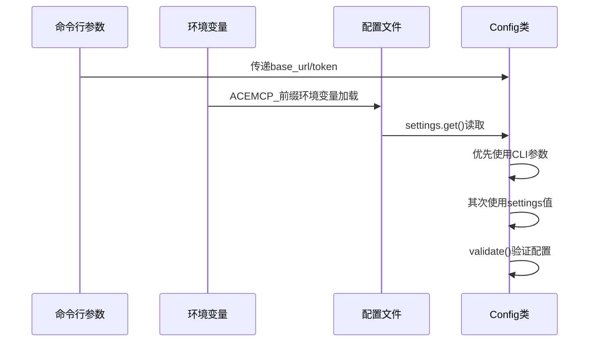

# 配置项详解

<cite>
**Referenced Files in This Document**   
- [config.py](file://src/acemcp/config.py)
- [settings.toml](file://~/.acemcp/settings.toml)
- [app.py](file://src/acemcp/web/app.py)
- [README_EN.md](file://README_EN.md)
</cite>

## 目录
1. [配置项详解](#配置项详解)
2. [配置项详细说明](#配置项详细说明)
3. [配置优先级链](#配置优先级链)
4. [配置示例](#配置示例)
5. [常见配置错误与修复](#常见配置错误与修复)

## 配置项详细说明

本节详细解析acemcp中所有可配置项的含义与作用，包括BASE_URL、TOKEN、BATCH_SIZE、MAX_LINES_PER_BLOB、TEXT_EXTENSIONS和EXCLUDE_PATTERNS。

### BATCH_SIZE

**数据类型**: 整数 (int)  
**默认值**: 10  
**有效范围**: 正整数 (> 0)  
**作用**: 控制每次上传到外部API的代码块数量。该配置直接影响系统性能与请求频率。较小的批次大小会增加请求次数但降低单次请求负载，较大的批次大小则相反。在`Config`类的初始化和重载方法中通过`settings.get("BATCH_SIZE", DEFAULT_CONFIG["BATCH_SIZE"])`获取值，并在`validate()`方法中验证其为正数。

**Section sources**
- [config.py](file://src/acemcp/config.py#L133-L134)
- [config.py](file://src/acemcp/config.py#L145-L146)
- [config.py](file://src/acemcp/config.py#L154-L157)

### MAX_LINES_PER_BLOB

**数据类型**: 整数 (int)  
**默认值**: 800  
**有效范围**: 正整数 (> 0)  
**作用**: 决定单个文本片段的最大行数，防止上下文过载。当文件行数超过此限制时，系统会自动将文件分割成多个块进行处理。该配置通过`settings.get("MAX_LINES_PER_BLOB", DEFAULT_CONFIG["MAX_LINES_PER_BLOB"])`获取，并在`validate()`方法中进行有效性检查。

**Section sources**
- [config.py](file://src/acemcp/config.py#L134-L134)
- [config.py](file://src/acemcp/config.py#L146-L146)
- [config.py](file://src/acemcp/config.py#L157-L159)

### BASE_URL

**数据类型**: 字符串 (str)  
**默认值**: "https://api.example.com"  
**有效范围**: 有效的URL字符串  
**作用**: 指定API端点URL，用于与外部服务通信。该配置可通过命令行参数`--base-url`覆盖，在`Config`类中优先使用命令行参数，其次从配置文件或环境变量获取。必须配置有效值，否则`validate()`方法将抛出异常。

**Section sources**
- [config.py](file://src/acemcp/config.py#L135-L135)
- [config.py](file://src/acemcp/config.py#L147-L147)
- [config.py](file://src/acemcp/config.py#L160-L162)

### TOKEN

**数据类型**: 字符串 (str)  
**默认值**: "your-token-here"  
**有效范围**: 非空字符串  
**作用**: 认证令牌，用于API请求的身份验证。与BASE_URL类似，可通过`--token`命令行参数覆盖。系统要求必须配置有效令牌，空值将导致`validate()`方法抛出异常。

**Section sources**
- [config.py](file://src/acemcp/config.py#L136-L136)
- [config.py](file://src/acemcp/config.py#L148-L148)
- [config.py](file://src/acemcp/config.py#L162-L164)

### TEXT_EXTENSIONS

**数据类型**: 字符串集合 (set[str])  
**默认值**: 包含多种编程语言和文本文件扩展名的列表  
**有效范围**: 文件扩展名字符串集合  
**作用**: 定义被索引的文件类型扩展名集合。系统将仅处理匹配这些扩展名的文件。该配置从配置文件获取后转换为集合类型以提高查找效率。默认值包含Python、JavaScript、TypeScript、Java、Go等主流编程语言文件扩展名。

**Section sources**
- [config.py](file://src/acemcp/config.py#L137-L137)
- [config.py](file://src/acemcp/config.py#L149-L149)
- [config.py](file://src/acemcp/config.py#L15-L77)

### EXCLUDE_PATTERNS

**数据类型**: 字符串列表 (list[str])  
**默认值**: 包含常见忽略模式的列表  
**有效范围**: 路径匹配模式字符串列表  
**作用**: 结合pathspec实现.gitignore风格的路径排除。定义了应被索引过程忽略的文件和目录模式，如虚拟环境、构建产物、版本控制目录等。支持通配符（*、?），与项目根目录下的`.gitignore`文件模式合并使用。

**Section sources**
- [config.py](file://src/acemcp/config.py#L138-L138)
- [config.py](file://src/acemcp/config.py#L150-L150)
- [config.py](file://src/acemcp/config.py#L45-L77)

## 配置优先级链

系统实现了多源配置合并机制，遵循命令行 > 环境变量 > 配置文件的优先级链。

### 优先级实现机制

配置优先级链的具体实现通过`Config`类的初始化逻辑完成。当创建`Config`实例时，构造函数接收可选的`base_url`和`token`参数，这些参数来自命令行解析。在属性赋值时，优先使用命令行参数（`self._cli_base_url`或`self._cli_token`），若为空则从`settings`对象获取配置文件或环境变量的值。



**Diagram sources**
- [config.py](file://src/acemcp/config.py#L122-L138)
- [config.py](file://src/acemcp/config.py#L140-L150)

### _dynaconf库的角色

_dynaconf库在多源配置合并中扮演核心角色。在`config.py`中通过以下代码初始化：
```python
settings = Dynaconf(
    envvar_prefix="ACEMCP",
    settings_files=[str(USER_CONFIG_FILE)],
    load_dotenv=True,
    merge_enabled=True,
)
```
_dynaconf负责：
1. 加载`~/.acemcp/settings.toml`配置文件
2. 读取以`ACEMCP_`为前缀的环境变量
3. 合并多源配置（`merge_enabled=True`）
4. 提供`settings.get()`方法获取配置值，支持默认值 fallback

**Section sources**
- [config.py](file://src/acemcp/config.py#L110-L115)
- [config.py](file://src/acemcp/config.py#L133-L138)

## 配置示例

### settings.toml自定义配置

可以通过修改`~/.acemcp/settings.toml`来自定义索引范围。以下是一个实际配置示例：

```toml
BATCH_SIZE = 20
MAX_LINES_PER_BLOB = 1000
BASE_URL = "https://your-api-endpoint.com"
TOKEN = "your-bearer-token-here"
TEXT_EXTENSIONS = [".py", ".js", ".ts", ".java", ".go", ".md", ".txt"]
EXCLUDE_PATTERNS = [".venv", "node_modules", ".git", "__pycache__", "*.pyc", "dist", "build"]
```

### Web接口配置更新

系统还提供Web管理接口来更新配置。通过POST请求`/api/config`端点，可以更新配置并自动重载：

```mermaid
flowchart TD
A[客户端发送配置更新] --> B{验证配置文件存在}
B --> |是| C[读取现有settings.toml]
C --> D[合并更新的配置项]
D --> E[写回settings.toml文件]
E --> F[调用config.reload()]
F --> G[重新加载配置]
G --> H[返回成功响应]
B --> |否| I[返回404错误]
```

**Diagram sources**
- [app.py](file://src/acemcp/web/app.py#L74-L118)

**Section sources**
- [app.py](file://src/acemcp/web/app.py#L74-L118)
- [config.py](file://src/acemcp/config.py#L140-L150)

## 常见配置错误与修复

### 配置值无效

**错误示例**: `BATCH_SIZE = -5` 或 `MAX_LINES_PER_BLOB = 0`  
**症状**: 系统启动失败，抛出`ValueError`  
**修复**: 确保所有数值配置为正整数

### 必需配置缺失

**错误示例**: 空的`BASE_URL`或`TOKEN`  
**症状**: `validate()`方法抛出"must be configured"异常  
**修复**: 在`settings.toml`中提供有效值，或通过命令行参数指定

### 文件路径错误

**错误示例**: `settings.toml`文件不存在或权限不足  
**症状**: `_ensure_user_config()`无法创建配置文件  
**修复**: 检查`~/.acemcp/`目录权限，确保用户有读写权限

### 类型错误

**错误示例**: `TEXT_EXTENSIONS`配置为字符串而非列表  
**症状**: `set()`转换失败或索引逻辑异常  
**修复**: 确保`TEXT_EXTENSIONS`为字符串列表格式

**Section sources**
- [config.py](file://src/acemcp/config.py#L152-L164)
- [config.py](file://src/acemcp/config.py#L85-L104)