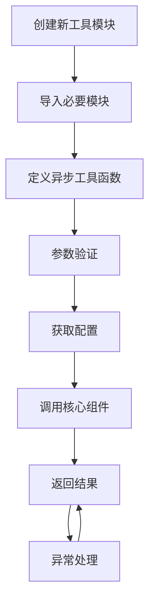

# 功能扩展

<cite>
**Referenced Files in This Document**   
- [search_context.py](file://src/acemcp/tools/search_context.py)
- [server.py](file://src/acemcp/server.py)
- [app.py](file://src/acemcp/web/app.py)
- [config.py](file://src/acemcp/config.py)
- [manager.py](file://src/acemcp/index/manager.py)
- [__init__.py](file://src/acemcp/tools/__init__.py)
- [index.html](file://src/acemcp/web/templates/index.html)
</cite>

## 目录
1. [简介](#简介)
2. [MCP工具扩展](#mcp工具扩展)
3. [Web界面扩展](#web界面扩展)
4. [配置系统扩展](#配置系统扩展)
5. [测试建议](#测试建议)
6. [编码规范与最佳实践](#编码规范与最佳实践)

## 简介
本文档详细指导开发者如何扩展acemcp的功能。重点说明添加新的MCP工具的完整流程，包括在`src/acemcp/tools/`目录下创建新的Python模块，定义异步工具函数，遵循`search_context_tool`的模式，使用`get_config()`获取配置，通过`IndexManager`或其他核心组件实现功能，正确处理参数验证和异常。同时，文档还涵盖了Web界面扩展、配置系统扩展、测试建议以及编码规范与最佳实践。

## MCP工具扩展

### 创建新的工具模块
在`src/acemcp/tools/`目录下创建新的Python模块。该目录下已有一个示例工具`search_context.py`，可以作为参考。



**Section sources**
- [search_context.py](file://src/acemcp/tools/search_context.py#L1-L52)

### 工具函数定义
定义异步工具函数，遵循`search_context_tool`的模式。函数必须是异步的，并接受一个字典参数`arguments`。

```python
async def tool_name(arguments: dict[str, Any]) -> dict[str, Any]:
    """工具功能描述。

    Args:
        arguments: 工具参数，包含：
            - 参数名: 参数描述

    Returns:
        包含 'type' 和 'text' 的字典
    """
```

**Section sources**
- [search_context.py](file://src/acemcp/tools/search_context.py#L11-L21)

### 参数验证和异常处理
在工具函数中，必须对输入参数进行验证，并正确处理可能出现的异常。

```python
try:
    # 参数验证
    if not arguments.get("required_param"):
        return {"type": "text", "text": "Error: required_param is required"}

    # 核心逻辑
    result = await core_function(arguments)

    return {"type": "text", "text": result}

except Exception as e:
    logger.exception("Error in tool_name")
    return {"type": "text", "text": f"Error: {e!s}"}
```

**Section sources**
- [search_context.py](file://src/acemcp/tools/search_context.py#L22-L50)

### 获取配置和调用核心组件
使用`get_config()`获取配置，并通过`IndexManager`或其他核心组件实现功能。

```python
from acemcp.config import get_config
from acemcp.index import IndexManager

config = get_config()
index_manager = IndexManager(
    config.index_storage_path,
    config.base_url,
    config.token,
    config.text_extensions,
    config.batch_size,
    config.max_lines_per_blob,
    config.exclude_patterns,
)
result = await index_manager.some_method()
```

**Section sources**
- [search_context.py](file://src/acemcp/tools/search_context.py#L7-L8)
- [search_context.py](file://src/acemcp/tools/search_context.py#L34-L44)

### 返回格式
工具函数的返回值必须是一个包含`'type'`和`'text'`的字典。

```python
return {"type": "text", "text": result}
```

**Section sources**
- [search_context.py](file://src/acemcp/tools/search_context.py#L46)
- [search_context.py](file://src/acemcp/tools/search_context.py#L50)

### 在server.py中注册新工具
在`server.py`中注册新工具，使其能够被调用。

```python
from acemcp.tools import search_context_tool, new_tool

@app.list_tools()
async def list_tools() -> list[Tool]:
    return [
        Tool(
            name="search_context",
            description="Search for relevant code context...",
            inputSchema={
                "type": "object",
                "properties": {
                    "project_root_path": {
                        "type": "string",
                        "description": "Absolute path to the project root directory...",
                    },
                    "query": {
                        "type": "string",
                        "description": "Natural language search query...",
                    },
                },
                "required": ["project_root_path", "query"],
            },
        ),
        Tool(
            name="new_tool",
            description="Description of new tool...",
            inputSchema={
                "type": "object",
                "properties": {
                    "param1": {
                        "type": "string",
                        "description": "Description of param1...",
                    },
                },
                "required": ["param1"],
            },
        ),
    ]

@app.call_tool()
async def call_tool(name: str, arguments: dict) -> dict:
    if name == "search_context":
        return await search_context_tool(arguments)
    elif name == "new_tool":
        return await new_tool(arguments)
    return {"type": "text", "text": f"Unknown tool: {name}"}
```

**Section sources**
- [server.py](file://src/acemcp/server.py#L14-L15)
- [server.py](file://src/acemcp/server.py#L20-L46)
- [server.py](file://src/acemcp/server.py#L49-L65)

## Web界面扩展

### 添加新的HTML模板
在`src/acemcp/web/templates/`中添加新的HTML模板。该目录下已有一个示例模板`index.html`，可以作为参考。

**Section sources**
- [index.html](file://src/acemcp/web/templates/index.html#L1-L553)

### 定义新的FastAPI路由和API端点
在`web/app.py`中定义新的FastAPI路由和API端点。

```python
@app.get("/api/new-endpoint")
async def new_endpoint() -> dict:
    """新的API端点。

    Returns:
        响应数据
    """
    # 业务逻辑
    return {"status": "success", "data": "example"}

@app.post("/api/new-endpoint")
async def new_endpoint_post(data: dict) -> dict:
    """处理POST请求的API端点。

    Args:
        data: 请求数据

    Returns:
        响应数据
    """
    # 业务逻辑
    return {"status": "success", "data": data}
```

**Section sources**
- [app.py](file://src/acemcp/web/app.py#L39-L188)

### 处理WebSocket消息
在`web/app.py`中定义WebSocket端点，用于处理实时消息。

```python
@app.websocket("/ws/new-websocket")
async def new_websocket(websocket: WebSocket) -> None:
    """WebSocket端点。

    Args:
        websocket: WebSocket连接
    """
    await websocket.accept()
    queue: asyncio.Queue = asyncio.Queue()
    broadcaster.add_client(queue)

    try:
        while True:
            message = await queue.get()
            await websocket.send_text(message)
    except WebSocketDisconnect:
        broadcaster.remove_client(queue)
    finally:
        broadcaster.remove_client(queue)
```

**Section sources**
- [app.py](file://src/acemcp/web/app.py#L169-L187)

## 配置系统扩展

### 添加新的配置项
在`config.py`中添加新的配置项。可以通过环境变量、配置文件或命令行参数进行配置。

```python
# 在 DEFAULT_CONFIG 中添加默认值
DEFAULT_CONFIG = {
    "NEW_CONFIG_KEY": "default_value",
    # 其他配置项...
}

# 在 Config 类中添加属性
class Config:
    def __init__(self, base_url: str | None = None, token: str | None = None) -> None:
        self.new_config_key: str = settings.get("NEW_CONFIG_KEY", DEFAULT_CONFIG["NEW_CONFIG_KEY"])
        # 其他初始化...

    def reload(self) -> None:
        self.new_config_key = settings.get("NEW_CONFIG_KEY", DEFAULT_CONFIG["NEW_CONFIG_KEY"])
        # 其他重新加载...
```

**Section sources**
- [config.py](file://src/acemcp/config.py#L10-L78)
- [config.py](file://src/acemcp/config.py#L119-L151)

## 测试建议

### 编写单元测试
为新功能编写单元测试，确保代码的正确性和稳定性。

```python
import pytest
from acemcp.tools import new_tool

@pytest.mark.asyncio
async def test_new_tool():
    arguments = {"param1": "test_value"}
    result = await new_tool(arguments)
    assert result["type"] == "text"
    assert "expected_text" in result["text"]
```

### 编写集成测试
编写集成测试，验证新功能与其他组件的交互。

```python
import pytest
from fastapi.testclient import TestClient
from acemcp.web.app import create_app

@pytest.fixture
def client():
    app = create_app()
    return TestClient(app)

def test_new_api_endpoint(client):
    response = client.get("/api/new-endpoint")
    assert response.status_code == 200
    assert response.json()["status"] == "success"
```

## 编码规范与最佳实践

### 代码风格
遵循PEP 8代码风格指南，保持代码的一致性和可读性。

### 文档字符串
为所有函数、类和模块编写清晰的文档字符串，说明其功能、参数和返回值。

### 异常处理
正确处理异常，记录详细的错误信息，避免程序崩溃。

### 性能优化
考虑性能影响，避免不必要的计算和I/O操作。

### 安全性
注意安全性，避免注入攻击和其他安全漏洞。