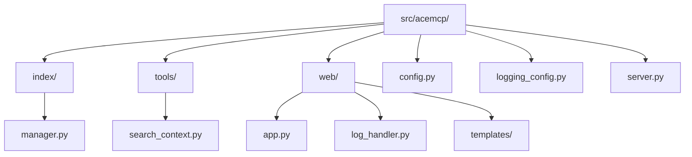

# 开发者指南

<cite>
**本文档引用的文件**  
- [pyproject.toml](file://pyproject.toml)
- [config.py](file://src/acemcp/config.py)
- [server.py](file://src/acemcp/server.py)
- [app.py](file://src/acemcp/web/app.py)
- [search_context.py](file://src/acemcp/tools/search_context.py)
- [manager.py](file://src/acemcp/index/manager.py)
- [logging_config.py](file://src/acemcp/logging_config.py)
- [log_handler.py](file://src/acemcp/web/log_handler.py)
- [README.md](file://README.md)
</cite>

## 目录
1. [简介](#简介)
2. [本地开发环境搭建](#本地开发环境搭建)
3. [代码结构与编码规范](#代码结构与编码规范)
4. [扩展机制](#扩展机制)
5. [调试方法](#调试方法)
6. [测试策略](#测试策略)
7. [代码贡献流程](#代码贡献流程)

## 简介
本指南为开发者提供完整的本地开发环境配置、代码调试、扩展开发和贡献流程说明。项目是一个用于代码库索引和语义搜索的MCP服务器，支持多编码文件和.gitignore集成。

## 本地开发环境搭建

### Python虚拟环境与依赖安装
使用`uv`工具链进行依赖管理，推荐使用`uv`而非`pip`以获得更好的性能和兼容性。

```bash
# 克隆仓库
git clone https://github.com/qy527145/acemcp.git
cd acemcp

# 创建并激活虚拟环境
uv venv
source .venv/bin/activate  # Linux/Mac
# 或 .venv\Scripts\activate  # Windows

# 安装生产依赖
uv sync

# 安装开发依赖（来自pyproject.toml的dev组）
uv pip install -e ".[dev]"
```

**pyproject.toml中的开发依赖**：
- `pip>=25.3`：包管理工具
- `pre-commit>=4.3.0`：预提交钩子
- `ruff>=0.14.3`：代码格式化和lint工具

**Section sources**
- [pyproject.toml](file://pyproject.toml#L29-L34)

### 预提交钩子配置
项目使用`pre-commit`确保代码质量，安装后会在git提交时自动运行检查。

```bash
# 安装预提交钩子
pre-commit install

# 手动运行所有检查
pre-commit run --all-files
```

## 代码结构与编码规范

### 项目代码结构
项目采用模块化设计，主要分为核心功能、工具和Web界面三个部分。



**Diagram sources**
- [project_structure](file://#L1-L10)

### 编码规范
项目使用`ruff`作为代码检查工具，配置在`pyproject.toml`中。

**主要规范**：
- 行长度限制：336字符
- 启用的检查规则：A, ARG, B, C, E, F, G, I, ISC, N, PIE, PLE, Q, R, RET, SLF, T, TID, UP, W等
- 圈复杂度限制：最大17
- 导入排序：标准库 → 第三方库 → 本地库

**Section sources**
- [pyproject.toml](file://pyproject.toml#L36-L114)

## 扩展机制

### 添加新的MCP工具
在`tools`目录下创建新模块可轻松扩展MCP功能。

**步骤**：
1. 在`src/acemcp/tools/`目录创建新Python文件（如`new_tool.py`）
2. 实现工具函数，遵循`async def tool_name(arguments: dict) -> dict`模式
3. 在`__init__.py`中导出新工具

```python
# 示例：在tools目录创建新工具
from typing import Any
from loguru import logger

async def new_tool(arguments: dict[str, Any]) -> dict[str, Any]:
    """新MCP工具示例。
    
    Args:
        arguments: 工具参数
        
    Returns:
        工具执行结果
    """
    try:
        # 工具逻辑
        return {"type": "text", "text": "工具执行成功"}
    except Exception as e:
        logger.exception("工具执行失败")
        return {"type": "text", "text": f"错误: {e!s}"}
```

**工具注册**：
在`server.py`中使用`@app.call_tool()`装饰器注册新工具。

**Section sources**
- [server.py](file://src/acemcp/server.py#L49-L65)
- [tools/search_context.py](file://src/acemcp/tools/search_context.py#L11-L52)

### 扩展Web界面功能
Web界面基于FastAPI构建，可通过修改`web`目录下的文件进行扩展。

**主要组件**：
- `app.py`：FastAPI应用定义
- `templates/`：HTML模板
- `static/`：静态资源
- `log_handler.py`：日志广播处理器

**添加新API端点**：
```python
@app.get("/api/new-feature")
async def new_feature() -> dict:
    """新功能API端点。"""
    return {"status": "success", "data": "新功能数据"}
```

**Section sources**
- [app.py](file://src/acemcp/web/app.py#L39-L188)
- [log_handler.py](file://src/acemcp/web/log_handler.py#L12-L75)

## 调试方法

### 运行服务进行调试
通过命令行参数启动服务并启用Web管理界面进行调试。

```bash
# 启动服务并启用Web界面（端口8080）
uv run acemcp --web-port 8080

# 覆盖配置参数
uv run acemcp --base-url "https://api.example.com" --token "your-token" --web-port 8080
```

访问`http://localhost:8080`查看Web管理界面，可实时监控日志、查看状态和调试工具。

**Section sources**
- [server.py](file://src/acemcp/server.py#L117-L136)
- [app.py](file://src/acemcp/web/app.py#L68-L85)

### 断点调试
使用Python调试器（如pdb或IDE调试器）设置断点。

```python
import pdb; pdb.set_trace()  # 设置断点
```

推荐在以下关键位置设置断点：
- `server.py`中的`main`函数
- `tools/search_context.py`中的`search_context_tool`函数
- `index/manager.py`中的`IndexManager`类方法

### 日志调试
项目使用`loguru`进行日志记录，日志文件位于`~/.acemcp/log/acemcp.log`。

**日志特性**：
- 控制台输出：INFO级别及以上（彩色）
- 文件输出：DEBUG级别及以上（详细格式）
- 自动轮转：5MB时轮转
- 保留策略：最多10个文件
- 压缩：轮转文件自动压缩为zip

**实时日志流**：
Web界面通过WebSocket提供实时日志流，具有智能重连功能。

**Section sources**
- [logging_config.py](file://src/acemcp/logging_config.py#L14-L68)
- [log_handler.py](file://src/acemcp/web/log_handler.py#L12-L75)

## 测试策略

### 单元测试
项目应为关键组件编写单元测试，测试文件应放在`tests/`目录下。

**测试重点**：
- `index/manager.py`中的索引和搜索逻辑
- `tools/`目录下各工具的功能
- `config.py`中的配置管理
- `web/app.py`中的API端点

### 集成测试
测试MCP工具与外部API的集成，特别是`search_context`工具的端到端流程。

**测试场景**：
1. 配置验证
2. 增量索引功能
3. 语义搜索准确性
4. 错误处理和重试机制
5. 多编码文件支持
6. .gitignore集成

### 代码质量检查
使用`ruff`进行代码质量检查：

```bash
# 运行代码检查
ruff check src/

# 格式化代码
ruff format src/
```

**Section sources**
- [pyproject.toml](file://pyproject.toml#L36-L114)

## 代码贡献流程

### 分支管理
采用Git流进行分支管理：

```bash
# 创建功能分支
git checkout -b feature/new-tool

# 开发完成后提交
git add .
git commit -m "feat: 添加新MCP工具"

# 推送到远程
git push origin feature/new-tool
```

**分支命名规范**：
- `feature/`：新功能
- `fix/`：bug修复
- `docs/`：文档更新
- `refactor/`：代码重构

### 代码审查
提交Pull Request后，需经过代码审查才能合并。

**审查重点**：
- 代码风格是否符合`ruff`规范
- 是否有适当的日志记录
- 错误处理是否完善
- 是否有必要的类型注解
- 文档是否更新

### 版本发布
版本号遵循语义化版本控制（SemVer）。

**发布流程**：
1. 更新`pyproject.toml`中的版本号
2. 更新`README.md`中的更新日志
3. 创建发布分支
4. 合并到主分支
5. 创建Git标签

```bash
# 创建标签
git tag -a v0.1.5 -m "版本 0.1.5"
git push origin v0.1.5
```

**Section sources**
- [pyproject.toml](file://pyproject.toml#L2-L3)
- [README.md](file://README.md#L332-L350)