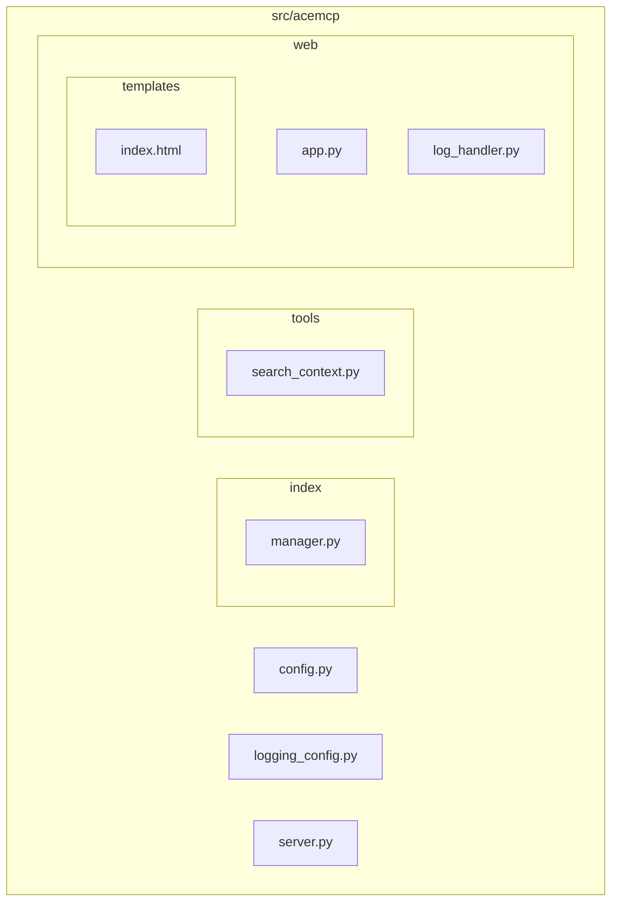
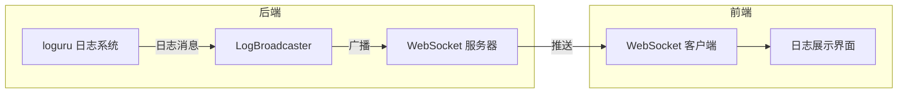
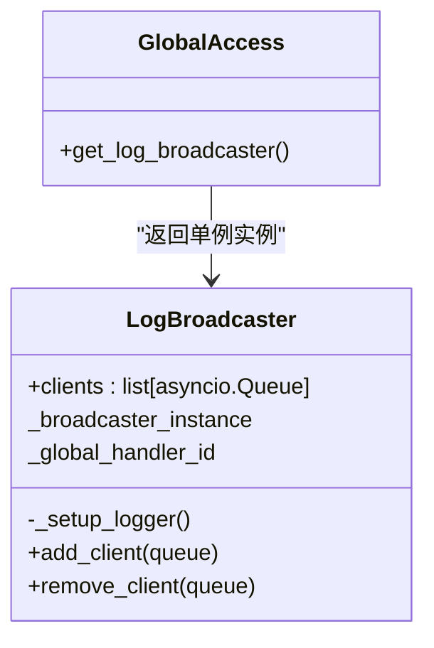
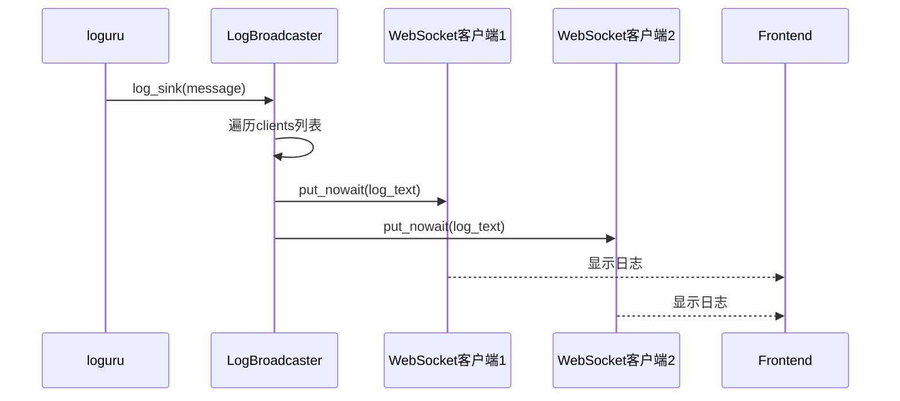
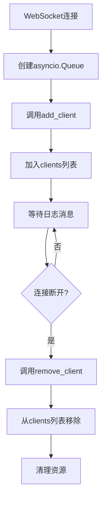
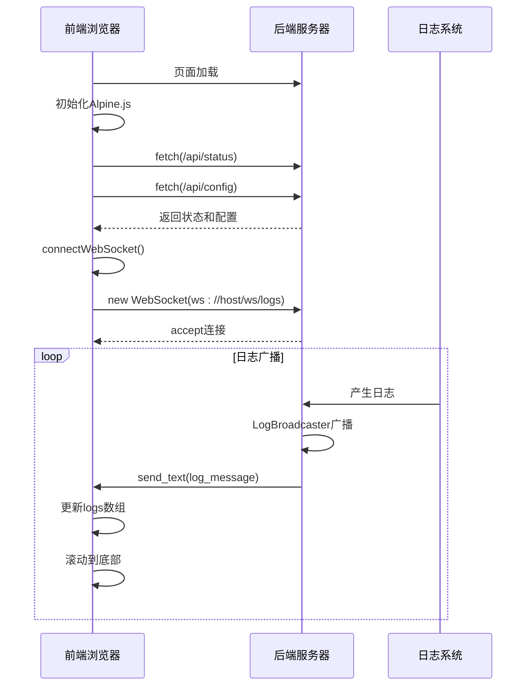

# 实时日志流

<cite>
**本文档引用的文件**
- [log_handler.py](file://src/acemcp/web/log_handler.py)
- [app.py](file://src/acemcp/web/app.py)
- [index.html](file://src/acemcp/web/templates/index.html)
- [server.py](file://src/acemcp/server.py)
- [logging_config.py](file://src/acemcp/logging_config.py)
</cite>

## 目录
1. [简介](#简介)
2. [项目结构](#项目结构)
3. [核心组件](#核心组件)
4. [架构概述](#架构概述)
5. [详细组件分析](#详细组件分析)
6. [依赖分析](#依赖分析)
7. [性能考虑](#性能考虑)
8. [故障排除指南](#故障排除指南)
9. [结论](#结论)

## 简介
本文档深入解析了实时日志流功能的实现机制，重点阐述了 `LogBroadcaster` 类如何通过观察者模式实现日志的实时广播，以支持 Web 界面的动态日志展示。文档详细描述了其单例设计模式、客户端生命周期管理、日志过滤机制以及前端交互流程。

## 项目结构
本项目采用分层模块化设计，主要分为索引管理、工具集和 Web 服务三大模块。实时日志功能主要由 `web` 模块实现，通过 `log_handler.py` 定义日志广播逻辑，`app.py` 提供 WebSocket 接口，`templates/index.html` 实现前端展示。



**Diagram sources**
- [log_handler.py](file://src/acemcp/web/log_handler.py)
- [app.py](file://src/acemcp/web/app.py)
- [index.html](file://src/acemcp/web/templates/index.html)

**Section sources**
- [log_handler.py](file://src/acemcp/web/log_handler.py)
- [app.py](file://src/acemcp/web/app.py)

## 核心组件
`LogBroadcaster` 类是实时日志流功能的核心，它实现了观察者模式，将日志消息广播给所有连接的 WebSocket 客户端。该类通过单例模式确保全局唯一实例，并通过 `clients` 列表管理所有客户端的异步队列。

**Section sources**
- [log_handler.py](file://src/acemcp/web/log_handler.py#L11-L57)

## 架构概述
系统通过 `LogBroadcaster` 作为中心枢纽，接收来自 `loguru` 的日志消息，并将其广播给所有注册的客户端。前端通过 WebSocket 连接到 `/ws/logs` 端点，实时接收日志流。



**Diagram sources**
- [log_handler.py](file://src/acemcp/web/log_handler.py#L11-L57)
- [app.py](file://src/acemcp/web/app.py#L169-L187)

## 详细组件分析

### LogBroadcaster 分析
`LogBroadcaster` 类实现了观察者模式，允许任意数量的 WebSocket 客户端订阅日志流。

#### 单例模式实现


**Diagram sources**
- [log_handler.py](file://src/acemcp/web/log_handler.py#L61-L72)

`LogBroadcaster` 通过全局变量 `_broadcaster_instance` 和 `_global_handler_id` 确保全局唯一实例。`get_log_broadcaster()` 函数负责实例的创建和获取，实现了单例模式。

**Section sources**
- [log_handler.py](file://src/acemcp/web/log_handler.py#L63-L72)

#### 观察者模式与日志广播


**Diagram sources**
- [log_handler.py](file://src/acemcp/web/log_handler.py#L28-L41)

`_setup_logger()` 方法注册了一个自定义的 `log_sink` 回调函数。当有日志消息产生时，该函数会遍历 `_broadcaster_instance.clients` 列表，将日志文本放入每个客户端的 `asyncio.Queue` 中。使用切片 `[:]` 遍历列表是为了避免在迭代过程中修改列表导致的问题。

**Section sources**
- [log_handler.py](file://src/acemcp/web/log_handler.py#L20-L41)

#### 客户端生命周期管理


**Diagram sources**
- [app.py](file://src/acemcp/web/app.py#L170-L187)
- [log_handler.py](file://src/acemcp/web/log_handler.py#L43-L57)

`add_client()` 和 `remove_client()` 方法负责管理客户端的生命周期。当 WebSocket 连接建立时，服务器会创建一个 `asyncio.Queue` 并调用 `add_client()` 将其加入 `clients` 列表。连接断开时，`finally` 块中的 `remove_client()` 会将其移除，防止内存泄漏。

**Section sources**
- [log_handler.py](file://src/acemcp/web/log_handler.py#L43-L57)
- [app.py](file://src/acemcp/web/app.py#L174-L186)

#### 日志过滤机制
日志过滤器 `filter=lambda record: record["level"].no >= 20` 确保只有 INFO 级别（级别号20）及以上的日志才会被广播。这通过在 `logger.add()` 方法中设置 `filter` 参数实现，有效减少了不必要的网络传输。

**Section sources**
- [log_handler.py](file://src/acemcp/web/log_handler.py#L41)

### 前端交互流程


**Diagram sources**
- [app.py](file://src/acemcp/web/app.py#L169-L187)
- [index.html](file://src/acemcp/web/templates/index.html#L391-L487)

前端使用 Alpine.js 框架，通过 `connectWebSocket()` 函数建立 WebSocket 连接。连接成功后，`onmessage` 事件处理器会将收到的日志消息添加到 `logs` 数组中，并自动滚动到最新日志。前端还实现了断线重连机制，使用指数退避算法进行重试。

**Section sources**
- [app.py](file://src/acemcp/web/app.py#L169-L187)
- [index.html](file://src/acemcp/web/templates/index.html#L391-L487)

## 依赖分析
```mermaid
graph TD
server[server.py] --> |初始化| log_handler[log_handler.py]
server --> |启动| app[app.py]
app --> |创建| log_broadcaster[log_broadcaster]
app --> |提供| websocket[/ws/logs]
log_handler --> |广播| log_broadcaster
log_broadcaster --> |使用| asyncio[asyncio.Queue]
log_broadcaster --> |集成| loguru[loguru]
index_html --> |连接| websocket
```

**Diagram sources**
- [server.py](file://src/acemcp/server.py#L128-L130)
- [app.py](file://src/acemcp/web/app.py#L17)
- [log_handler.py](file://src/acemcp/web/log_handler.py)

`LogBroadcaster` 的初始化时机至关重要。在 `server.py` 中，`run()` 函数首先检查是否启用了 Web 界面，如果启用，则立即调用 `get_log_broadcaster()` 初始化广播器，**在** `setup_logging()` 之前。这确保了日志广播器的 `log_sink` 处理程序不会被后续的日志配置所覆盖。

**Section sources**
- [server.py](file://src/acemcp/server.py#L126-L133)
- [logging_config.py](file://src/acemcp/logging_config.py#L37-L43)

## 性能考虑
在高并发场景下，大量客户端同时接收日志可能导致性能瓶颈。为保证系统稳定性，开发者应订阅日志流时处理 `QueueFull` 异常，避免因单个客户端阻塞而影响整体性能。未来的优化策略可包括批量推送（batching）或限流机制（rate limiting），以减少网络开销和系统负载。

## 故障排除指南
- **日志未显示**：检查 `LogBroadcaster` 是否在 `setup_logging()` 之前初始化。
- **内存泄漏**：确保 `remove_client()` 在 WebSocket 断开时被调用。
- **连接频繁断开**：检查前端的重连逻辑和网络状况。
- **日志级别错误**：验证 `filter` 函数的级别号设置是否正确。

**Section sources**
- [log_handler.py](file://src/acemcp/web/log_handler.py#L36-L37)
- [app.py](file://src/acemcp/web/app.py#L181-L184)

## 结论
`LogBroadcaster` 类通过精巧的设计，实现了高效、稳定的实时日志流功能。其单例模式保证了全局一致性，观察者模式支持了灵活的客户端扩展，而完善的生命周期管理和错误处理则确保了系统的健壮性。该实现为开发者提供了一个强大的调试和监控工具。