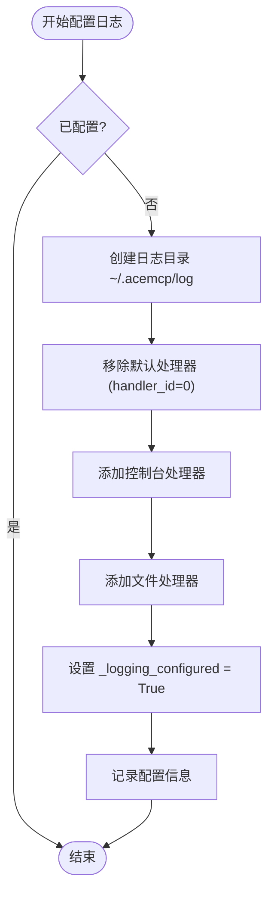
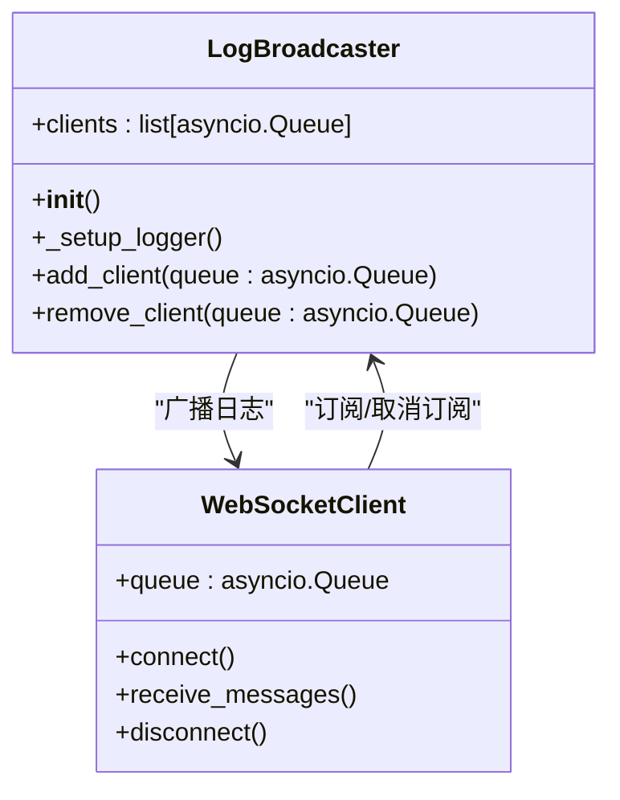
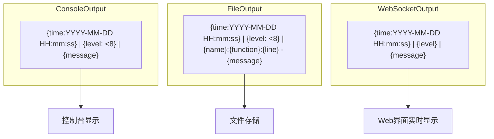
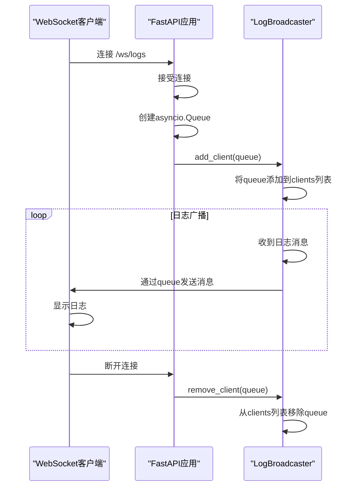

# 日志与监控

<cite>
**Referenced Files in This Document**   
- [logging_config.py](file://src/acemcp/logging_config.py)
- [log_handler.py](file://src/acemcp/web/log_handler.py)
- [server.py](file://src/acemcp/server.py)
- [app.py](file://src/acemcp/web/app.py)
- [config.py](file://src/acemcp/config.py)
</cite>

## 目录
1. [简介](#简介)
2. [日志配置](#日志配置)
3. [观察者模式实现](#观察者模式实现)
4. [日志级别与格式](#日志级别与格式)
5. [日志路径与轮转策略](#日志路径与轮转策略)
6. [日志流订阅](#日志流订阅)
7. [性能评估与优化](#性能评估与优化)

## 简介
本文档详细说明了acemcp项目中日志与监控系统的实现机制。系统基于loguru库构建，实现了控制台输出、文件输出（带轮转策略）以及通过WebSocket向Web界面广播日志消息的实时监控功能。文档重点阐述了LogBroadcaster类如何实现观察者模式，将日志消息广播给WebSocket客户端，以及日志级别、格式、路径配置和性能优化等关键方面。

## 日志配置

日志系统通过`logging_config.py`文件中的`setup_logging()`函数进行全局配置。该函数确保日志配置只执行一次，避免重复配置导致的日志重复输出问题。配置过程包括创建日志目录、移除默认处理器并添加自定义的控制台和文件处理器。

**Diagram sources**
- [logging_config.py](file://src/acemcp/logging_config.py#L14-L65)

**Section sources**
- [logging_config.py](file://src/acemcp/logging_config.py#L14-L65)
- [server.py](file://src/acemcp/server.py#L133)

## 观察者模式实现

LogBroadcaster类实现了观察者模式，将日志消息广播给多个WebSocket客户端。该类维护一个客户端队列列表，当有新的日志消息时，会遍历所有客户端队列并尝试将消息放入队列中。系统使用单例模式确保全局只有一个LogBroadcaster实例。

**Diagram sources**
- [log_handler.py](file://src/acemcp/web/log_handler.py#L12-L57)

**Section sources**
- [log_handler.py](file://src/acemcp/web/log_handler.py#L12-L57)
- [app.py](file://src/acemcp/web/app.py#L18)

## 日志级别与格式

系统定义了不同的日志级别和格式，以满足不同场景的需求。控制台输出使用INFO级别，而文件输出使用DEBUG级别，确保文件中包含更详细的调试信息。日志格式包含时间戳、日志级别和消息内容，文件日志还包含源文件、函数和行号信息。

**Diagram sources**
- [logging_config.py](file://src/acemcp/logging_config.py#L48-L56)
- [log_handler.py](file://src/acemcp/web/log_handler.py#L41)

**Section sources**
- [logging_config.py](file://src/acemcp/logging_config.py#L48-L56)
- [log_handler.py](file://src/acemcp/web/log_handler.py#L41)

## 日志路径与轮转策略

日志文件存储在用户主目录下的`.acemcp/log/acemcp.log`路径中。系统实现了文件轮转策略，当文件大小达到5MB时自动创建新文件，最多保留10个历史文件。轮转的文件会被压缩为zip格式，以节省磁盘空间。配置中还启用了线程安全的日志记录（enqueue=True），确保多线程环境下的日志完整性。

**Section sources**
- [logging_config.py](file://src/acemcp/logging_config.py#L54-L62)

## 日志流订阅

开发者可以通过WebSocket连接`/ws/logs`端点来订阅实时日志流。当客户端连接时，系统会为其创建一个asyncio.Queue，并将其添加到LogBroadcaster的客户端列表中。日志消息会通过该队列推送到客户端。客户端断开连接时，系统会自动从客户端列表中移除对应的队列，避免内存泄漏。

**Diagram sources**
- [app.py](file://src/acemcp/web/app.py#L169-L187)
- [log_handler.py](file://src/acemcp/web/log_handler.py#L42-L57)

**Section sources**
- [app.py](file://src/acemcp/web/app.py#L169-L187)
- [log_handler.py](file://src/acemcp/web/log_handler.py#L42-L57)

## 性能评估与优化

日志系统的性能经过精心设计和优化。首先，系统通过全局标志`_logging_configured`确保日志配置只执行一次，避免重复配置的开销。其次，文件处理器启用了`enqueue=True`选项，实现线程安全的日志记录，避免多线程竞争。对于WebSocket广播，系统使用asyncio.Queue实现非阻塞的消息传递，当队列满时会静默丢弃消息，避免阻塞日志记录线程。此外，系统只在INFO级别及以上广播日志，减少不必要的网络传输。日志轮转和压缩策略也有效控制了磁盘空间的使用。

**Section sources**
- [logging_config.py](file://src/acemcp/logging_config.py#L8-L65)
- [log_handler.py](file://src/acemcp/web/log_handler.py#L24-L40)