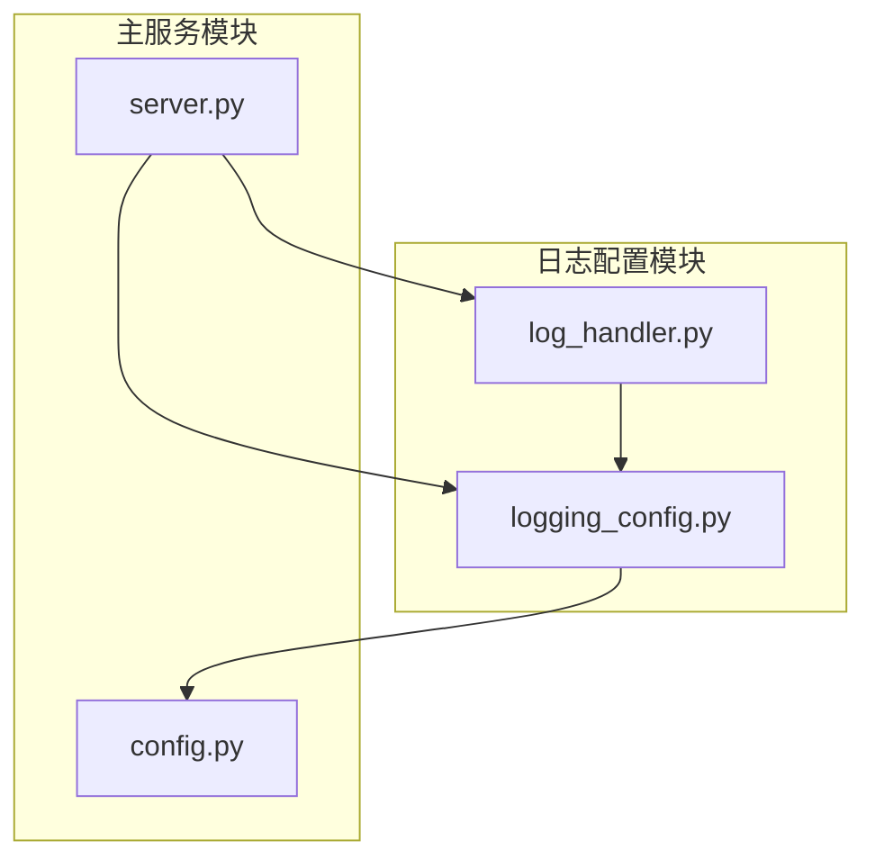
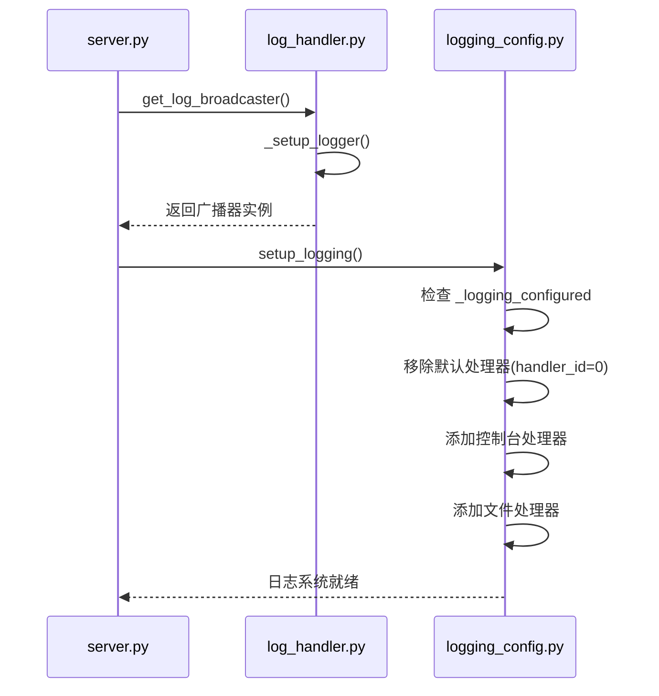
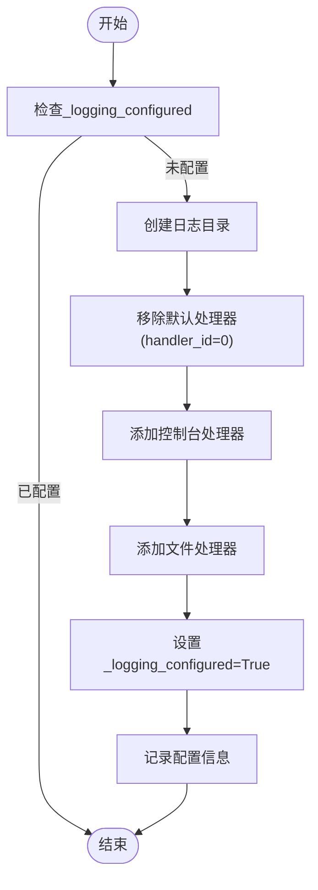
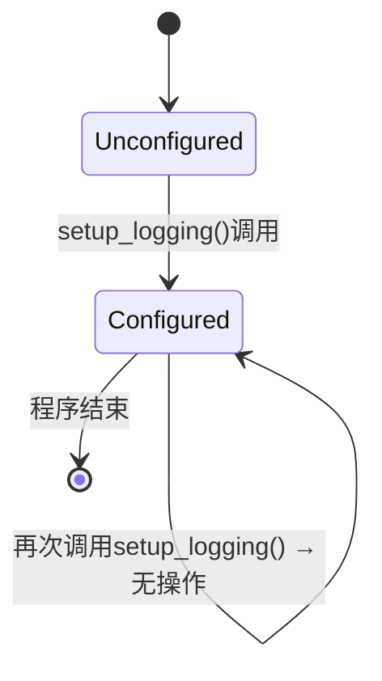
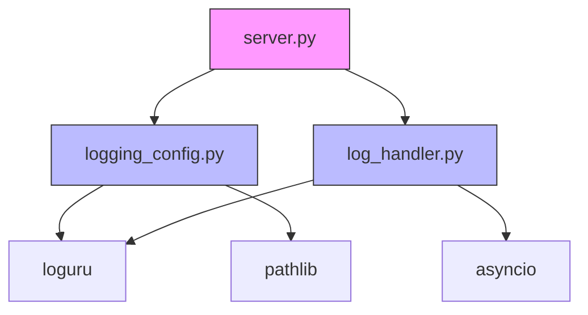

# 日志配置管理

<cite>
**Referenced Files in This Document**  
- [logging_config.py](file://src/acemcp/logging_config.py)
- [log_handler.py](file://src/acemcp/web/log_handler.py)
- [server.py](file://src/acemcp/server.py)
- [config.py](file://src/acemcp/config.py)
</cite>

## 目录
1. [简介](#简介)
2. [项目结构](#项目结构)
3. [核心组件](#核心组件)
4. [架构概述](#架构概述)
5. [详细组件分析](#详细组件分析)
6. [依赖分析](#依赖分析)
7. [性能考虑](#性能考虑)
8. [故障排除指南](#故障排除指南)
9. [结论](#结论)

## 简介
本文档详细说明了acemcp项目的日志配置管理系统，重点介绍基于loguru库的全局日志配置机制。文档涵盖`setup_logging`函数的实现细节，包括控制台和文件双输出的初始化过程、日志格式、级别控制（INFO/DEBUG）、颜色化输出以及线程安全队列（enqueue=True）的使用。同时，详细解释日志文件路径（~/.acemcp/log/acemcp.log）的生成逻辑、5MB大小轮转、最多保留10个历史文件的策略，以及zip压缩归档功能。文档还阐述了`_global_handler_id`与`_logging_configured`标志位如何防止重复配置，并确保与WebSocket广播等自定义处理器共存。

## 项目结构
acemcp项目的日志相关功能分布在多个模块中，主要集中在`src/acemcp/`目录下。日志配置的核心逻辑位于`logging_config.py`，而WebSocket日志广播功能则在`web/log_handler.py`中实现。主服务器模块`server.py`负责协调日志系统的初始化顺序。



**Diagram sources**
- [logging_config.py](file://src/acemcp/logging_config.py)
- [log_handler.py](file://src/acemcp/web/log_handler.py)
- [server.py](file://src/acemcp/server.py)

**Section sources**
- [logging_config.py](file://src/acemcp/logging_config.py)
- [log_handler.py](file://src/acemcp/web/log_handler.py)
- [server.py](file://src/acemcp/server.py)

## 核心组件
日志系统的核心组件包括`setup_logging`函数、`_logging_configured`标志位、`_global_handler_id`全局处理器ID以及`LogBroadcaster`类。这些组件协同工作，确保日志系统能够安全、高效地初始化，并支持多种输出目标。

**Section sources**
- [logging_config.py](file://src/acemcp/logging_config.py#L14-L65)
- [log_handler.py](file://src/acemcp/web/log_handler.py#L12-L73)

## 架构概述
acemcp的日志架构采用模块化设计，通过`loguru`库提供灵活的日志处理能力。系统在启动时首先初始化WebSocket日志广播器（如果启用），然后调用`setup_logging`函数配置主日志处理器。这种顺序确保了自定义处理器不会被主配置过程意外移除。



**Diagram sources**
- [server.py](file://src/acemcp/server.py#L126-L133)
- [logging_config.py](file://src/acemcp/logging_config.py#L14-L65)
- [log_handler.py](file://src/acemcp/web/log_handler.py#L20-L40)

## 详细组件分析

### setup_logging函数分析
`setup_logging`函数是日志系统的核心初始化函数，负责配置控制台和文件双输出。该函数设计为幂等的，可以安全地多次调用。

#### 初始化流程


**Diagram sources**
- [logging_config.py](file://src/acemcp/logging_config.py#L27-L65)

#### 控制台与文件处理器配置
```mermaid
classDiagram
class ConsoleHandler {
+sink : lambda
+format : "<green>{time}</green> | <level>{level}</level> | <level>{message}</level>"
+level : "INFO"
+colorize : True
}
class FileHandler {
+sink : "~/.acemcp/log/acemcp.log"
+format : "{time} | {level} | {name} : {function} : {line} - {message}"
+level : "DEBUG"
+rotation : "5 MB"
+retention : 10
+compression : "zip"
+encoding : "utf-8"
+enqueue : True
}
ConsoleHandler --> FileHandler : "并行输出"
```

**Diagram sources**
- [logging_config.py](file://src/acemcp/logging_config.py#L46-L63)

**Section sources**
- [logging_config.py](file://src/acemcp/logging_config.py#L14-L65)

### 日志路径与轮转策略
日志文件路径遵循标准的用户配置目录模式，位于`~/.acemcp/log/acemcp.log`。系统使用`pathlib.Path`库确保跨平台兼容性。

#### 路径生成逻辑
```python
log_dir = Path.home() / ".acemcp" / "log"
log_file = log_dir / "acemcp.log"
```

该逻辑首先获取用户主目录，然后逐级构建`.acemcp/log`目录结构，最后指定日志文件名为`acemcp.log`。`mkdir(parents=True, exist_ok=True)`确保所有父目录都被创建，且不会因目录已存在而报错。

**Section sources**
- [logging_config.py](file://src/acemcp/logging_config.py#L31-L35)

### 防止重复配置机制
系统通过两个全局变量确保日志配置的幂等性：

- `_logging_configured`: 布尔标志，跟踪日志是否已配置
- `_global_handler_id`: 存储WebSocket广播处理器的ID，防止重复添加



**Diagram sources**
- [logging_config.py](file://src/acemcp/logging_config.py#L8-L8)
- [log_handler.py](file://src/acemcp/web/log_handler.py#L9-L9)

**Section sources**
- [logging_config.py](file://src/acemcp/logging_config.py#L8-L8)
- [log_handler.py](file://src/acemcp/web/log_handler.py#L9-L9)

## 依赖分析
日志系统与其他模块存在明确的依赖关系，确保正确的初始化顺序。



**Diagram sources**
- [server.py](file://src/acemcp/server.py#L13-L15)
- [logging_config.py](file://src/acemcp/logging_config.py#L5)
- [log_handler.py](file://src/acemcp/web/log_handler.py#L6)

**Section sources**
- [server.py](file://src/acemcp/server.py#L13-L15)
- [logging_config.py](file://src/acemcp/logging_config.py#L5)
- [log_handler.py](file://src/acemcp/web/log_handler.py#L3-L6)

## 性能考虑
日志系统的设计充分考虑了性能因素：

1. **线程安全**: 通过`enqueue=True`参数确保多线程环境下的日志写入安全
2. **异步处理**: WebSocket广播使用异步队列，避免阻塞主日志流
3. **条件检查**: 使用标志位避免重复配置，减少不必要的系统调用
4. **文件操作优化**: 目录创建使用`exist_ok=True`，避免额外的存在性检查

## 故障排除指南
### 日志未输出问题
**可能原因及解决方案：**

| 问题现象 | 可能原因 | 解决方案 |
|---------|---------|---------|
| 完全无日志输出 | `setup_logging()`未被调用 | 检查`server.py`中的`run()`函数调用顺序 |
| 控制台无颜色输出 | 终端不支持ANSI颜色 | 确认终端支持颜色显示，或禁用`colorize`参数 |
| 文件日志缺失 | 权限不足或路径无效 | 检查`~/.acemcp`目录的读写权限 |

**Section sources**
- [logging_config.py](file://src/acemcp/logging_config.py#L46-L51)
- [server.py](file://src/acemcp/server.py#L133)

### 日志轮转失效问题
**排查步骤：**

1. 确认`rotation="5 MB"`参数正确设置
2. 检查文件系统是否有足够的空间
3. 验证`retention=10`是否被正确解析
4. 查看压缩功能是否因缺少依赖而失败

```python
# 检查轮转配置
_file_handler_id = logger.add(
    sink=str(log_file),
    rotation="5 MB",
    retention=10,
    compression="zip"
)
```

**Section sources**
- [logging_config.py](file://src/acemcp/logging_config.py#L58-L60)

### 处理器冲突问题
当需要移除默认处理器时，应使用安全的移除方法：

```python
try:
    logger.remove(0)
except ValueError:
    pass  # 处理器0可能已被移除
```

此模式确保即使处理器不存在也不会引发异常，保证配置过程的健壮性。

**Section sources**
- [logging_config.py](file://src/acemcp/logging_config.py#L39-L43)

## 结论
acemcp的日志配置系统通过精心设计的初始化流程和状态管理机制，实现了安全、可靠且可扩展的日志功能。系统能够有效支持控制台输出、文件轮转和WebSocket广播等多种日志输出方式，同时通过幂等性设计和依赖管理确保了配置过程的稳定性。开发者可以基于此系统进行定制化扩展，如修改日志路径、调整轮转策略或添加新的处理器，而不会破坏现有功能。