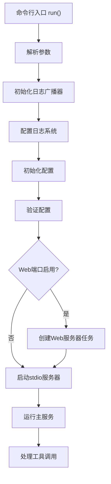
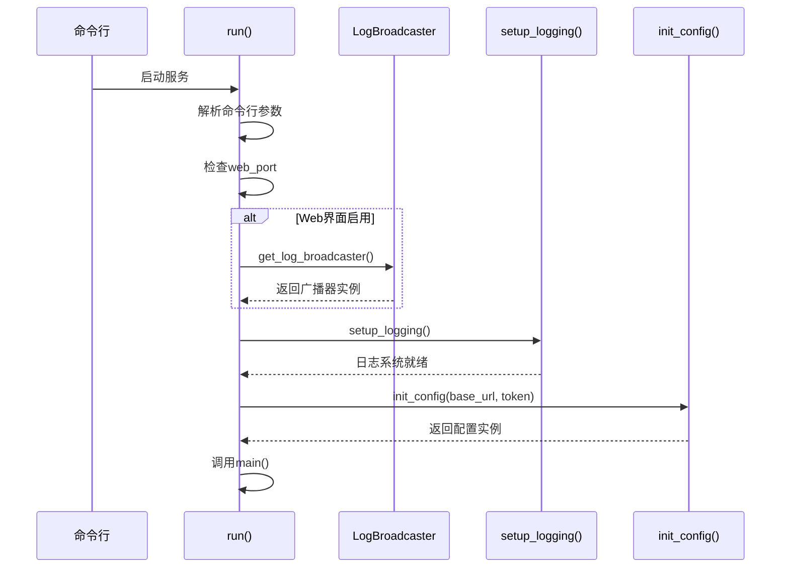
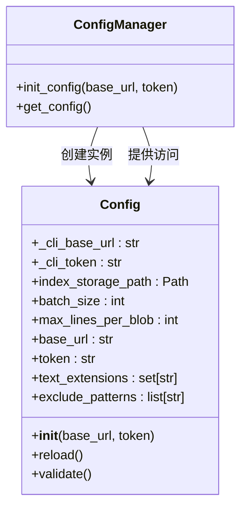
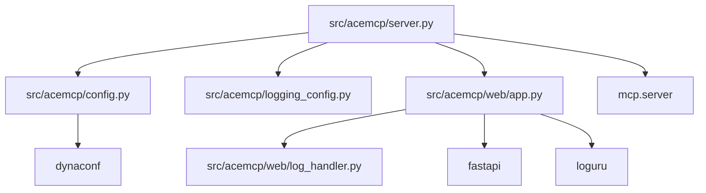

# 服务启动流程

<cite>
**Referenced Files in This Document**   
- [src/acemcp/server.py](file://src/acemcp/server.py)
- [src/acemcp/config.py](file://src/acemcp/config.py)
- [src/acemcp/logging_config.py](file://src/acemcp/logging_config.py)
- [src/acemcp/web/app.py](file://src/acemcp/web/app.py)
- [src/acemcp/web/log_handler.py](file://src/acemcp/web/log_handler.py)
</cite>

## 目录
1. [简介](#简介)
2. [核心组件](#核心组件)
3. [架构概述](#架构概述)
4. [详细组件分析](#详细组件分析)
5. [依赖分析](#依赖分析)
6. [性能考虑](#性能考虑)
7. [故障排除指南](#故障排除指南)
8. [结论](#结论)

## 简介
本文档详细描述了acemcp服务的启动流程，从命令行入口到服务初始化的完整过程。重点阐述了命令行参数解析、配置加载与验证、日志系统初始化以及Web界面管理等核心机制。文档详细说明了参数覆盖优先级（命令行 > 环境变量 > 配置文件）、配置文件(settings.toml)的加载过程、日志广播功能的实现原理，以及主服务与Web服务器的并行运行机制。

## 核心组件
acemcp服务的核心组件包括命令行解析、配置管理、日志系统和Web管理界面。`run()`函数作为命令行入口点，负责解析`--base-url`、`--token`和`--web-port`等参数。`Config`类实现了三层配置优先级机制，确保命令行参数具有最高优先级。`setup_logging()`函数配置了文件和控制台日志输出，而`LogBroadcaster`类实现了WebSocket日志广播功能，使Web界面能够实时显示服务器日志。

**Section sources**
- [src/acemcp/server.py](file://src/acemcp/server.py#L116-L134)
- [src/acemcp/config.py](file://src/acemcp/config.py#L118-L164)

## 架构概述
acemcp服务采用模块化架构，包含配置管理、日志系统、MCP服务器核心和Web管理界面四个主要组件。服务启动时，首先通过命令行参数解析，然后加载并验证配置，接着初始化日志系统。如果启用了Web界面，会创建一个异步任务来运行Web服务器，同时主服务通过stdio与MCP客户端建立通信。这种架构设计实现了功能分离，确保了主服务与Web管理界面的并行运行。



**Diagram sources**
- [src/acemcp/server.py](file://src/acemcp/server.py#L116-L134)
- [src/acemcp/server.py](file://src/acemcp/server.py#L86-L113)

## 详细组件分析

### 命令行参数解析与配置初始化
`run()`函数作为服务的入口点，使用`argparse.ArgumentParser`解析命令行参数`--base-url`、`--token`和`--web-port`。参数解析后，服务会根据是否启用Web界面来决定初始化顺序：如果`web_port`被指定，会先初始化`LogBroadcaster`以确保日志广播功能正常工作，然后才调用`setup_logging()`配置日志系统。这种顺序确保了WebSocket日志处理器不会被后续的日志配置所覆盖。



**Diagram sources**
- [src/acemcp/server.py](file://src/acemcp/server.py#L116-L134)
- [src/acemcp/web/log_handler.py](file://src/acemcp/web/log_handler.py#L63-L72)

**Section sources**
- [src/acemcp/server.py](file://src/acemcp/server.py#L116-L134)
- [src/acemcp/web/log_handler.py](file://src/acemcp/web/log_handler.py#L63-L72)

### 配置管理与参数优先级
`Config`类实现了三层配置优先级机制：命令行参数 > 环境变量 > 配置文件。在`__init__`方法中，首先保存命令行参数，然后从`settings`（由Dynaconf管理）中获取配置值，如果命令行参数存在则优先使用。`init_config()`函数负责创建全局配置实例，而`get_config()`提供对全局实例的访问。配置文件`settings.toml`位于`~/.acemcp/`目录下，首次运行时会自动创建并填充默认值。



**Diagram sources**
- [src/acemcp/config.py](file://src/acemcp/config.py#L118-L164)
- [src/acemcp/config.py](file://src/acemcp/config.py#L182-L194)

**Section sources**
- [src/acemcp/config.py](file://src/acemcp/config.py#L118-L164)
- [src/acemcp/config.py](file://src/acemcp/config.py#L182-L194)

### 日志系统与Web界面集成
日志系统的设计考虑了Web界面的特殊需求。`LogBroadcaster`类在`setup_logging()`之前初始化，确保其WebSocket处理器不会被移除。`setup_logging()`函数会移除默认的日志处理器（ID为0），但保留其他自定义处理器，从而实现了日志广播功能。Web服务器通过`run_web_server()`函数作为异步任务运行，使用Uvicorn在指定端口上提供管理界面，同时主服务通过stdio与MCP客户端通信，两者并行运行互不干扰。

```mermaid
flowchart TD
Start([服务启动]) --> CheckWeb["检查web_port参数"]
CheckWeb --> |启用| InitBroadcaster["初始化LogBroadcaster"]
InitBroadcaster --> SetupLogging["配置日志系统"]
CheckWeb --> |禁用| SetupLogging
SetupLogging --> InitConfig["初始化配置"]
InitConfig --> ValidateConfig["验证配置"]
ValidateConfig --> StartMain["启动主服务"]
StartMain --> {Web启用?}
{Web启用?} --> |是| StartWeb["创建Web服务器任务"]
{Web启用?} --> |否| RunStdio["运行stdio服务器"]
StartWeb --> RunStdio
RunStdio --> End([服务运行])
```

**Diagram sources**
- [src/acemcp/logging_config.py](file://src/acemcp/logging_config.py#L13-L65)
- [src/acemcp/server.py](file://src/acemcp/server.py#L67-L83)

**Section sources**
- [src/acemcp/logging_config.py](file://src/acemcp/logging_config.py#L13-L65)
- [src/acemcp/server.py](file://src/acemcp/server.py#L67-L83)

## 依赖分析
acemcp服务的组件间存在明确的依赖关系。`server.py`是主入口模块，依赖`config.py`进行配置管理，依赖`logging_config.py`进行日志配置，依赖`web/app.py`提供Web管理界面。`config.py`使用Dynaconf库管理配置，从`settings.toml`文件和环境变量中读取配置。`web/app.py`依赖`log_handler.py`实现日志广播功能，并通过`get_config()`访问全局配置。这种依赖结构确保了配置的一致性和日志系统的完整性。



**Diagram sources**
- [src/acemcp/server.py](file://src/acemcp/server.py#L12-L15)
- [src/acemcp/web/app.py](file://src/acemcp/web/app.py#L14-L15)

**Section sources**
- [src/acemcp/server.py](file://src/acemcp/server.py#L12-L15)
- [src/acemcp/web/app.py](file://src/acemcp/web/app.py#L14-L15)

## 性能考虑
服务启动时的性能考虑主要体现在日志配置和异步任务管理上。日志系统使用`enqueue=True`参数实现线程安全的日志记录，避免了I/O阻塞。Web服务器作为独立的异步任务运行，不会阻塞主服务的stdio通信。配置文件的读取和解析在服务启动时一次性完成，避免了运行时的重复I/O操作。对于大型代码库的索引，`batch_size`配置项控制了每次上传的文件数量，平衡了内存使用和处理效率。

## 故障排除指南
启动过程中常见的问题包括配置文件缺失、权限不足和端口冲突。如果服务无法启动，首先检查`~/.acemcp/`目录是否存在且可写。如果Web界面无法访问，确认`--web-port`参数是否正确指定，以及该端口是否被其他进程占用。日志文件位于`~/.acemcp/log/acemcp.log`，包含详细的启动信息和错误堆栈。配置验证会在启动时检查`base_url`和`token`是否设置，如果验证失败，服务将不会启动并输出相应的错误信息。

**Section sources**
- [src/acemcp/config.py](file://src/acemcp/config.py#L152-L165)
- [src/acemcp/logging_config.py](file://src/acemcp/logging_config.py#L30-L36)

## 结论
acemcp服务的启动流程设计合理，实现了配置管理、日志记录和Web管理的无缝集成。通过清晰的参数优先级机制和模块化的架构设计，服务既保持了灵活性又确保了稳定性。命令行参数、环境变量和配置文件的三层配置体系满足了不同场景下的需求，而Web管理界面的异步运行机制则提供了友好的管理体验而不影响主服务性能。整体设计体现了良好的软件工程实践，为后续的功能扩展和维护奠定了坚实基础。