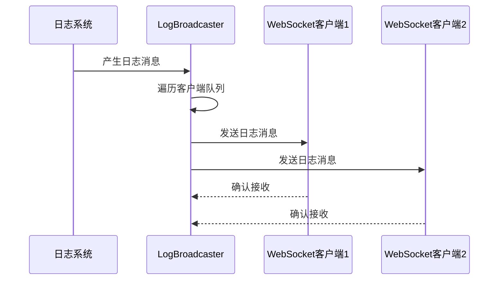

# 架构模式详解

<cite>
**本文档引用的文件**  
- [config.py](file://src/acemcp/config.py)
- [logging_config.py](file://src/acemcp/logging_config.py)
- [index/manager.py](file://src/acemcp/index/manager.py)
- [web/log_handler.py](file://src/acemcp/web/log_handler.py)
- [web/app.py](file://src/acemcp/web/app.py)
</cite>

## 目录
1. [单例模式实现](#单例模式实现)
2. [依赖注入模式应用](#依赖注入模式应用)
3. [观察者模式实现](#观察者模式实现)
4. [工厂模式体现](#工厂模式体现)
5. [架构模式对比](#架构模式对比)

## 单例模式实现

在acemcp架构中，单例模式通过全局实例变量确保关键组件的唯一性。`Config`类通过`_config_instance`全局变量实现配置的单一实例，该变量在`get_config()`函数中被初始化和返回。当首次调用`get_config()`时，会创建`Config`实例并存储在`_config_instance`中，后续调用直接返回该实例，避免了重复创建。同样，`LogBroadcaster`类通过`_broadcaster_instance`实现日志广播器的全局唯一性，在`get_log_broadcaster()`函数中进行实例化管理。这种实现方式确保了配置和日志系统在整个应用生命周期中保持一致的状态。

**Section sources**
- [config.py](file://src/acemcp/config.py#L168-L180)
- [log_handler.py](file://src/acemcp/web/log_handler.py#L61-L72)

## 依赖注入模式应用

`IndexManager`类体现了依赖注入模式的应用，其`__init__`方法接收多个配置参数而非直接访问全局配置。这种设计将依赖关系显式地通过参数传递，提高了模块的可测试性和灵活性。`IndexManager`的构造函数接收`storage_path`、`base_url`、`token`、`text_extensions`、`batch_size`等参数，这些参数由外部调用者提供，而不是在类内部直接引用全局变量。这种松耦合的设计使得`IndexManager`可以在不同配置环境下被实例化和测试，无需修改其内部实现。在`search_context_tool`函数中，`IndexManager`的实例化过程展示了依赖注入的实际应用，配置参数通过`get_config()`获取后传递给构造函数。

**Section sources**
- [manager.py](file://src/acemcp/index/manager.py#L67-L91)
- [search_context.py](file://src/acemcp/tools/search_context.py#L34-L43)

## 观察者模式实现

WebSocket日志系统通过观察者模式实现了实时日志广播功能。`LogBroadcaster`类作为主题（Subject），维护着一个客户端队列列表`clients`，当新日志产生时，会通知所有注册的观察者（WebSocket客户端）。在`_setup_logger`方法中，自定义的`log_sink`函数被添加为loguru的日志处理器，该函数在接收到日志消息时，会遍历所有客户端队列并发送日志文本。WebSocket端点`websocket_logs`作为观察者，通过`add_client`方法注册到`LogBroadcaster`，并在连接断开时通过`remove_client`方法注销。这种设计实现了发布-订阅机制，使得日志系统能够高效地向多个客户端广播日志消息，而无需每个客户端直接与日志系统耦合。

**Diagram sources**
- [log_handler.py](file://src/acemcp/web/log_handler.py#L12-L58)
- [app.py](file://src/acemcp/web/app.py#L169-L187)

## 工厂模式体现

`create_app()`函数体现了工厂模式的设计思想，封装了FastAPI应用的创建逻辑。该函数作为工厂方法，负责创建和配置FastAPI应用实例，包括路由注册、静态文件挂载和依赖注入等复杂过程。通过工厂模式，应用的创建细节被封装在`create_app`函数内部，使用者只需调用该函数即可获得配置好的应用实例，而无需了解内部实现细节。函数内部完成了多个组件的组装：创建FastAPI实例、挂载静态文件目录、定义API路由处理函数、设置WebSocket端点等。这种封装提高了代码的可维护性，使得应用创建逻辑可以集中管理，并在需要时进行统一修改。

**Section sources**
- [app.py](file://src/acemcp/web/app.py#L39-L187)

## 架构模式对比

acemcp架构融合了多种设计模式，形成了一个MVC-like架构。与传统MVC模式相比，该项目在控制层和模型层的设计上有所创新。传统MVC模式中，控制器直接调用模型并返回视图，而acemcp通过依赖注入和单例模式实现了更灵活的组件交互。模型层（如`IndexManager`）通过依赖注入接收配置，提高了可测试性；视图层通过WebSocket实现了实时日志推送，增强了用户体验。项目更适合称为MVC-like架构，因为它保留了MVC的核心思想——关注点分离，但在具体实现上采用了更适合现代Web应用的设计模式组合。这种架构既保持了MVC的清晰结构，又通过设计模式的灵活应用提升了系统的可扩展性和可维护性。

**Section sources**
- [app.py](file://src/acemcp/web/app.py#L15-L187)
- [manager.py](file://src/acemcp/index/manager.py#L67-L549)
- [config.py](file://src/acemcp/config.py#L119-L197)