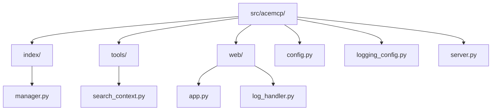
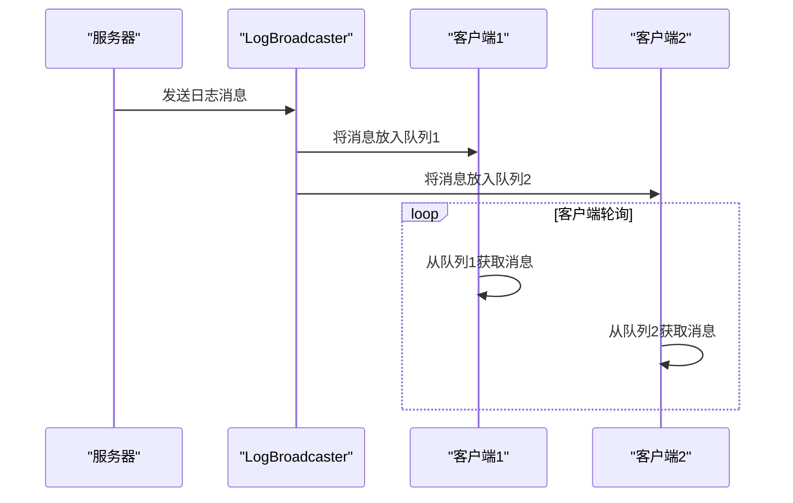
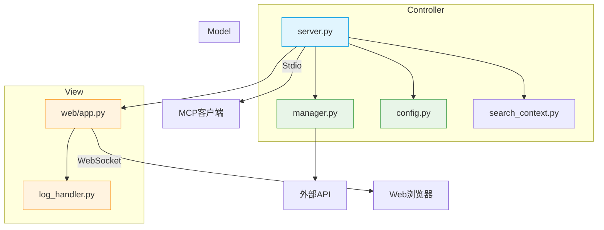

# 核心架构与设计

<cite>
**本文档引用的文件**  
- [server.py](file://src/acemcp/server.py)
- [config.py](file://src/acemcp/config.py)
- [index/manager.py](file://src/acemcp/index/manager.py)
- [web/app.py](file://src/acemcp/web/app.py)
- [tools/search_context.py](file://src/acemcp/tools/search_context.py)
- [logging_config.py](file://src/acemcp/logging_config.py)
- [web/log_handler.py](file://src/acemcp/web/log_handler.py)
</cite>

## 目录
1. [简介](#简介)
2. [项目结构](#项目结构)
3. [MVC-like 架构模式](#mvc-like-架构模式)
4. [关键架构模式](#关键架构模式)
5. [组件关系与数据流](#组件关系与数据流)
6. [技术选型理由](#技术选型理由)
7. [结论](#结论)

## 简介

acemcp 是一个用于代码库索引和语义搜索的 MCP（Model Context Protocol）服务器。本架构文档系统性地描述了其模块化设计、组件间交互以及核心架构模式。该系统采用类 MVC 架构，将配置与索引数据作为 Model，将 server.py 和 manager.py 作为 Controller，将 Web 界面作为 View。文档深入分析了单例、依赖注入、观察者和工厂等关键设计模式的应用，并详细阐述了从客户端请求到结果返回的完整数据流。

## 项目结构

acemcp 的项目结构清晰地体现了其模块化设计，主要分为 `index`、`tools`、`web` 三个核心模块，以及 `config` 和 `logging_config` 等支撑模块。



**Diagram sources**
- [src/acemcp/](file://src/acemcp/)
- [src/acemcp/index/](file://src/acemcp/index/)
- [src/acemcp/tools/](file://src/acemcp/tools/)
- [src/acemcp/web/](file://src/acemcp/web/)

**Section sources**
- [src/acemcp/](file://src/acemcp/)

## MVC-like 架构模式

acemcp 的设计遵循一种类 MVC（Model-View-Controller）的模式，实现了关注点的分离。

### Model（模型）：配置与索引数据

在 acemcp 中，Model 层由 `Config` 类和 `IndexManager` 类共同构成，它们负责管理应用的状态和数据。

`Config` 类（位于 `config.py`）是应用的配置模型。它通过 `Dynaconf` 库管理来自环境变量、配置文件（`~/.acemcp/settings.toml`）和命令行参数的配置。它定义了诸如 `BASE_URL`、`TOKEN`、`BATCH_SIZE`、`TEXT_EXTENSIONS` 等核心参数。`Config` 类通过单例模式实现，确保全局配置的一致性。

`IndexManager` 类（位于 `index/manager.py`）是索引数据的模型。它负责管理代码库的索引状态，包括：
- **数据存储**：通过 `projects.json` 文件持久化记录每个项目根路径与其已索引的 blob 名称列表。
- **数据操作**：提供 `index_project` 方法来收集、处理和上传代码文件，以及 `search_context` 方法来执行搜索。
- **数据验证**：在索引前自动进行增量检查，通过 SHA-256 哈希计算来识别文件是否已存在，避免重复上传。

这两个类共同构成了系统的数据核心，Controller 层通过它们来读取配置和操作索引数据。

**Section sources**
- [config.py](file://src/acemcp/config.py#L118-L164)
- [manager.py](file://src/acemcp/index/manager.py#L66-L549)

### Controller（控制器）：业务逻辑协调者

Controller 层是系统的业务逻辑中枢，主要由 `server.py` 和 `manager.py` 组成。

`server.py` 是主控制器，扮演着 MCP 服务器的入口和协调者的角色。它的核心职责包括：
- **初始化**：通过 `init_config` 函数解析命令行参数并初始化 `Config` 单例。
- **工具注册**：使用 `@app.list_tools()` 和 `@app.call_tool()` 装饰器定义和注册 MCP 工具（如 `search_context`）。
- **流程控制**：在 `main` 函数中协调整个服务器的启动流程，包括配置初始化、日志设置、Web 服务器启动和 MCP 服务器运行。
- **依赖注入**：将 `Config` 实例注入到 `IndexManager` 和 `search_context_tool` 中。

`manager.py` 中的 `IndexManager` 类不仅是 Model，也承担了重要的 Controller 职责。它协调了从文件收集、内容读取、大文件分割、增量索引到最终 API 调用的整个复杂流程。例如，`search_context` 方法首先调用 `index_project` 进行自动索引，然后加载索引数据，最后构造并发送搜索请求，体现了典型的控制器行为。

**Section sources**
- [server.py](file://src/acemcp/server.py#L17-L138)
- [manager.py](file://src/acemcp/index/manager.py#L66-L549)

### View（视图）：Web 管理界面

View 层由 `web` 模块实现，提供了一个基于 Web 的管理界面，使用户能够直观地监控和管理服务器。

`web/app.py` 文件中的 `create_app` 函数是 View 层的工厂，它创建了一个 FastAPI 应用实例。该应用提供了以下 API 端点：
- `/api/config`：获取和更新服务器配置。
- `/api/status`：获取服务器运行状态。
- `/api/tools/execute`：调试执行 MCP 工具。
- `/ws/logs`：通过 WebSocket 提供实时日志流。

前端模板 `web/templates/index.html` 利用这些 API 构建了一个交互式界面，用户可以在其中查看配置、监控实时日志、测试工具执行，从而实现了对后端数据和逻辑的可视化呈现。

**Section sources**
- [app.py](file://src/acemcp/web/app.py#L38-L187)
- [index.html](file://src/acemcp/web/templates/index.html)

## 关键架构模式

acemcp 巧妙地应用了多种经典的设计模式，以提升代码的可维护性、可扩展性和健壮性。

### 单例模式（Singleton）

单例模式确保一个类只有一个实例，并提供一个全局访问点。acemcp 在两个关键组件中应用了此模式。

`Config` 类通过全局变量 `_config_instance` 实现了单例。`get_config()` 函数检查该实例是否已创建，若未创建则进行初始化，从而保证了在整个应用生命周期中，配置对象是唯一的。这避免了配置不一致的问题。

`LogBroadcaster` 类（位于 `web/log_handler.py`）同样使用了单例模式。`get_log_broadcaster()` 函数确保了日志广播器的全局唯一性。这对于 WebSocket 日志广播至关重要，因为所有客户端都必须连接到同一个广播器实例，才能接收到相同的日志消息。

```mermaid
classDiagram
class Config {
-_config_instance : Config
+get_config() : Config
+init_config() : Config
}
class LogBroadcaster {
-_broadcaster_instance : LogBroadcaster
+get_log_broadcaster() : LogBroadcaster
+add_client(queue)
+remove_client(queue)
}
note right of Config : 全局配置单例
note right of LogBroadcaster : 全局日志广播器单例
```

**Diagram sources**
- [config.py](file://src/acemcp/config.py#L167-L197)
- [log_handler.py](file://src/acemcp/web/log_handler.py#L61-L73)

**Section sources**
- [config.py](file://src/acemcp/config.py#L167-L197)
- [log_handler.py](file://src/acemcp/web/log_handler.py#L61-L73)

### 依赖注入（Dependency Injection）

依赖注入是一种设计模式，它将一个对象所依赖的其他对象（依赖项）从外部传递给它，而不是在对象内部直接创建。这降低了组件间的耦合度。

在 acemcp 中，`IndexManager` 的构造函数明确地接收了其运行所需的所有依赖项，包括 `storage_path`、`base_url`、`token`、`text_extensions`、`batch_size` 等。这些依赖项由 `server.py` 或 `search_context_tool` 在创建 `IndexManager` 实例时提供。

```python
# 依赖项由外部传入
index_manager = IndexManager(
    config.index_storage_path,
    config.base_url,
    config.token,
    config.text_extensions,
    config.batch_size,
    config.max_lines_per_blob,
    config.exclude_patterns,
)
```

这种设计使得 `IndexManager` 不再依赖于具体的配置获取方式，提高了其可测试性（可以轻松注入模拟的依赖项进行单元测试）和灵活性。

**Section sources**
- [manager.py](file://src/acemcp/index/manager.py#L68-L90)
- [search_context.py](file://src/acemcp/tools/search_context.py#L34-L43)

### 观察者模式（Observer）

观察者模式定义了一种一对多的依赖关系，当一个对象（被观察者）的状态发生改变时，所有依赖于它的对象（观察者）都会得到通知并自动更新。

acemcp 使用观察者模式实现了实时日志广播功能。`LogBroadcaster` 是被观察者（主题），而每个连接到 `/ws/logs` 的 WebSocket 客户端都是一个观察者。

当 `LogBroadcaster` 接收到一条日志消息时，它会遍历其内部的客户端队列列表，并将消息推送给每一个队列。客户端通过轮询自己的队列来获取新日志并更新界面。这种模式实现了日志生产者（服务器）和消费者（Web 界面）之间的松耦合。



**Diagram sources**
- [log_handler.py](file://src/acemcp/web/log_handler.py#L11-L57)
- [app.py](file://src/acemcp/web/app.py#L169-L187)

**Section sources**
- [log_handler.py](file://src/acemcp/web/log_handler.py#L11-L57)
- [app.py](file://src/acemcp/web/app.py#L169-L187)

### 工厂模式（Factory）

工厂模式定义了一个用于创建对象的接口，但让子类决定实例化哪一个类。它将对象的创建与使用分离。

`create_app` 函数（位于 `web/app.py`）是一个典型的工厂方法。它封装了创建和配置 FastAPI 应用实例的复杂逻辑。调用者无需了解如何设置路由、挂载静态文件或配置日志处理器，只需调用 `create_app()` 即可获得一个完全配置好的 Web 应用实例。

```python
def create_app() -> FastAPI:
    """创建 FastAPI 应用程序。
    
    Returns:
        FastAPI 应用实例
    """
    app = FastAPI(title="Acemcp Management", ...)
    # ... 配置路由和中间件
    return app
```

这种模式简化了 Web 应用的创建过程，并确保了每次创建的应用都遵循相同的配置标准。

**Section sources**
- [app.py](file://src/acemcp/web/app.py#L38-L187)

## 组件关系与数据流

本节将详细说明 `server.py` 如何作为主控制器协调各个组件，并描述从 MCP 客户端请求到最终结果返回的完整数据流。

### 组件关系图



**Diagram sources**
- [server.py](file://src/acemcp/server.py)
- [config.py](file://src/acemcp/config.py)
- [manager.py](file://src/acemcp/index/manager.py)
- [app.py](file://src/acemcp/web/app.py)
- [log_handler.py](file://src/acemcp/web/log_handler.py)

**Section sources**
- [server.py](file://src/acemcp/server.py)
- [config.py](file://src/acemcp/config.py)
- [manager.py](file://src/acemcp/index/manager.py)
- [app.py](file://src/acemcp/web/app.py)
- [log_handler.py](file://src/acemcp/web/log_handler.py)

### 数据流：从请求到结果

当 MCP 客户端发起一个 `search_context` 工具调用时，系统内部的数据流如下：

1.  **请求接收**：`server.py` 中的 `@app.call_tool()` 装饰器捕获到 `search_context` 工具调用，并将参数传递给 `call_tool` 函数。
2.  **工具分发**：`call_tool` 函数识别出工具名称，并调用 `tools/search_context.py` 中的 `search_context_tool` 函数。
3.  **依赖注入与初始化**：`search_context_tool` 函数通过 `get_config()` 获取全局 `Config` 实例，并使用该配置作为依赖项来创建一个 `IndexManager` 实例。
4.  **自动索引（增量）**：`IndexManager` 的 `search_context` 方法首先调用 `index_project`。该方法会：
    *   收集指定项目根路径下的所有文本文件（遵守 `.gitignore` 和排除模式）。
    *   计算每个文件内容的 SHA-256 哈希值。
    *   与本地存储的 `projects.json` 进行比对，仅将新文件或修改过的文件上传到远程 API。
5.  **执行搜索**：增量索引完成后，`search_context` 方法会从 `projects.json` 加载该项目所有已索引的 blob 名称，并构造一个搜索请求，发送到远程 API。
6.  **结果返回**：远程 API 返回格式化的检索结果，该结果通过 `search_context_tool` 返回给 `call_tool`，最终通过 MCP 协议返回给客户端。

这个流程确保了搜索操作的高效性和结果的实时性，用户无需关心底层的索引过程。

**Section sources**
- [server.py](file://src/acemcp/server.py#L49-L65)
- [search_context.py](file://src/acemcp/tools/search_context.py#L11-L46)
- [manager.py](file://src/acemcp/index/manager.py#L468-L549)

## 技术选型理由

acemcp 的技术栈选择体现了对性能、开发效率和现代 Web 标准的考量。

### 选择 FastAPI 和 Uvicorn 的理由

选择 **FastAPI** 作为 Web 框架，主要基于以下优势：
- **高性能**：FastAPI 基于 Starlette 和 Pydantic，性能接近 Go 语言的水平，非常适合处理实时日志流等高并发场景。
- **异步支持**：原生支持 `async`/`await`，能够高效地处理 I/O 密集型任务，如文件读取、网络请求和 WebSocket 通信。
- **自动文档**：内置了 OpenAPI 和 JSON Schema 支持，能自动生成交互式 API 文档（Swagger UI），极大地方便了开发和调试。
- **类型安全**：深度集成 Pydantic，通过 Python 类型提示提供强大的数据验证和序列化功能，减少了运行时错误。

选择 **Uvicorn** 作为 ASGI 服务器，是因为：
- **轻量高效**：Uvicorn 是一个快速、轻量级的 ASGI 服务器，专为运行 FastAPI 等现代异步框架而设计。
- **生产就绪**：它稳定可靠，支持进程管理、信号处理和日志记录，可以直接用于生产环境。
- **无缝集成**：与 FastAPI 集成度极高，配置简单，启动方便。

这两者的结合为 acemcp 的 Web 管理界面提供了强大、高效且易于开发的后端支持。

**Section sources**
- [app.py](file://src/acemcp/web/app.py#L8-L11)
- [server.py](file://src/acemcp/server.py#L6-L7)

## 结论

acemcp 通过精心设计的类 MVC 架构和多种设计模式的应用，构建了一个模块化、可维护且健壮的 MCP 服务器。`Config` 和 `IndexManager` 作为 Model 管理着核心数据和状态，`server.py` 作为主 Controller 协调全局流程，而基于 FastAPI 的 Web 界面则提供了直观的 View。单例、依赖注入、观察者和工厂模式的运用，使得组件间耦合度低，代码清晰。数据流设计合理，通过自动增量索引保证了搜索的实时性和效率。技术选型上，FastAPI 和 Uvicorn 的组合为系统提供了高性能和现代化的开发体验。整体架构清晰，为未来的功能扩展和维护奠定了坚实的基础。