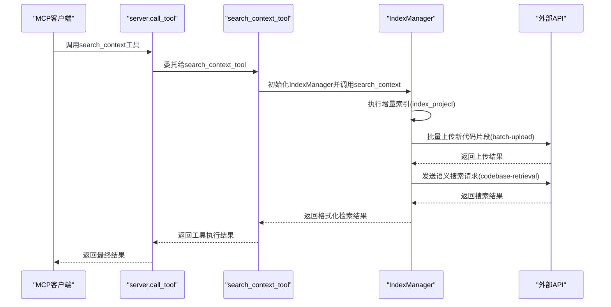

# 组件交互模型

<cite>
**本文档引用的文件**   
- [server.py](file://src/acemcp/server.py)
- [search_context.py](file://src/acemcp/tools/search_context.py)
- [manager.py](file://src/acemcp/index/manager.py)
- [app.py](file://src/acemcp/web/app.py)
- [config.py](file://src/acemcp/config.py)
</cite>

## 目录
1. [核心组件调用关系](#核心组件调用关系)
2. [Web界面交互机制](#web界面交互机制)
3. [外部API交互模式](#外部api交互模式)
4. [完整调用链序列图](#完整调用链序列图)
5. [依赖注入模式应用](#依赖注入模式应用)

## 核心组件调用关系

`server.py` 作为主控制器，通过 `@app.call_tool()` 装饰器定义了工具调用的入口点。当MCP客户端调用 `search_context` 工具时，`call_tool()` 函数会接收到工具名称和参数，并根据工具名称进行分发处理。对于 `search_context` 工具，`call_tool()` 会委托给 `search_context_tool` 函数进行处理。

`search_context_tool` 函数位于 `tools/search_context.py` 文件中，负责处理具体的搜索上下文工具调用。该函数首先验证输入参数，然后获取当前配置实例，并使用配置参数初始化 `IndexManager` 实例。初始化完成后，`search_context_tool` 会调用 `IndexManager` 的 `search_context` 方法，传入项目根路径和查询字符串，最终将搜索结果返回给调用者。

**Section sources**
- [server.py](file://src/acemcp/server.py#L48-L64)
- [search_context.py](file://src/acemcp/tools/search_context.py#L10-L49)

## Web界面交互机制

Web界面与核心组件的交互主要通过两个API端点实现：`/api/config` 和 `/ws/logs`。

`/api/config` 端点支持GET和POST两种HTTP方法。当客户端发送GET请求时，`get_config_api()` 函数会调用 `get_config()` 获取当前配置实例，并将配置信息以JSON格式返回。当客户端发送POST请求时，`update_config_api()` 函数会接收配置更新请求，将新的配置值写入用户配置文件 `settings.toml`，然后调用 `config.reload()` 方法重新加载配置，确保配置变更立即生效。

`/ws/logs` 端点是一个WebSocket接口，用于实现实时日志广播。当客户端建立WebSocket连接时，`websocket_logs()` 函数会创建一个异步队列，并将该队列添加到 `LogBroadcaster` 实例的客户端列表中。`LogBroadcaster` 是一个全局单例，它通过 `loguru` 的自定义sink机制捕获所有日志消息，并将这些消息广播给所有已连接的客户端。当客户端断开连接时，相应的队列会被从客户端列表中移除。

**Section sources**
- [app.py](file://src/acemcp/web/app.py#L58-L71)
- [app.py](file://src/acemcp/web/app.py#L74-L114)
- [app.py](file://src/acemcp/web/app.py#L169-L187)
- [log_handler.py](file://src/acemcp/web/log_handler.py#L12-L58)

## 外部API交互模式

`IndexManager` 与外部API的交互主要通过 `httpx.AsyncClient` 实现批量上传和语义搜索请求。在 `index_project()` 方法中，当需要上传新的代码片段时，`IndexManager` 会创建一个 `httpx.AsyncClient` 实例，并将其用于发送批量上传请求。上传请求的目标URL由配置中的 `base_url` 和 `/batch-upload` 路径组成，请求头中包含使用 `Bearer` 方案的授权令牌。

在 `search_context()` 方法中，执行语义搜索时也会创建一个 `httpx.AsyncClient` 实例。搜索请求的目标URL由 `base_url` 和 `/agents/codebase-retrieval` 路径组成。为了提高可靠性，`IndexManager` 实现了 `_retry_request()` 辅助方法，该方法支持指数退避重试机制，最多重试3次，初始重试延迟为1秒。这确保了在网络不稳定的情况下，请求能够自动重试，提高了系统的健壮性。

**Section sources**
- [manager.py](file://src/acemcp/index/manager.py#L382-L416)
- [manager.py](file://src/acemcp/index/manager.py#L522-L537)
- [manager.py](file://src/acemcp/index/manager.py#L128-L162)

## 完整调用链序列图

**Diagram sources**
- [server.py](file://src/acemcp/server.py#L48-L64)
- [search_context.py](file://src/acemcp/tools/search_context.py#L10-L49)
- [manager.py](file://src/acemcp/index/manager.py#L468-L549)

## 依赖注入模式应用

依赖注入模式在 `IndexManager` 的初始化过程中得到了充分体现。`IndexManager` 的构造函数接收多个配置参数，包括存储路径、基础URL、令牌、文本文件扩展名、批处理大小、最大行数和排除模式等。这些参数不是在类内部硬编码或直接从全局配置中读取，而是通过构造函数参数传入，这使得 `IndexManager` 的依赖关系清晰明确，便于测试和维护。

在 `search_context_tool` 函数中，首先通过 `get_config()` 获取配置实例，然后将配置中的各个属性作为参数传递给 `IndexManager` 的构造函数。这种依赖注入的方式使得 `IndexManager` 与配置管理系统的耦合度降低，提高了代码的模块化程度和可重用性。同时，由于所有依赖都通过构造函数显式声明，代码的可读性和可维护性也得到了提升。

**Section sources**
- [manager.py](file://src/acemcp/index/manager.py#L70-L91)
- [search_context.py](file://src/acemcp/tools/search_context.py#L34-L43)
- [config.py](file://src/acemcp/config.py#L170-L179)