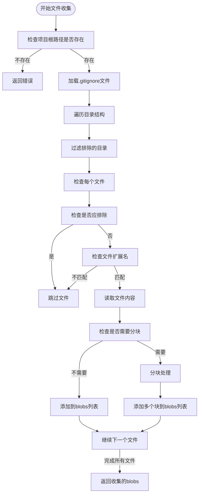
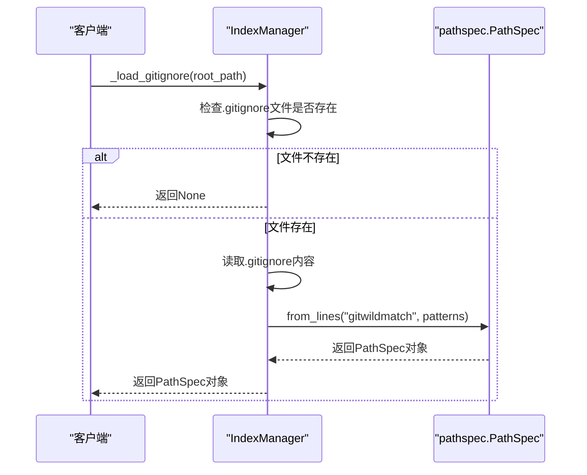
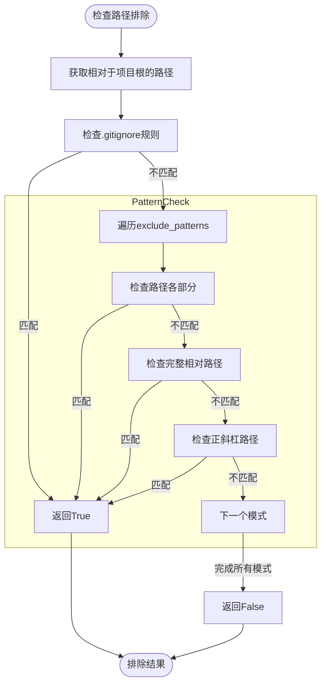
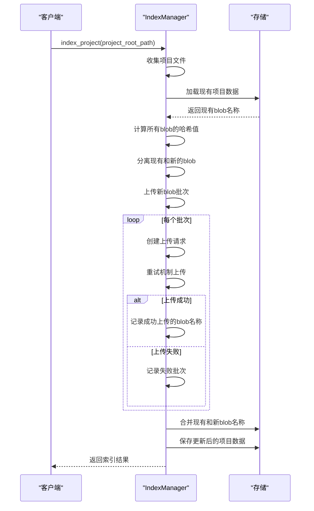
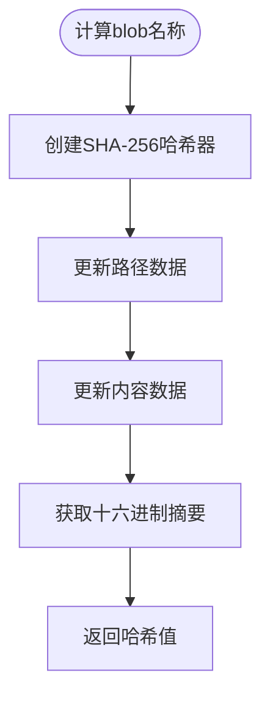
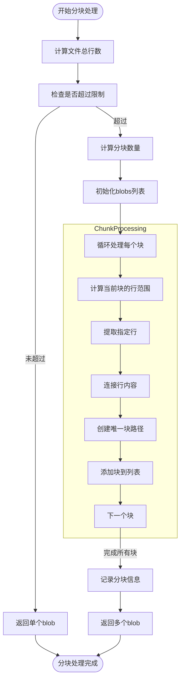
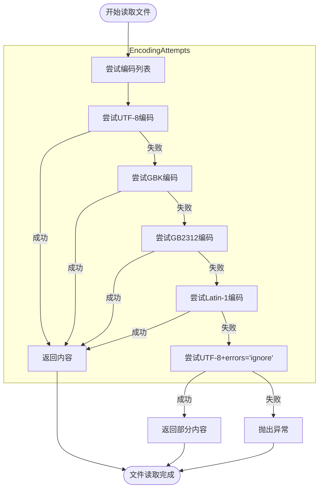
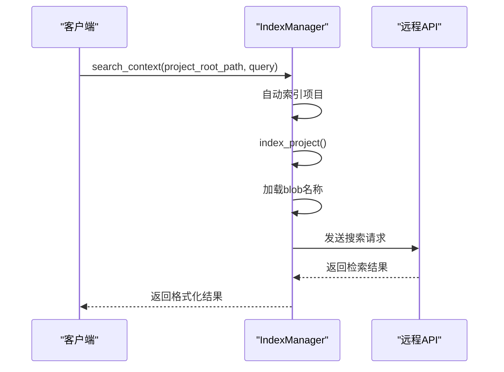
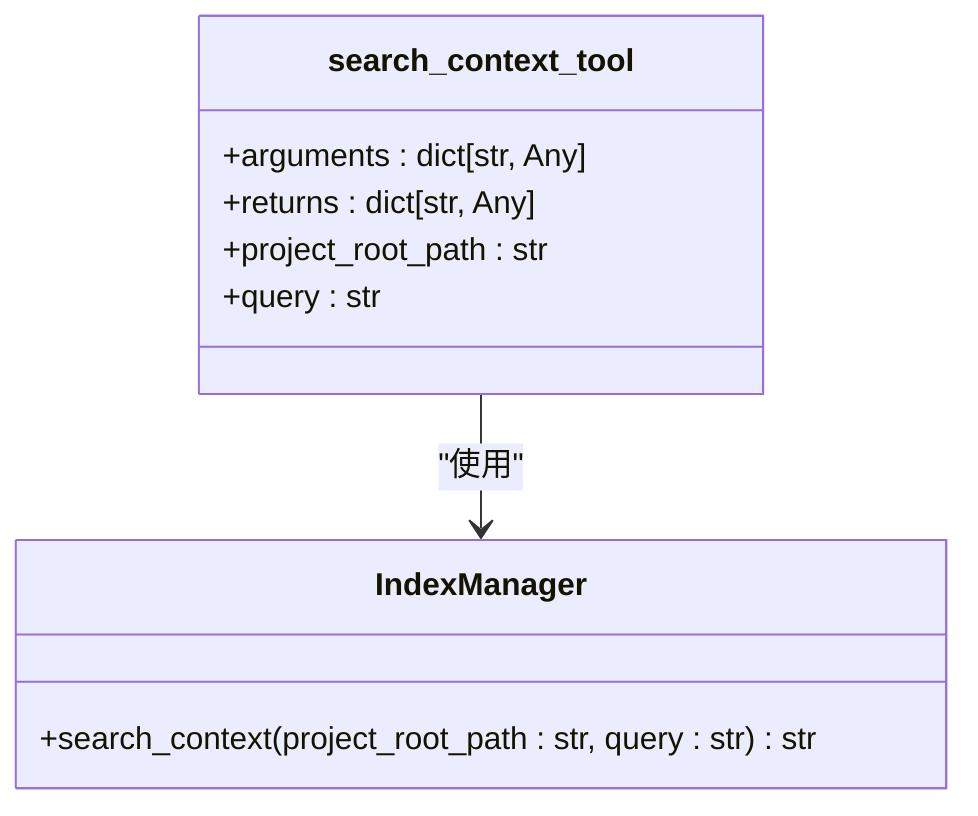
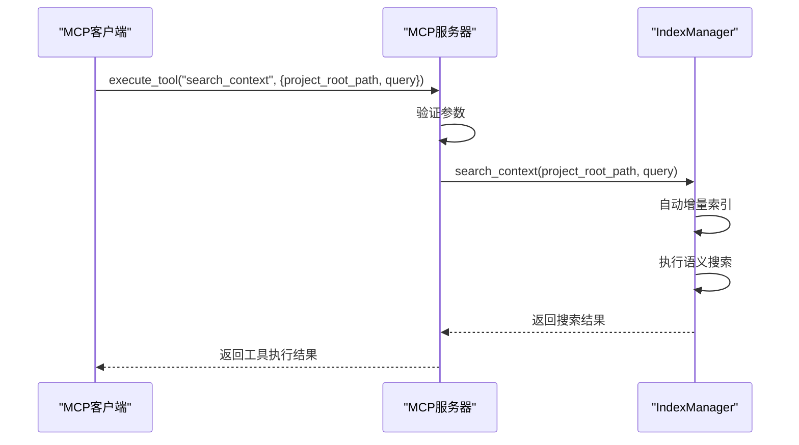

# 索引与搜索功能

<cite>
**本文档引用的文件 **  
- [manager.py](file://src/acemcp/index/manager.py)
- [search_context.py](file://src/acemcp/tools/search_context.py)
- [config.py](file://src/acemcp/config.py)
</cite>

## 目录
1. [简介](#简介)
2. [核心组件分析](#核心组件分析)
3. [文件收集与排除机制](#文件收集与排除机制)
4. [增量索引更新](#增量索引更新)
5. [大文件分块处理](#大文件分块处理)
6. [多编码自动检测](#多编码自动检测)
7. [语义搜索实现机制](#语义搜索实现机制)
8. [search_context MCP工具接口](#search_context-mcp工具接口)
9. [MCP客户端调用示例](#mcp客户端调用示例)
10. [搜索性能优化与瓶颈分析](#搜索性能优化与瓶颈分析)

## 简介
本技术文档深入解析AceMCP系统中索引与搜索功能的实现机制。文档详细阐述了IndexManager模块如何实现文件收集、增量索引更新、大文件分块处理和多编码自动检测。同时，文档解释了.gitignore规则如何通过pathspec库被解析并应用于文件排除，对比了语义搜索与传统关键词搜索的区别，并详细描述了search_context MCP工具的接口定义和使用方法。

## 核心组件分析

### IndexManager模块
IndexManager是索引系统的核心类，负责管理代码库的索引和检索。它通过配置化的参数控制索引行为，包括存储路径、API基础URL、认证令牌、文本文件扩展名、批量上传大小、单个块最大行数以及排除模式。

**组件来源**
- [manager.py](file://src/acemcp/index/manager.py#L67-L549)

### 配置管理
系统通过Config类管理全局配置，支持从用户配置文件、环境变量和命令行参数加载配置。默认配置定义了常见的文本文件扩展名和需要排除的目录模式。

**组件来源**
- [config.py](file://src/acemcp/config.py#L119-L200)

## 文件收集与排除机制

### 文件收集流程
IndexManager通过_collect_files方法递归收集项目目录中的所有文本文件。该方法使用os.walk遍历目录结构，并根据配置的文本文件扩展名过滤文件。



**图表来源**
- [manager.py](file://src/acemcp/index/manager.py#L274-L328)

### .gitignore规则解析
系统通过_load_gitignore方法加载和解析项目根目录下的.gitignore文件。该方法使用pathspec库的gitwildmatch模式解析.gitignore中的规则，并创建PathSpec对象用于后续的文件匹配。



**图表来源**
- [manager.py](file://src/acemcp/index/manager.py#L104-L125)

### 文件排除逻辑
_should_exclude方法负责判断文件或目录是否应该被排除。该方法首先检查.gitignore规则，然后检查配置的exclude_patterns。排除判断考虑了路径的各个部分、完整相对路径以及使用正斜杠的路径形式。



**图表来源**
- [manager.py](file://src/acemcp/index/manager.py#L164-L209)

**组件来源**
- [manager.py](file://src/acemcp/index/manager.py#L164-L209)

## 增量索引更新

### 增量索引工作流程
index_project方法实现了增量索引功能，避免重复上传未更改的文件。该方法通过SHA-256哈希值识别文件内容变化，只上传新增或修改的文件块。



**图表来源**
- [manager.py](file://src/acemcp/index/manager.py#L331-L465)

### 哈希计算机制
系统使用calculate_blob_name函数计算每个文件块的唯一标识符。该函数结合文件路径和内容，使用SHA-256哈希算法生成64字符的十六进制字符串作为blob名称。



**图表来源**
- [manager.py](file://src/acemcp/index/manager.py#L51-L63)

**组件来源**
- [manager.py](file://src/acemcp/index/manager.py#L51-L63)

## 大文件分块处理

### 分块处理逻辑
_split_file_content方法负责将大文件分割成多个较小的块，以避免单个文件过大影响索引和搜索性能。当文件行数超过max_lines_per_blob配置值时，文件会被分割。



**图表来源**
- [manager.py](file://src/acemcp/index/manager.py#L240-L271)

**组件来源**
- [manager.py](file://src/acemcp/index/manager.py#L240-L271)

## 多编码自动检测

### 编码检测流程
read_file_with_encoding函数实现了多编码自动检测功能，按优先级顺序尝试UTF-8、GBK、GB2312和Latin-1编码读取文件。如果所有编码尝试都失败，则使用UTF-8配合errors='ignore'选项读取，确保文件内容不会完全丢失。



**图表来源**
- [manager.py](file://src/acemcp/index/manager.py#L15-L48)

**组件来源**
- [manager.py](file://src/acemcp/index/manager.py#L15-L48)

## 语义搜索实现机制

### 语义搜索与关键词搜索对比
语义搜索与传统关键词搜索有本质区别：

| 特性 | 语义搜索 | 传统关键词搜索 |
|------|----------|----------------|
| **匹配方式** | 基于语义相似度和上下文理解 | 基于精确关键词匹配 |
| **查询理解** | 理解查询的意图和上下文 | 仅匹配字面关键词 |
| **结果相关性** | 返回语义相关的上下文 | 返回包含关键词的片段 |
| **容错能力** | 能处理同义词和相关概念 | 对拼写错误敏感 |
| **上下文感知** | 考虑代码结构和上下文关系 | 仅考虑文本内容 |

### 搜索执行流程
search_context方法实现了语义搜索功能，它首先自动执行增量索引确保搜索基于最新代码库，然后向远程API发送搜索请求。



**图表来源**
- [manager.py](file://src/acemcp/index/manager.py#L468-L549)

**组件来源**
- [manager.py](file://src/acemcp/index/manager.py#L468-L549)

## search_context MCP工具接口

### 接口定义
search_context_tool是MCP服务器的工具函数，封装了IndexManager的搜索功能，使其可以通过MCP协议调用。



**图表来源**
- [search_context.py](file://src/acemcp/tools/search_context.py#L11-L51)

### 输入参数
search_context工具接受以下输入参数：

| 参数名 | 类型 | 必需 | 描述 |
|-------|------|------|------|
| project_root_path | string | 是 | 项目根目录的绝对路径 |
| query | string | 是 | 搜索查询字符串 |

### 输出格式
工具返回标准化的JSON响应格式：

```json
{
  "type": "text",
  "text": "搜索结果内容"
}
```

如果发生错误，返回相应的错误信息。

**组件来源**
- [search_context.py](file://src/acemcp/tools/search_context.py#L11-L51)

## MCP客户端调用示例

### 调用流程
在MCP客户端中调用search_context工具进行代码上下文检索的流程如下：



**图表来源**
- [search_context.py](file://src/acemcp/tools/search_context.py#L11-L51)
- [app.py](file://src/acemcp/web/app.py#L139-L167)

## 搜索性能优化与瓶颈分析

### 性能优化策略
系统实现了多种性能优化策略：

1. **批量处理**：文件上传采用批量处理，减少API调用次数
2. **增量索引**：只上传新增或修改的文件，避免重复工作
3. **重试机制**：_retry_request方法实现指数退避重试，提高网络请求成功率
4. **缓存利用**：通过projects.json文件缓存已索引的blob名称
5. **并发处理**：使用异步IO提高文件读取和网络请求效率

### 可能的瓶颈
系统可能遇到的性能瓶颈包括：

| 瓶颈类型 | 描述 | 缓解策略 |
|---------|------|----------|
| **大文件处理** | 单个大文件可能导致内存占用过高 | 实现流式处理或更细粒度的分块 |
| **网络延迟** | 远程API调用可能成为性能瓶颈 | 优化批量大小，实现连接复用 |
| **磁盘I/O** | 大量小文件读取可能导致I/O瓶颈 | 优化文件遍历顺序，使用缓存 |
| **编码检测** | 多编码尝试增加文件读取时间 | 实现编码缓存，快速失败机制 |
| **内存占用** | 大项目可能导致内存不足 | 实现分批处理，及时释放内存 |

**组件来源**
- [manager.py](file://src/acemcp/index/manager.py#L128-L161)
- [manager.py](file://src/acemcp/index/manager.py#L378-L416)