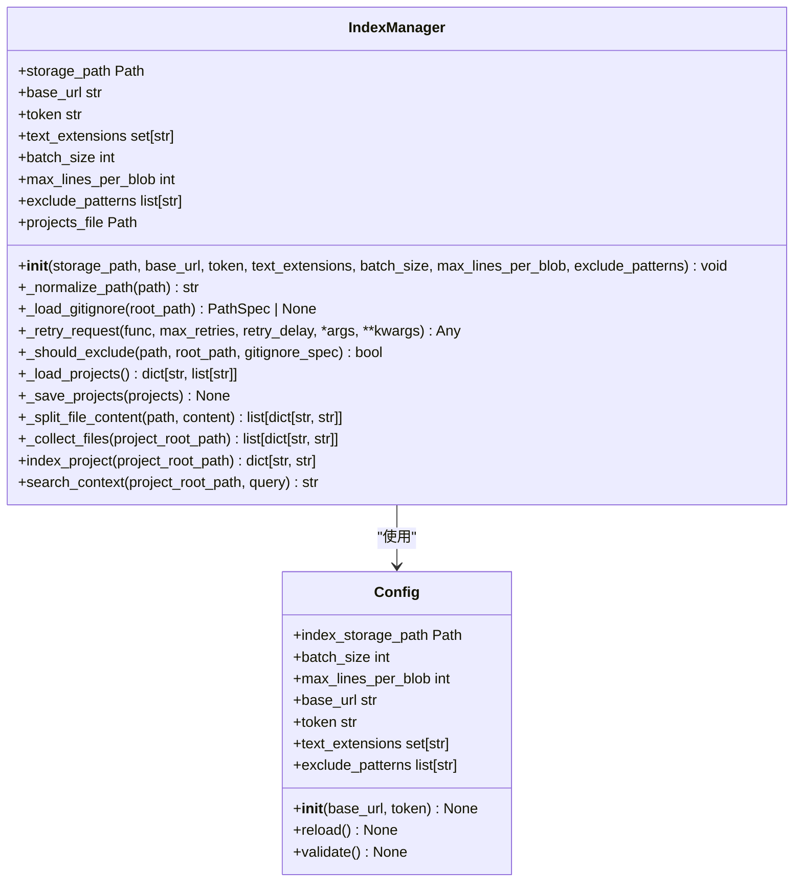
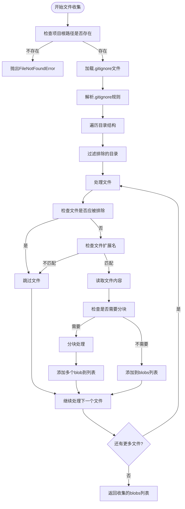
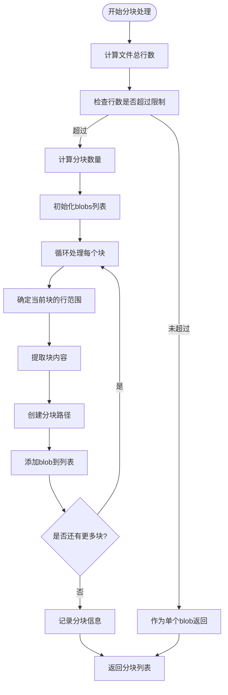
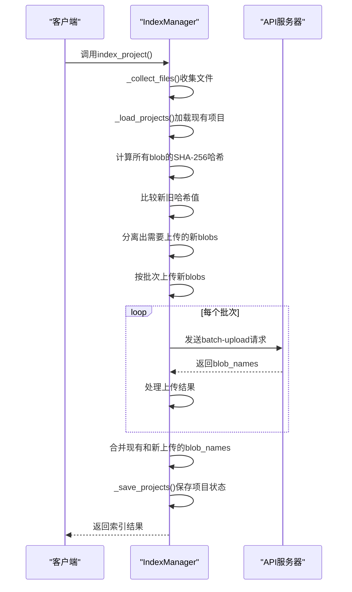
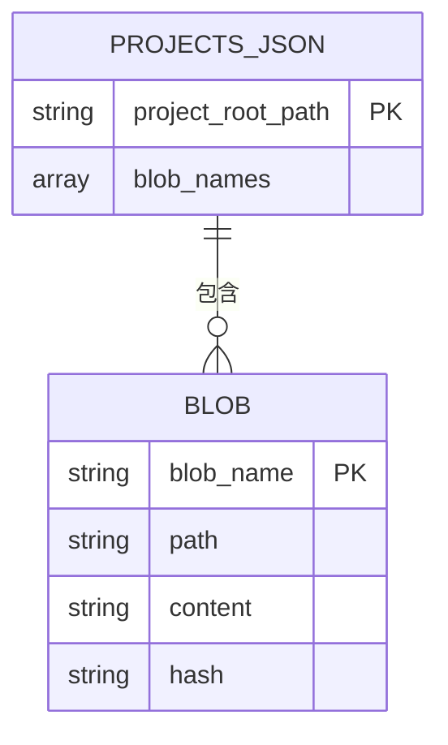
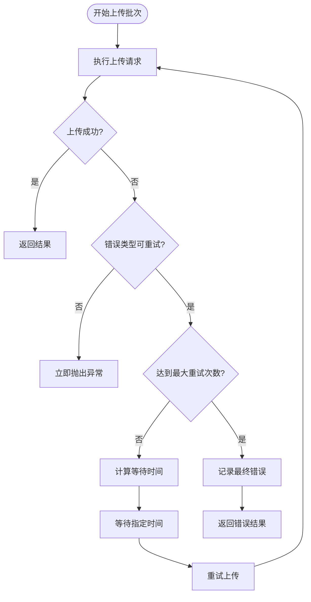
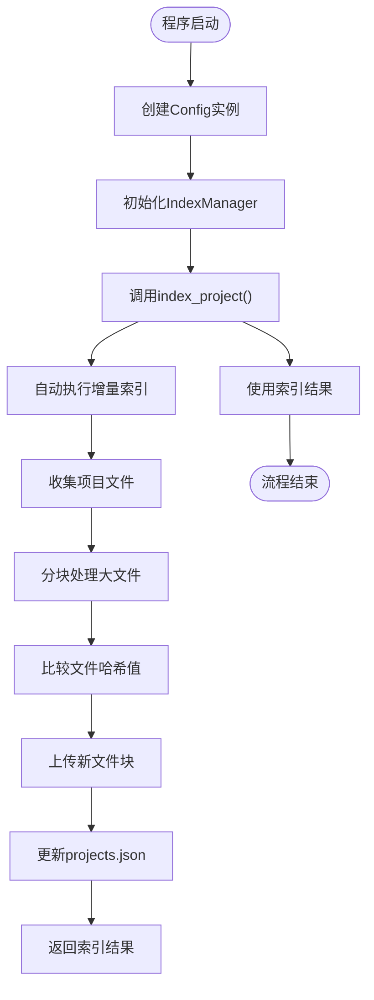

# 索引管理机制

<cite>
**本文档引用的文件**
- [manager.py](file://src/acemcp/index/manager.py)
- [config.py](file://src/acemcp/config.py)
</cite>

## 目录
1. [简介](#简介)
2. [核心组件](#核心组件)
3. [文件收集机制](#文件收集机制)
4. [大文件分块处理](#大文件分块处理)
5. [增量索引更新](#增量索引更新)
6. [状态持久化](#状态持久化)
7. [批量上传与重试机制](#批量上传与重试机制)
8. [配置参数详解](#配置参数详解)
9. [使用示例](#使用示例)

## 简介
索引管理机制是代码库索引系统的核心组件，负责管理代码库的索引和检索过程。该机制通过`IndexManager`类实现，提供了文件收集、增量索引更新和大文件分块处理等关键功能。系统能够智能地识别文件变更，仅上传修改过的文件块，从而提高索引效率并减少网络传输开销。

**Section sources**
- [manager.py](file://src/acemcp/index/manager.py#L67-L552)

## 核心组件
`IndexManager`类是索引管理机制的核心，封装了代码库索引和检索的所有功能。该类通过构造函数接收多个配置参数，包括存储路径、基础URL、认证令牌、文本文件扩展名等。系统实现了自动化的文件收集、内容分块、增量更新和状态持久化等功能，确保代码库索引的准确性和时效性。

**Diagram sources**
- [manager.py](file://src/acemcp/index/manager.py#L67-L552)
- [config.py](file://src/acemcp/config.py#L119-L200)

**Section sources**
- [manager.py](file://src/acemcp/index/manager.py#L67-L552)

## 文件收集机制
文件收集机制通过`_collect_files`方法实现，负责遍历项目目录并收集所有文本文件。该机制结合了`.gitignore`规则和自定义排除模式，确保只索引相关的代码文件。系统使用`pathspec`库解析`.gitignore`文件，实现了与Git相同的文件排除逻辑。

**Diagram sources**
- [manager.py](file://src/acemcp/index/manager.py#L274-L329)

**Section sources**
- [manager.py](file://src/acemcp/index/manager.py#L274-L329)

## 大文件分块处理
大文件分块处理机制通过`_split_file_content`方法实现，当文件行数超过`max_lines_per_blob`限制时，将文件内容分割成多个块。这种分块策略确保了单个文件块的大小在可管理范围内，提高了索引和检索的效率。

**Diagram sources**
- [manager.py](file://src/acemcp/index/manager.py#L240-L272)

**Section sources**
- [manager.py](file://src/acemcp/index/manager.py#L240-L272)

## 增量索引更新
增量索引更新机制是`index_project`方法的核心功能，通过SHA-256哈希值识别新旧文件，仅上传变更的文件块。该机制显著提高了索引效率，避免了重复上传未修改的文件内容。

**Diagram sources**
- [manager.py](file://src/acemcp/index/manager.py#L331-L466)

**Section sources**
- [manager.py](file://src/acemcp/index/manager.py#L331-L466)

## 状态持久化
状态持久化机制通过`projects.json`文件实现，用于存储项目的索引状态。该文件记录了每个项目路径对应的blob名称列表，支持增量索引和状态恢复。

**Diagram sources**
- [manager.py](file://src/acemcp/index/manager.py#L212-L238)

**Section sources**
- [manager.py](file://src/acemcp/index/manager.py#L212-L238)

## 批量上传与重试机制
批量上传与重试机制确保了索引过程的可靠性和容错性。系统采用指数退避策略进行请求重试，能够有效应对网络波动和临时性故障。

**Diagram sources**
- [manager.py](file://src/acemcp/index/manager.py#L128-L162)

**Section sources**
- [manager.py](file://src/acemcp/index/manager.py#L128-L162)

## 配置参数详解
`IndexManager`类的构造函数接受多个配置参数，每个参数都有特定的作用和配置方式：

| 参数名称 | 类型 | 默认值 | 作用说明 |
|--------|-----|-------|--------|
| storage_path | Path | 无 | 存储索引数据的路径，系统会自动创建该目录 |
| base_url | str | 无 | API请求的基础URL，用于与远程服务器通信 |
| token | str | 无 | 授权令牌，用于API请求的身份验证 |
| text_extensions | set[str] | 无 | 要索引的文本文件扩展名集合 |
| batch_size | int | 无 | 每批上传的文件数量，控制批量上传的大小 |
| max_lines_per_blob | int | 800 | 单个blob的最大行数，超过此值将进行分块 |
| exclude_patterns | list[str] | None | 要排除的文件和目录模式列表 |

这些参数通过`Config`类从配置文件和环境变量中加载，支持灵活的配置管理。

**Section sources**
- [manager.py](file://src/acemcp/index/manager.py#L70-L91)
- [config.py](file://src/acemcp/config.py#L122-L150)

## 使用示例
以下是`IndexManager`的初始化和调用流程示例：

**Diagram sources**
- [manager.py](file://src/acemcp/index/manager.py#L331-L466)

**Section sources**
- [manager.py](file://src/acemcp/index/manager.py#L331-L466)