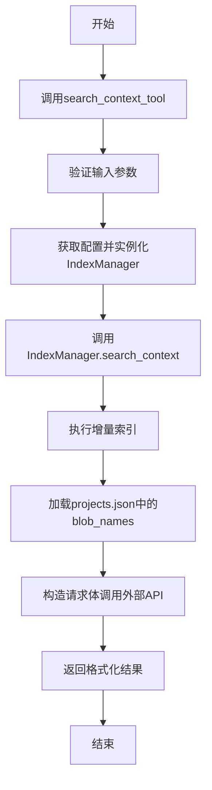

# 语义搜索实现

<cite>
**Referenced Files in This Document**   
- [manager.py](file://src/acemcp/index/manager.py)
- [search_context.py](file://src/acemcp/tools/search_context.py)
- [config.py](file://src/acemcp/config.py)
</cite>

## 目录
1. [引言](#引言)
2. [核心组件](#核心组件)
3. [语义搜索工作流程](#语义搜索工作流程)
4. [search_context_tool MCP工具接口](#search_context_tool-mcp工具接口)
5. [性能影响因素与优化建议](#性能影响因素与优化建议)
6. [结论](#结论)

## 引言
本文档深入探讨了语义搜索功能的技术实现，重点分析了`IndexManager`类的`search_context`方法如何通过自动增量索引和外部API调用实现高效的语义搜索。与传统的关键词搜索不同，语义搜索基于自然语言理解，能够匹配上下文和意图，而非简单的字面匹配。本文将详细阐述其工作流程、接口规范、返回格式及性能优化策略。

## 核心组件

`IndexManager`类是语义搜索的核心，负责代码库的索引管理和检索。`search_context`方法是其关键功能，确保搜索前索引的最新性。`search_context_tool`是MCP工具的入口，负责参数验证和调用`IndexManager`。

**Section sources**
- [manager.py](file://src/acemcp/index/manager.py#L66-L549)
- [search_context.py](file://src/acemcp/tools/search_context.py#L10-L50)
- [config.py](file://src/acemcp/config.py#L119-L200)

## 语义搜索工作流程



**Diagram sources**
- [search_context.py](file://src/acemcp/tools/search_context.py#L10-L50)
- [manager.py](file://src/acemcp/index/manager.py#L467-L549)

### 语义搜索与传统关键词搜索的本质区别
语义搜索与传统关键词搜索的根本区别在于其匹配机制。关键词搜索依赖于查询词与文档中词的精确或模糊匹配，而语义搜索则通过理解查询的自然语言含义和上下文，匹配语义上相关的代码片段。这使得语义搜索能够理解同义词、上下位词和复杂的查询意图，从而提供更准确和相关的结果。

**Section sources**
- [manager.py](file://src/acemcp/index/manager.py#L467-L549)

## search_context_tool MCP工具接口

`search_context_tool`是MCP协议中的一个工具，用于执行语义搜索。其接口规范如下：

### 输入参数验证
- `project_root_path`：项目根目录的绝对路径，必须提供。
- `query`：搜索查询字符串，必须提供。

### 配置获取与实例化
通过`get_config()`获取配置，并使用配置参数实例化`IndexManager`。

### 返回格式
返回格式为`{"type": "text", "text": result}`，其中`result`是格式化的检索结果。该格式符合MCP协议的语义，表示返回的是文本类型的结果。

### 实际调用示例
在MCP客户端中，可以通过以下方式调用此工具：
```json
{
  "tool_name": "search_context",
  "arguments": {
    "project_root_path": "C:/Users/username/projects/myproject",
    "query": "日志配置 设置 初始化 logger"
  }
}
```
返回结果的结构和含义如下：
- `type`: 结果类型，固定为`text`。
- `text`: 检索到的格式化文本结果，包含相关代码片段、文件路径和行号等信息。

**Section sources**
- [search_context.py](file://src/acemcp/tools/search_context.py#L10-L50)

## 性能影响因素与优化建议

### 搜索性能的影响因素
- **索引完整性**：索引的完整性和准确性直接影响搜索结果的质量。
- **外部API响应时间**：外部API的响应时间是搜索性能的关键瓶颈。
- **网络延迟**：网络延迟会影响API调用的速度。

### 优化建议
- **确保索引及时更新**：定期执行增量索引，确保索引的最新性。
- **优化外部API性能**：与API提供方合作，优化API的响应时间和稳定性。
- **减少网络延迟**：尽量将客户端和服务器部署在同一个网络环境中，减少网络延迟。

**Section sources**
- [manager.py](file://src/acemcp/index/manager.py#L467-L549)

## 结论
语义搜索功能通过`IndexManager`类的`search_context`方法实现了高效的代码库检索。其自动增量索引和外部API调用的机制确保了搜索结果的最新性和准确性。`search_context_tool` MCP工具的接口规范清晰，返回格式符合MCP协议。通过理解语义搜索与传统关键词搜索的本质区别，可以更好地利用该功能进行代码检索。性能优化建议有助于提升搜索效率和用户体验。