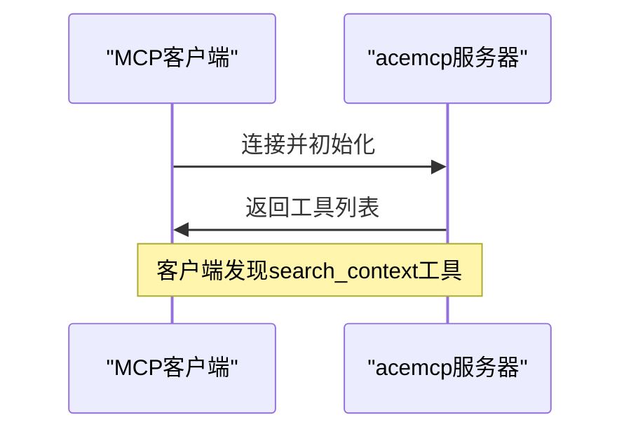
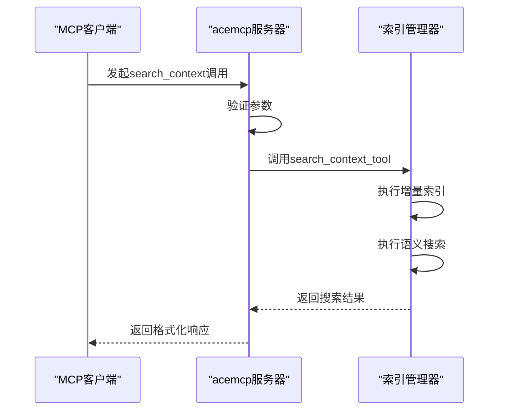
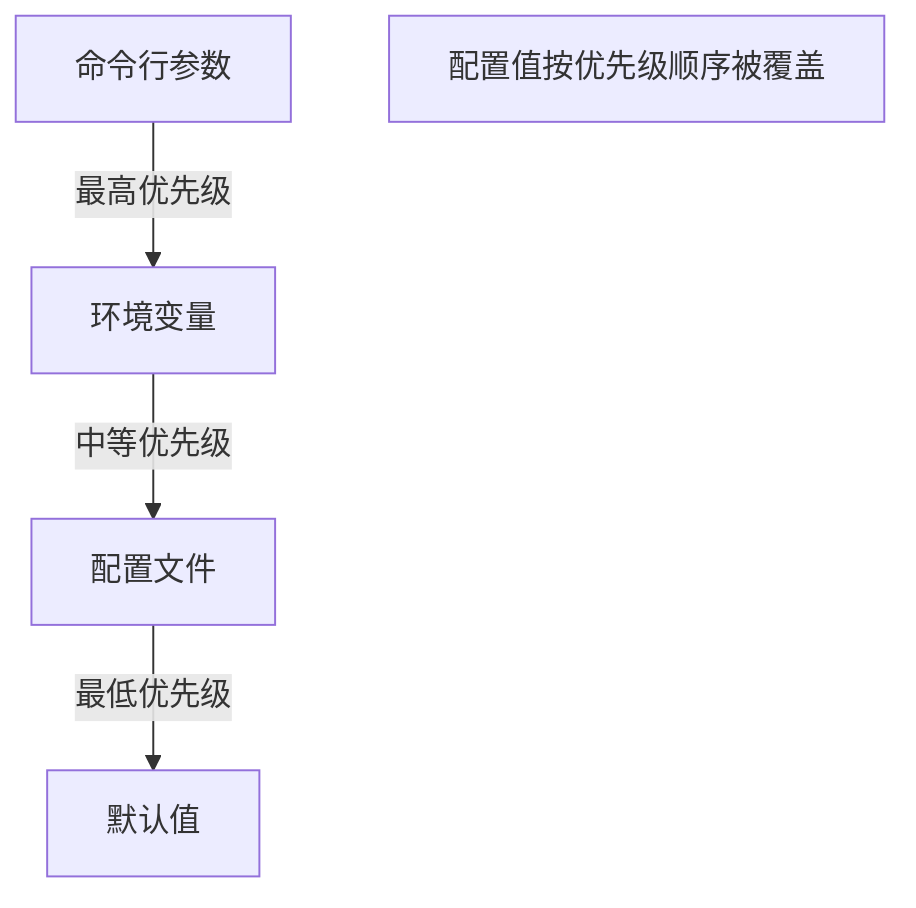

# 客户端集成

<cite>
**本文档引用的文件**   
- [README.md](file://README.md)
- [config.py](file://src/acemcp/config.py)
- [server.py](file://src/acemcp/server.py)
- [search_context.py](file://src/acemcp/tools/search_context.py)
- [app.py](file://src/acemcp/web/app.py)
</cite>

## 目录
1. [简介](#简介)
2. [MCP配置](#mcp配置)
3. [配置文件结构](#配置文件结构)
4. [工具注册与发现](#工具注册与发现)
5. [客户端通信流程](#客户端通信流程)
6. [配置覆盖优先级](#配置覆盖优先级)
7. [安全信息传递](#安全信息传递)

## 简介
acemcp是一个用于代码库索引和语义搜索的MCP服务器。本指南详细说明了如何将acemcp服务器集成到MCP客户端（如Claude Desktop）中，包括配置方法、工具调用流程和通信机制。

**Section sources**
- [README.md](file://README.md#L1-L350)

## MCP配置
要将acemcp集成到MCP客户端中，需要在客户端配置文件中添加相应的服务器配置。配置的核心是定义`mcpServers`字段，其中包含启动服务器的命令和参数。

### 基础配置
最简单的配置仅包含启动服务器所需的基本命令和参数：

```json
{
  "mcpServers": {
    "acemcp": {
      "command": "uvx",
      "args": [
        "acemcp"
      ]
    }
  }
}
```

在此配置中，`command`字段指定使用`uvx`命令来运行工具，`args`数组的第一个参数是工具名称`acemcp`。

### 启用Web界面的配置
要启用Web管理界面，可以在`args`数组中添加`--web-port`参数来指定监听端口：

```json
{
  "mcpServers": {
    "acemcp": {
      "command": "uvx",
      "args": [
        "acemcp",
        "--web-port",
        "8888"
      ]
    }
  }
}
```

配置完成后，可以通过访问`http://localhost:8888`来使用Web管理界面，该界面提供了配置管理、实时日志监控和工具调试器等功能。

**Section sources**
- [README.md](file://README.md#L64-L108)

## 配置文件结构
acemcp的配置主要通过三种方式实现：配置文件、命令行参数和环境变量。配置文件在首次运行时自动创建于`~/.acemcp/settings.toml`，包含默认值。

配置文件`settings.toml`的主要选项包括：
- `BATCH_SIZE`: 每批上传的文件数量（默认：10）
- `MAX_LINES_PER_BLOB`: 大文件分割前的最大行数（默认：800）
- `BASE_URL`: API端点URL
- `TOKEN`: 认证令牌
- `TEXT_EXTENSIONS`: 要索引的文件扩展名列表
- `EXCLUDE_PATTERNS`: 要排除的模式列表（支持通配符如`*.pyc`）

这些配置可以通过修改配置文件进行持久化设置，也可以通过其他方式临时覆盖。

**Section sources**
- [config.py](file://src/acemcp/config.py#L9-L77)
- [README.md](file://README.md#L37-L57)

## 工具注册与发现
acemcp服务器通过MCP协议的`list_tools`接口实现工具的自动发现。当客户端连接到服务器时，会自动调用此接口来获取可用工具列表。



**Diagram sources**
- [server.py](file://src/acemcp/server.py#L19-L45)

服务器通过`@app.list_tools()`装饰器定义`list_tools`函数，该函数返回一个包含`search_context`工具信息的列表。工具描述中包含了参数说明和使用示例，使客户端能够正确调用工具。

`search_context`工具的主要参数包括：
- `project_root_path`: 项目根目录的绝对路径（在Windows上也使用正斜杠）
- `query`: 用于查找相关代码上下文的自然语言搜索查询

**Section sources**
- [server.py](file://src/acemcp/server.py#L19-L45)
- [README.md](file://README.md#L123-L142)

## 客户端通信流程
客户端与acemcp服务器通过标准输入输出（stdio）进行通信。通信流程从客户端发起`search_context`调用开始，到服务器返回响应结束。



**Diagram sources**
- [server.py](file://src/acemcp/server.py#L48-L64)
- [search_context.py](file://src/acemcp/tools/search_context.py#L11-L51)

具体流程如下：
1. 客户端通过stdio发送`search_context`调用请求
2. 服务器的`call_tool`函数接收请求并分发给相应的工具处理函数
3. `search_context_tool`函数首先获取当前配置，然后创建`IndexManager`实例
4. 索引管理器自动执行增量索引，仅上传新文件或修改过的文件
5. 索引完成后，向API端点发送搜索请求
6. 将搜索结果格式化后返回给客户端

**Section sources**
- [server.py](file://src/acemcp/server.py#L48-L64)
- [search_context.py](file://src/acemcp/tools/search_context.py#L11-L51)

## 配置覆盖优先级
acemcp支持多种配置方式，它们的优先级从高到低依次为：命令行参数 > 环境变量 > 配置文件。这种分层配置机制提供了极大的灵活性。



**Diagram sources**
- [config.py](file://src/acemcp/config.py#L118-L164)

具体来说：
- **命令行参数**：通过`--base-url`和`--token`等参数直接覆盖配置，优先级最高
- **环境变量**：使用`ACEMCP_`前缀的环境变量（如`ACEMCP_BASE_URL`）进行配置
- **配置文件**：位于`~/.acemcp/settings.toml`的持久化配置

服务器启动时，会按照优先级顺序加载配置，确保高优先级的配置能够正确覆盖低优先级的配置。

**Section sources**
- [config.py](file://src/acemcp/config.py#L118-L164)
- [README.md](file://README.md#L59-L62)

## 安全信息传递
敏感信息如`base_url`和`token`可以通过多种安全方式传递给acemcp服务器。推荐使用命令行参数或环境变量来传递这些敏感信息，避免将它们硬编码在配置文件中。

在Web管理界面中，令牌信息会被屏蔽显示，只显示`***`，但在内部处理时会使用完整令牌。这种设计既保证了安全性，又不影响功能使用。

通过`args`数组传递参数的方式既灵活又安全，例如：
```json
"args": [
  "acemcp",
  "--base-url", "https://your-api-endpoint.com",
  "--token", "your-secret-token"
]
```

这种方式确保了敏感信息可以在不修改配置文件的情况下动态传递，特别适合在不同环境间切换时使用。

**Section sources**
- [server.py](file://src/acemcp/server.py#L117-L135)
- [app.py](file://src/acemcp/web/app.py#L58-L71)