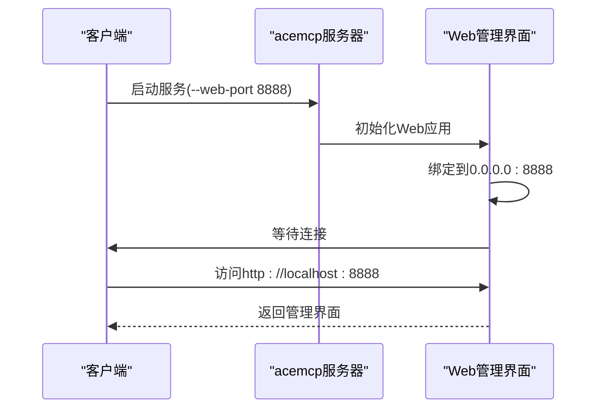
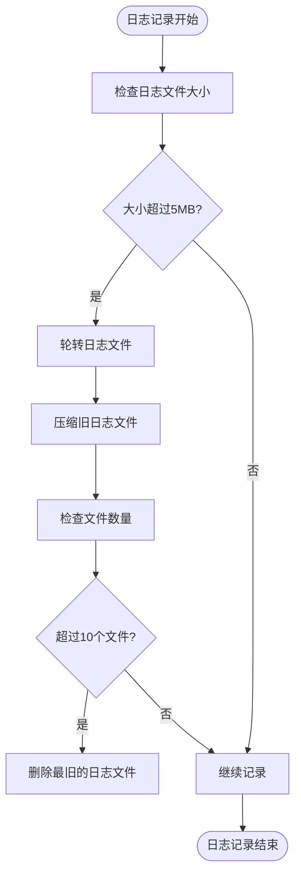
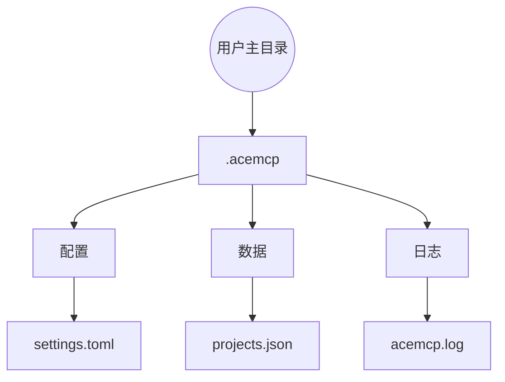
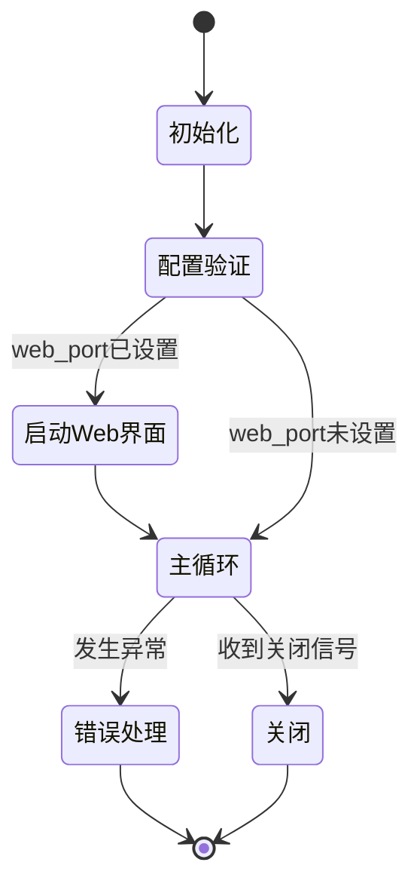

# 服务部署

<cite>
**本文档引用的文件**
- [server.py](file://src/acemcp/server.py)
- [config.py](file://src/acemcp/config.py)
- [logging_config.py](file://src/acemcp/logging_config.py)
- [app.py](file://src/acemcp/web/app.py)
- [settings.toml](file://~/.acemcp/settings.toml)
- [index.html](file://src/acemcp/web/templates/index.html)
</cite>

## 目录
1. [简介](#简介)
2. [服务启动机制](#服务启动机制)
3. [命令行参数详解](#命令行参数详解)
4. [Web管理界面配置](#web管理界面配置)
5. [日志系统配置](#日志系统配置)
6. [配置文件与数据存储](#配置文件与数据存储)
7. [服务生命周期管理](#服务生命周期管理)

## 简介

acemcp是一个用于代码库索引的MCP服务器，提供语义搜索功能。本指南详细说明了在不同环境下部署和配置该服务的方法，包括启动机制、命令行参数、Web管理界面、日志配置、数据存储位置以及服务的生命周期管理。

**Section sources**
- [server.py](file://src/acemcp/server.py#L1-L141)
- [README.md](file://README.md#L1-L350)

## 服务启动机制

acemcp服务可以通过两种方式启动：由MCP客户端自动启动或手动运行。服务的入口点是`server.py`文件中的`run()`函数，该函数作为命令行工具的执行入口。

当通过MCP客户端配置时，服务会根据客户端的配置自动启动。例如，在Claude Desktop等MCP客户端中，通过配置`command`和`args`来指定启动方式。服务也可以通过命令行手动启动，使用`uv run acemcp`命令。

服务启动时会执行以下初始化流程：
1. 解析命令行参数
2. 初始化日志广播器（如果启用了Web界面）
3. 设置日志配置
4. 初始化配置
5. 验证配置
6. 启动主服务循环

**Section sources**
- [server.py](file://src/acemcp/server.py#L117-L138)
- [README.md](file://README.md#L27-L34)

## 命令行参数详解

acemcp支持多个命令行参数，用于覆盖配置文件中的设置。这些参数具有最高优先级，会覆盖配置文件和环境变量中的相应设置。

### 支持的命令行参数

- `--base-url`: 覆盖BASE_URL配置
- `--token`: 覆盖TOKEN配置
- `--web-port`: 在指定端口启用Web管理界面（例如8080）

### 参数优先级

参数的优先级从高到低为：
1. 命令行参数（最高优先级）
2. Web管理界面（更新用户配置文件）
3. 环境变量（使用ACEMCP_前缀）
4. 配置文件（最低优先级）

当多个来源提供相同配置时，优先级最高的来源将生效。例如，如果在命令行中指定了`--base-url`，则无论配置文件或环境变量中如何设置，都将使用命令行指定的值。

**Section sources**
- [server.py](file://src/acemcp/server.py#L119-L122)
- [config.py](file://src/acemcp/config.py#L122-L137)
- [README.md](file://README.md#L59-L62)

## Web管理界面配置

Web管理界面提供了对acemcp服务的可视化管理功能，包括配置管理、实时日志监控和工具调试器。

### 启用Web管理界面

要启用Web管理界面，需要在启动服务时使用`--web-port`参数指定端口号。例如：

```json
{
  "mcpServers": {
    "acemcp": {
      "command": "uvx",
      "args": [
        "acemcp",
        "--web-port",
        "8888"
      ]
    }
  }
}
```

启动后，可以通过`http://localhost:8888`访问管理界面。

### 界面功能

Web管理界面提供以下功能：
- **配置管理**：查看和编辑服务器配置（BASE_URL、TOKEN、BATCH_SIZE、MAX_LINES_PER_BLOB、TEXT_EXTENSIONS）
- **实时日志**：通过WebSocket连接实时监控服务器日志，具有智能重连功能
- **工具调试器**：直接从Web界面测试和调试MCP工具

### 端口绑定

Web服务器绑定到`0.0.0.0`地址，允许从任何网络接口访问。这是通过`run_web_server`函数中的`host="0.0.0.0"`配置实现的。



**Diagram sources**
- [server.py](file://src/acemcp/server.py#L68-L84)
- [app.py](file://src/acemcp/web/app.py#L39-L188)
- [index.html](file://src/acemcp/web/templates/index.html#L1-L553)

**Section sources**
- [server.py](file://src/acemcp/server.py#L67-L84)
- [app.py](file://src/acemcp/web/app.py#L38-L188)
- [README.md](file://README.md#L88-L119)

## 日志系统配置

acemcp的日志系统提供了详细的运行时信息记录，支持控制台输出和文件输出，并具有自动轮转功能。

### 日志输出配置

- **控制台输出**：INFO级别及以上（彩色输出）
- **文件输出**：DEBUG级别及以上（详细格式，包含模块、函数和行号）

这种配置确保了在控制台只显示重要信息，而详细的调试信息则保存在日志文件中。

### 日志轮转策略

日志系统实现了以下轮转策略：
- **轮转大小**：当日志文件达到5MB时自动轮转
- **保留数量**：最多保留10个日志文件
- **压缩**：轮转的日志文件自动压缩为.zip格式
- **线程安全**：日志记录对并发操作是线程安全的



**Diagram sources**
- [logging_config.py](file://src/acemcp/logging_config.py#L14-L67)
- [README.md](file://README.md#L296-L305)

**Section sources**
- [logging_config.py](file://src/acemcp/logging_config.py#L14-L67)
- [README.md](file://README.md#L296-L312)

## 配置文件与数据存储

acemcp使用特定的目录结构来存储配置文件、索引数据和日志文件。

### 配置文件初始化

首次运行时，服务会自动在`~/.acemcp/`目录下创建`settings.toml`配置文件。这个过程由`_ensure_user_config()`函数处理，该函数确保用户配置目录和文件的存在。

```python
def _ensure_user_config() -> Path:
    """确保用户配置文件存在。"""
    if not USER_CONFIG_DIR.exists():
        USER_CONFIG_DIR.mkdir(parents=True, exist_ok=True)
        logger.info(f"创建用户配置目录: {USER_CONFIG_DIR}")

    if not USER_DATA_DIR.exists():
        USER_DATA_DIR.mkdir(parents=True, exist_ok=True)
        logger.info(f"创建用户数据目录: {USER_DATA_DIR}")

    if not USER_CONFIG_FILE.exists():
        with USER_CONFIG_FILE.open("w", encoding="utf-8") as f:
            toml.dump(DEFAULT_CONFIG, f)
        logger.info(f"创建默认用户配置文件: {USER_CONFIG_FILE}")

    return USER_CONFIG_FILE
```

### 数据存储位置

- **配置**：`~/.acemcp/settings.toml`
- **已索引项目**：`~/.acemcp/data/projects.json`（固定位置）
- **日志文件**：`~/.acemcp/log/acemcp.log`（自动轮转）



**Diagram sources**
- [config.py](file://src/acemcp/config.py#L80-L84)
- [README.md](file://README.md#L289-L294)

**Section sources**
- [config.py](file://src/acemcp/config.py#L80-L104)
- [README.md](file://README.md#L38-L49)

## 服务生命周期管理

acemcp服务的生命周期包括正常启动、运行和关闭三个阶段。

### 启动流程

1. 解析命令行参数
2. 如果启用了Web界面，初始化日志广播器
3. 设置日志配置
4. 初始化并验证配置
5. 如果指定了Web端口，启动Web管理界面
6. 启动主服务循环

### 运行状态

服务运行时会持续监听MCP客户端的请求，并处理工具调用。Web管理界面提供实时状态监控，包括：
- 服务器状态（运行中）
- 已索引项目数量
- 存储路径

### 关闭流程

当收到关闭信号时，服务会：
1. 关闭主服务循环
2. 如果启用了Web界面，取消Web任务
3. 清理资源
4. 退出

服务具有良好的错误处理机制，任何未捕获的异常都会被记录并重新抛出，确保问题能够被及时发现和处理。



**Diagram sources**
- [server.py](file://src/acemcp/server.py#L87-L113)
- [README.md](file://README.md#L281-L285)

**Section sources**
- [server.py](file://src/acemcp/server.py#L86-L113)
- [README.md](file://README.md#L280-L285)