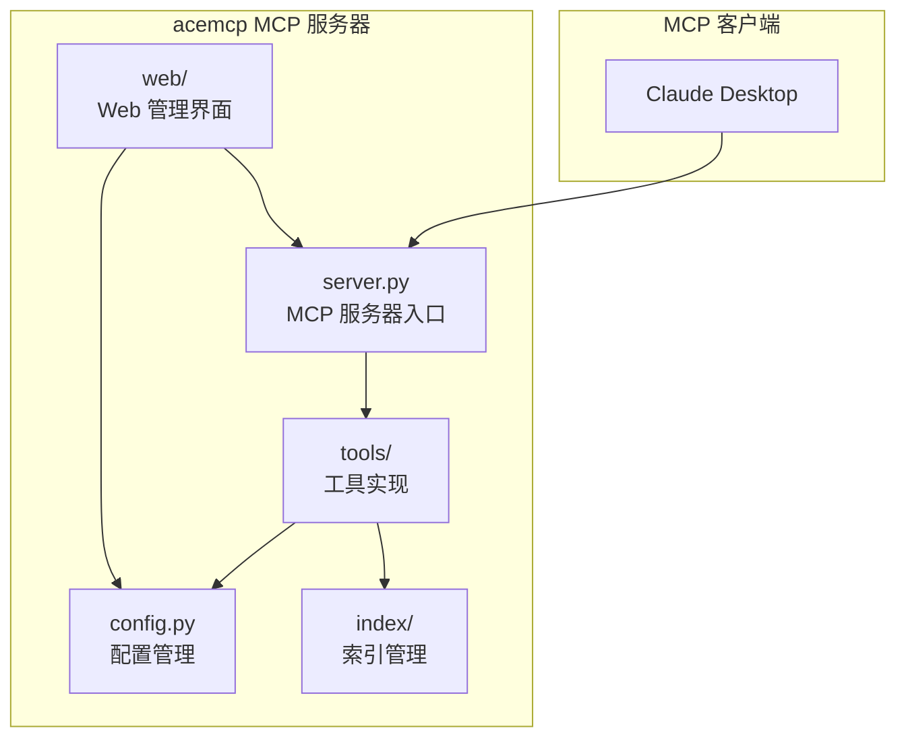

# 项目概述

<cite>
**Referenced Files in This Document**   
- [README.md](file://README.md)
- [server.py](file://src/acemcp/server.py)
- [config.py](file://src/acemcp/config.py)
- [web/app.py](file://src/acemcp/web/app.py)
- [index/manager.py](file://src/acemcp/index/manager.py)
- [tools/search_context.py](file://src/acemcp/tools/search_context.py)
- [web/log_handler.py](file://src/acemcp/web/log_handler.py)
- [web/templates/index.html](file://src/acemcp/web/templates/index.html)
- [pyproject.toml](file://pyproject.toml)
</cite>

## 目录
1. [简介](#简介)
2. [设计目标与应用场景](#设计目标与应用场景)
3. [核心功能详解](#核心功能详解)
4. [系统架构概览](#系统架构概览)
5. [Web管理界面](#web管理界面)
6. [MCP协议集成](#mcp协议集成)
7. [关键特性](#关键特性)
8. [使用示例](#使用示例)

## 简介

acemcp 是一个专为代码库设计的 Model Context Protocol (MCP) 服务器，其核心功能是为大型代码库提供自动索引和语义搜索服务。该项目旨在解决开发者在处理复杂项目时面临的上下文检索难题，通过智能化的索引机制和高效的搜索算法，帮助AI模型（如Claude）快速、准确地理解代码库的结构和内容。

作为一个MCP服务器，acemcp扮演着AI模型与代码库之间的桥梁角色。它无需用户手动干预，即可在后台自动完成代码索引，并通过标准化的MCP协议向AI客户端提供服务。这使得开发者能够将更多精力集中在核心业务逻辑上，而无需担心繁琐的上下文管理。

**Section sources**
- [README.md](file://README.md#L1-L350)

## 设计目标与应用场景

acemcp的设计目标是构建一个高效、易用且功能强大的代码上下文管理平台。其主要应用场景包括：

*   **AI辅助编程**：为AI编程助手（如Claude Desktop）提供实时、准确的代码库上下文。当AI需要理解某个函数的实现、查找特定功能的代码片段或分析项目架构时，acemcp能迅速返回最相关的代码部分，极大地提升AI生成代码的准确性和效率。
*   **大型代码库上下文检索**：对于拥有成千上万行代码的大型项目，手动查找特定功能或理解模块间关系是一项耗时且容易出错的任务。acemcp通过语义搜索能力，允许开发者使用自然语言描述来查找代码，例如“查找用户认证登录逻辑”或“找到数据库连接池的初始化代码”，从而快速定位到相关文件和代码行。

该项目通过自动化索引和语义搜索，旨在降低开发者在代码理解和导航上的认知负担，加速开发和调试流程。

**Section sources**
- [README.md](file://README.md#L5-L6)
- [README.md](file://README.md#L125-L126)

## 核心功能详解

acemcp的核心功能围绕`search_context`工具展开，该工具是整个MCP服务器提供服务的入口。

### `search_context` 工具

`search_context`是acemcp提供的唯一MCP工具，其主要功能是根据用户提供的查询，在指定的项目代码库中搜索相关的上下文代码。该工具的最大特点是**自动化和智能化**。

其工作流程如下：
1.  **接收请求**：工具接收两个参数：`project_root_path`（项目根目录的绝对路径）和`query`（用于搜索的自然语言查询）。
2.  **自动增量索引**：在执行搜索之前，工具会自动调用索引管理器，对指定的项目进行**增量索引**。这意味着它只会索引那些新增或修改过的文件，而不会重复处理未更改的文件，从而保证了索引过程的高效性。
3.  **执行语义搜索**：索引完成后，工具会向后端API发起搜索请求，利用语义匹配技术而非简单的关键词匹配，来查找与查询最相关的代码片段。
4.  **返回结果**：最终，工具会返回格式化的文本片段，其中包含匹配代码的文件路径、行号以及周围的上下文，帮助用户快速定位。

**Section sources**
- [server.py](file://src/acemcp/server.py#L19-L47)
- [tools/search_context.py](file://src/acemcp/tools/search_context.py#L11-L52)
- [README.md](file://README.md#L125-L149)

## 系统架构概览

acemcp的系统架构清晰地分为几个核心模块，它们协同工作以提供完整的MCP服务。



**Diagram sources**
- [server.py](file://src/acemcp/server.py#L17-L139)
- [config.py](file://src/acemcp/config.py#L119-L198)
- [tools/search_context.py](file://src/acemcp/tools/search_context.py#L11-L52)
- [index/manager.py](file://src/acemcp/index/manager.py#L67-L552)
- [web/app.py](file://src/acemcp/web/app.py#L39-L188)

**Section sources**
- [server.py](file://src/acemcp/server.py#L1-L141)
- [config.py](file://src/acemcp/config.py#L1-L200)
- [index/manager.py](file://src/acemcp/index/manager.py#L1-L552)

## Web管理界面

acemcp集成了一个基于FastAPI的Web管理界面，为用户提供了一个直观的图形化操作平台。

### 功能与访问

通过在启动服务器时添加`--web-port`命令行参数（例如`--web-port 8888`），即可在指定端口启用Web界面。用户可以通过浏览器访问`http://localhost:8888`来使用该界面。

### 主要功能

*   **配置管理**：用户可以在界面上查看和编辑服务器的核心配置，如`BASE_URL`、`TOKEN`、`BATCH_SIZE`等，所有更改会实时保存到用户配置文件中。
*   **实时日志流**：界面提供了一个实时日志显示区域，通过WebSocket连接，将服务器的运行日志实时推送到前端。这有助于用户监控服务器状态和调试问题。
*   **工具调试器**：提供了一个内置的调试工具，允许用户直接在Web界面上测试`search_context`工具，输入项目路径和查询，查看返回结果，极大地简化了调试流程。

**Section sources**
- [web/app.py](file://src/acemcp/web/app.py#L39-L188)
- [web/log_handler.py](file://src/acemcp/web/log_handler.py#L12-L75)
- [README.md](file://README.md#L110-L120)

## MCP协议集成

acemcp作为MCP服务器，与MCP客户端（如Claude Desktop）的集成非常简单。

### 配置方式

用户需要在MCP客户端的配置文件中（例如`mcp.json`）添加acemcp服务器的配置。基本配置如下：
```json
{
  "mcpServers": {
    "acemcp": {
      "command": "uvx",
      "args": [
        "acemcp"
      ]
    }
  }
}
```
如果需要启用Web管理界面，只需在`args`中添加`--web-port`参数：
```json
{
  "mcpServers": {
    "acemcp": {
      "command": "uvx",
      "args": [
        "acemcp",
        "--web-port",
        "8888"
      ]
    }
  }
}
```
当用户在AI对话中请求代码上下文时，MCP客户端会自动启动acemcp服务器并调用其`search_context`工具。

**Section sources**
- [README.md](file://README.md#L64-L106)
- [server.py](file://src/acemcp/server.py#L117-L139)

## 关键特性

acemcp具备多项关键特性，使其在同类工具中脱颖而出。

### 增量索引
系统采用增量索引机制，通过计算文件路径和内容的SHA-256哈希值来识别文件。只有当文件是新增或内容发生改变时，才会被上传到索引服务，这极大地提高了索引效率，避免了重复工作。

### 多编码格式支持
项目内置了对多种文件编码的自动检测和处理能力，支持UTF-8、GBK、GB2312和Latin-1等编码。它会按顺序尝试这些编码来读取文件，并在失败时优雅地回退，确保即使是非UTF-8编码的遗留代码库也能被正确索引。

### .gitignore规则集成
acemcp能够自动读取项目根目录下的`.gitignore`文件，并将其规则与服务器自身的排除模式（如`.venv`, `node_modules`等）相结合。这确保了索引过程会自动忽略所有被`.gitignore`标记为忽略的文件和目录，保持了与版本控制的一致性。

### 实时日志流
通过WebSocket技术，Web管理界面能够提供实时、低延迟的日志流。系统还实现了智能的指数退避重连策略，确保在网络不稳定的情况下也能保持连接的健壮性。

**Section sources**
- [index/manager.py](file://src/acemcp/index/manager.py#L14-L552)
- [README.md](file://README.md#L204-L211)
- [README.md](file://README.md#L331-L332)

## 使用示例

以下是acemcp的实际使用示例。

### 启动命令

*   **作为工具安装并运行**：
    ```bash
    uv tool install acemcp
    uvx acemcp --web-port 8888
    ```
*   **开发安装后运行**：
    ```bash
    git clone https://github.com/qy527145/acemcp.git
    cd acemcp
    uv sync
    uv run acemcp --web-port 8888
    ```

### 基本查询流程

1.  在MCP客户端中配置好acemcp服务器。
2.  在AI对话中提出类似“查找项目中所有与日志配置相关的代码”的请求。
3.  MCP客户端会自动调用acemcp的`search_context`工具，传入项目路径和查询“日志配置 设置 初始化 logger”。
4.  acemcp自动执行增量索引，然后进行语义搜索，并将包含相关代码片段的响应返回给AI，AI即可利用这些上下文进行回答。

**Section sources**
- [README.md](file://README.md#L13-L35)
- [README.md](file://README.md#L151-L195)